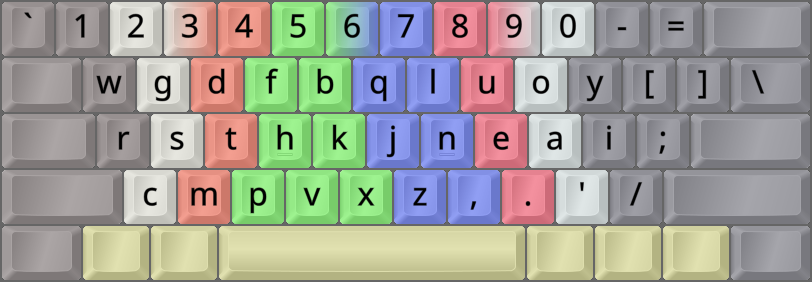
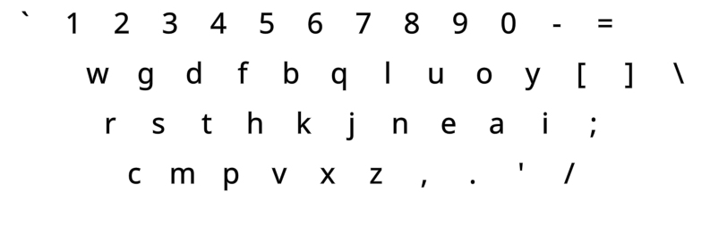
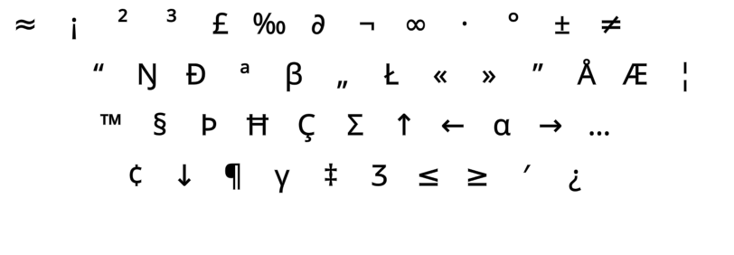
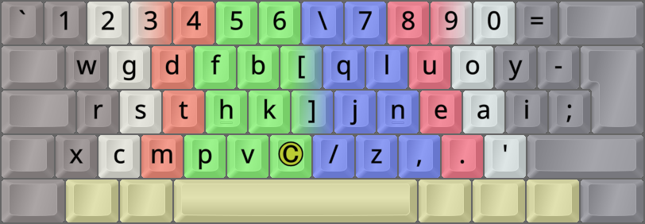

DreymaR's Big Bag Of Keyboard Tricks - EPKL
===========================================
<br><br>



_The APT layout (using the Angle mod) on an ANSI keyboard_

<br><br>

The APT layout
--------------
- This layout was made in 2021 by the **A**lt**K**eyboard**L**ayout creator Apsu. APTv3 is its stable form.
- It uses the [**Curl**][ErgCrl] principle, as the lateral index stretches hold rare letters (`J` and `K`).
- An [**Angle**][ErgAWi] ergo mod is strongly recommended for this layout on row-staggered boards.
- For more info, see [the APT layout repo on GitHub][APTGit].
<br>

Quote from the APT GitHub page:
> This is an alternate keyboard layout initially based on the work done in [MTGAP][MTGAP] and [CTGAP \[v2.0\]][CTGAP].
<br>

This layout gets special mention in [Getreuer's Alt Keyboard Layout guide][GetAKL]. Have a look!
<br>

#### The APTv3 layout on a ortho/matrix board:
```
+----------------------------+
| w g d f b   q l u o y  [ ] |
| r s t h k   j n e a i  ; \ |
| x c m p v   z , . ' /      |
+----------------------------+
```
<br>

#### The APTv3 layout on an ANSI board:
```
+-----------------------------+
| w g d f b   q l u o y [ ] \ |
| r s t h k   j n e a i ;     |
|  c m p v x   z , . ' /      |
+-----------------------------+
```
> _In this case, C is pressed with Ring, M with Middle, and PVX are all with Index._

<br><br>

||
|   :---:   |
|_The APT layout on an ANSI board, base/unshifted layer_|

||
|   :---:   |
|_The APT-eD layout on an ANSI board, AltGr+Shift layer_|

<br><br>

APTv3 Wide and (C)AWS variants
------------------------------
As mentioned, the APTv3 layout on standard keyboards already respects the [**C**url][ErgCrl] mod principle as the less common letters <kbd>J</kbd> and <kbd>K</kbd> are on the lateral inwards positions, while the more common <kbd>P</kbd> and <kbd>,</kbd> are easily accessible on the good lower row positions. An [**A**ngle][ErgAWi] mod is standard on row-staggered boards as well. So the default layout for standard boards may technically be described as **APT-(C)A**. But what about the **W**ide and **S**ymbol mods that some alt-layout users like?
<br>

Making a [**W**ide][ErgAWi] modded variant is pretty straightforward since the Slash key is in its usual position, and only SC and QU are different from Colemak. Since the function of the QU key on the lower row is to avoid same-finger bigrams (SFBs) with `O` and `A`, it could be replaced with SC if so desired; this was not deemed necessary.
<br>

The [**S**ym(bol)][ErgSym] mod should have <kbd>'</kbd> and <kbd>-</kbd> in good positions, at the least. For this layout, that's readily achievable by using only the hyphen/`MN` part of the Sym mod – not the `QU > SC` part of Colemak etc., since the QWERTY `P` key holds the letter `Y` in APT.
<br>

#### APT (C)AWS-ANSI, using only the Sym-Mn partial ergo mod:
```
+----------------------------+
| 1 2 3 4 5 6 \ 7 8 9 0 =    |
|  w g d f b [ q l u o y - ; |
|  r s t h k ] j n e a i     |
|   c m p v x / z , . '      |
+----------------------------+
```

<br>



_The APT-(C)AWS-ISO layout. The © key can be a Compose key, or whatever you wish._

<br><br>


[APTGit]: https://github.com/Apsu/APT                           (The APTv3 layout on GitHub)
[MTGAP]:  /Layouts/MTGAP/                                       (The MTGAP layout for EPKL)
[CTGAP]:  https://github.com/CTGAP/ctgap-keyboard-layout        (The CTGAP layouts on GitHub)
[ErgAWi]: https://dreymar.colemak.org/ergo-mods.html#angle-wide (DreymaR's BigBag on Angle+Wide ergo mods)
[ErgCrl]: https://dreymar.colemak.org/ergo-mods.html#curl-dh    (DreymaR's BigBag on the Curl-DH ergo mod)
[ErgSym]: https://dreymar.colemak.org/ergo-mods.html#symbols    (DreymaR's BigBag on the Symbols ergo mod)
[GetAKL]: https://getreuer.info/posts/keyboards/alt-layouts/index.html#which-alt-keyboard-layout-should-i-learn (Pascal Getreuer's Alt Keyboard Layout guide)
