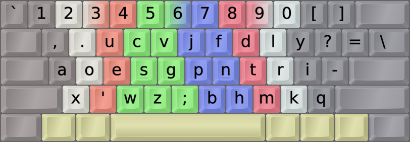

DreymaR's Big Bag Of Keyboard Tricks - EPKL
===========================================
 

 

The Boo layout
--------------
- This is a hand-made layout by Discord user Boo. It fares well even in modern analysis.
- It has similarities to Dvorak, such as the `AOE` and `,.` placements, but much better stats.
- Note that it has U on the same finger as E to reduce same-finger bigrams (SFB).
- It also avoids placing I on the index finger like Dvorak has, for the same reason.
- It contains its own Symbol mod by default, including the good hyphen placement of Dvorak.
- For more info, see the [Boo Layout Page at github.io][BooLay].
 

  

||
|   :---:   |
|_The Boo-AngleSym layout on an ISO board_|

[BooLay]: https://ballerboo.github.io/boolayout/ (The Boo layout page on github.io)
