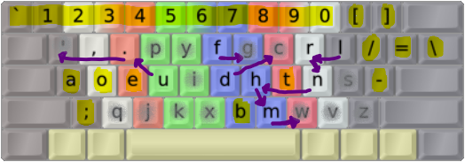

DreymaR's Big Bag Of Keyboard Tricks - EPKL
===========================================
 

 

The Boo layout
--------------
- This is a hand-made layout by Discord user Boo. It fares well even in modern analysis.
- It contains its own Symbol mod by default, including the good hyphen placement of Dvorak.
- For more info, see the [Boo Layout Page at github.io][BooLay].
 

  

||
|   :---:   |
|_The Boo-AngleSym layout on an ISO board_|

 

Similarity to Dvorak
--------------------
- The Boo layout has several similarities to Dvorak, such as the `AOE;`, `BT` and symbol key positions.
- Also, 9 keys are moved only a short distance from their Dvorak positions as seen below.
- It still has much better stats due to observation of modern design philosophies.
- Therefore, it may be a good choice for experienced Dvorak users who want a better layout?!
- Note that it has U on the same finger as E to reduce same-finger bigrams (SFB).
- It also avoids placing I on the index finger like Dvorak has, for the same reason.
- As a result of the UE improvement, `, .` move one key to the left.
- The LS and RN SFBs are avoided by the `L > R > N > H` remap.
- Dvorak's poor F position is fixed by a simple move, much like in [DreymaR's Dvorak-Curl-ID mod][Dvk-ID].
 

_Dvorak image showing conserved keys (yellow) and close displacements (arrows) going to the Boo layout._

[BooLay]: https://ballerboo.github.io/boolayout/ (The Boo layout page on github.io)
[Dvk-ID]: ../Dvorak#the-dvorak-curl-id-ergo-mod (DreymaR's Dvorak Curl-ID ergo mod)
