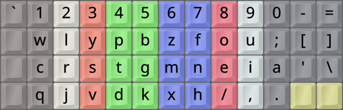
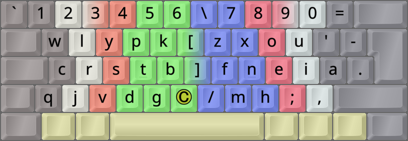
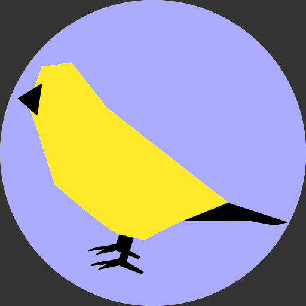

DreymaR's Big Bag Of Keyboard Tricks - EPKL
===========================================
<br><br>


_The default Canary layout (using the Angle mod) on an ANSI keyboard_

<br><br>

The Canary layout
------------------
- This layout was made by layout creators at the **A**lt**K**eyboard**L**ayout Discord, 2022-07.
- Its design is based on novel analysis and joint experience. It's meant as a "next step" from Colemak(-DH).
- It contains its own [**Curl**(DH)][ErgCrl] mod, in analogy to the Colemak-DH layout variant.
- An [**Angle**][ErgAWi] ergo mod is recommended for this layout on row-staggered boards.
- On ortho boards, `G > B > K` and `F > X > M` remaps are recommended in the [Canary ReadMe][CanOrt].
- For more info, see [the Canary layout repo on GitHub][CanGit].
<br>



_The Canary layout on an Ortho keyboard_

<br>

Here's a quote from Colby regarding the Canary layout [somewhat edited for brevity]:
> Canary was designed by oxey, semi, whorf, apsu, ec0vid, kathy, smudge, <3, and myself. \[...\] <br>
> The goal with Canary was not to be cutting-edge, but rather it was to create a layout that could \[act\] as a go-to first alt layout.
<br>

This layout gets special mention in [Getreuer's Alt Keyboard Layout guide][GetAKL]. Have a look!
<br>

#### The Canary layout on an ANSI board, with an Angle(Q) ergo mod:
```
+-----------------------------+
| w l y p k   z x o u ; [ ] \ |
| c r s t b   f n e i a '     |
|  j v d g q   m h / , .      |
+-----------------------------+
```

#### The Canary layout on a ortho/matrix board:
```
+----------------------------+
| w l y p b   z f o u ;  [ ] |
| c r s t g   m n e i a  ' \ |
| q j v d k   x h / , .      |
+----------------------------+
```

<br>

||
|   :---:   |
|_The Canary-eD layout on an ANSI board, unshifted layer_|

||
|   :---:   |
|_The Canary-eD layout on an ANSI board, AltGr+Shift layer_|

<br><br>

Canary Wide and (C)AWS variants
-------------------------------
As mentioned, the Canary layout on standard keyboards already contains a [**C**url][ErgCrl] mod as the letters <kbd>D</kbd> and <kbd>H</kbd> are easily accessible on the good lower row positions while less common letters are on the lateral inwards positions, and an [**A**ngle][ErgAWi] mod is standard on row-staggered boards as well. So the default layout for standard boards may technically be described as **Canary-(C)A**. But what about the **W**ide and **S**ymbol mods that some alt-layout users have grown fond of?
<br>

To create a [**W**ide][ErgAWi] modded variant, there's a hurdle to overcome: The lower-right punctuation keys have been rotated (`SL > CM > PD`) and so we can't just move the <kbd>/</kbd> key from the bottom right into the middle as usual. On ISO keyboards we may place <kbd>.</kbd> to the right of <kbd>A</kbd>, and if desired <kbd>;</kbd> in the place of <kbd>/</kbd> which then goes to the middle as usual. 
But on ANSI keyboards there is no key to the right of <kbd>'</kbd> as <kbd>\\</kbd> sits less accessibly above <kbd>Enter</kbd> instead. Apsu suggested that we go back to the old placements for these keys; however, be advised that this will bring back the `E,` same-finger bigram that some dislike in the Colemak layout. It may be an acceptable compromise if you want a Wide ergo mod.
<br>

[**S**ym(bol)][ErgSym] mods usually prioritize the common <kbd>'</kbd> (Apostrophe/Quote) and <kbd>-</kbd> (Hyphen/Underscore) keys. 
Non-Wide, you may use the same Sym mod as Colemak and other layouts that don't change symbol key positions do. With the Wide mods described above, the result is also quite similar to the Colemak-CAWS mod battery, with the possible exception of the keys mentioned (`/ , . ;` alias `SL CM PD SC`).
<br>

#### Canary (C)AWS-ISO proposal, moving the period key up:
```
+----------------------------+
| 1 2 3 4 5 6 \ 7 8 9 0 =    |
|  w l y p k [ z x o u ' -   |
|  c r s t b ] f n e i a .   |
| q j v d g _ / m h ; ,      |
+----------------------------+
```

#### Canary (C)AWS-ANSI proposal, using original symbol key positions:
```
+----------------------------+
| 1 2 3 4 5 6 \ 7 8 9 0 =    |
|  w l y p k [ z x o u ' - ; |
|  c r s t b ] f n e i a     |
|   j v d g q / m h , .      |
+----------------------------+
```

<br>



_The Canary-(C)AWS-ISO layout. The © key can be a Compose key, or whatever you wish._

<br><br>




[CanGit]: https://github.com/Apsu/Canary                        (The Canary layout on GitHub)
[CanOrt]: https://github.com/Apsu/Canary#ortho                  (Canary layout Readme, Ortho section)
[ErgAWi]: https://dreymar.colemak.org/ergo-mods.html#angle-wide (DreymaR's BigBag on Angle+Wide ergo mods)
[ErgCrl]: https://dreymar.colemak.org/ergo-mods.html#curl-dh    (DreymaR's BigBag on the Curl-DH ergo mod)
[ErgSym]: https://dreymar.colemak.org/ergo-mods.html#symbols    (DreymaR's BigBag on the Symbols ergo mod)
[GetAKL]: https://getreuer.info/posts/keyboards/alt-layouts/index.html#which-alt-keyboard-layout-should-i-learn (Pascal Getreuer's Alt Keyboard Layout guide)
