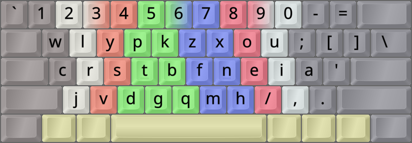
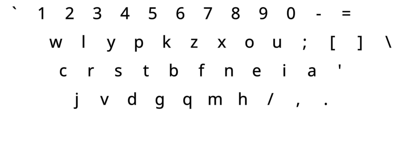
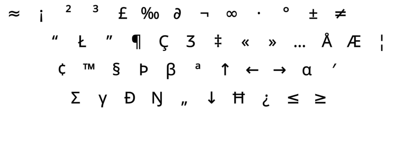

DreymaR's Big Bag Of Keyboard Tricks - EPKL
===========================================
<br><br>



_The default Canary layout (using the Angle mod) on an ANSI keyboard_

<br><br>

The Canary layout
------------------
- This layout was made by layout creators at the AltKeyboardLayout Discord, including Apsu and Semilin.
- Its design is based on novel analysis and joint experience.
- It contains its own Curl(DH) mod, and is strongly recommended to Angle mod on row-staggered boards.
- On ortho boards, use `G > B > K` and `F > X > M` remaps [as explained in the Canary readme][CanOrt].
- For more info, see [the Canary layout repo on GitHub][CanGit].
<br>

#### The Canary layout on an ANSI board:
```
+-----------------------------+
| w l y p k   z x o u ; [ ] \ |
| c r s t b   f n e i a '     |
|  j v d g q   m h / , .      |
+-----------------------------+
```

#### The Canary layout on a ortho/matrix board:
```
+----------------------------+
| w l y p b   z f o u ;  [ ] |
| c r s t g   m n e i a  ' \ |
| q j v d k   x h / , .      |
+----------------------------+
```

<br>

||
|   :---:   |
|_The Canary-eD layout on an ANSI board, unshifted layer_|

||
|   :---:   |
|_The Canary-eD layout on an ANSI board, AltGr+Shift layer_|

<br><br>


[CanGit]: https://github.com/Apsu/Canary (The Canary layout on GitHub)
[CanOrt]: https://github.com/Apsu/Canary#ortho (Canary layout Readme, Ortho section)
