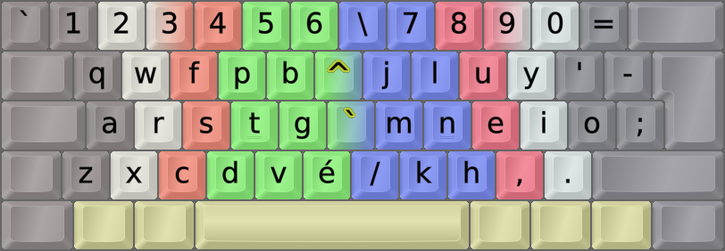
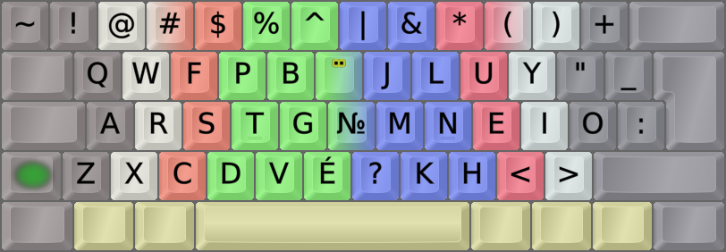

DreymaR's Big Bag Of Keyboard Tricks - EPKL
===========================================
 

  

Colemak[eD] locale layouts
--------------------------
Most of the Cmk-eD locale variants use ISO keyboards with an AngleWide configuration to allow index finger access to the bracket and ISO_102 keys where I mostly put the needed locale letters.

This may be supplemented with Curl(DH) and Sym mods to provide Colemak-CAW(S) with locale letters. You could remove the Wide mod if desired, but then the right hand pinky may get overworked.

Some locales traditionally use ANSI keyboards though, and some prefer to use the AltGr key instead of dead keys. So there may be other variants available.
  

  

Colemak-eD-BeCaFr French phonetic layout variant
------------------------------------------------
- The common letter éÉ is placed on the ISO key for easy access. Other acute-accent letters aren't so common in French.
- Another tack is to have a Compose key on the ISO key as this is a very useful key. Then, add a compose of `e` to `é`.
- Circumflex and grave accents are easily reachable on the unshifted layer, and diaeresis is on the shift layer.
- The № digraph sign was added in case someone needs it. It may also be composed from `No` with a Compose key.
 

||
|   :---:   |
|_Colemak-eD-BeCaFr_ISO_AWide, unshifted state_|

||
|   :---:   |
|_Colemak-eD-BeCaFr_ISO_AWide, shifted state_|

||
|   :---:   |
|_Colemak-eD-BeCaFr_ISO_AWide, AltGr state_|
