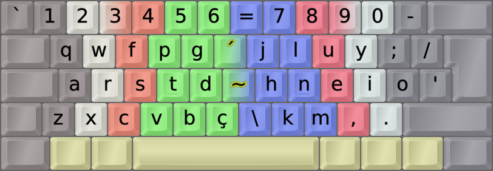

DreymaR's Big Bag Of Keyboard Tricks - EPKL
===========================================
 

  

Colemak[eD] locale layouts
--------------------------
Most of the Cmk-eD locale variants use ISO keyboards with an AngleWide configuration to allow index finger access to the bracket and ISO_102 keys where I mostly put the needed locale letters.

This may be supplemented with Curl(DH) and Sym mods to provide Colemak-CAW(S) with locale letters. You could remove the Wide mod if desired, but then the right hand pinky may get overworked.

Some locales traditionally use ANSI keyboards though, and some prefer to use the AltGr key instead of dead keys. So there may be other variants available.
  

Colemak-BrPt Portuguese (Brazil/Portugal) locale layout variant
---------------------------------------------------------------
For Portuguese locale Colemak, we need four accents (acute, tilde, grave, circumflex) that are placed on the bracket keys by frequency.
- These go in the middle of the board with the Wide ergo mod, so they're handy to reach with your index fingers.
- On the ISO key may be the letter `ç`, or the Compose key that lets you write many special letters and more.
	- Some special Compose sequences are added for the BrPt locale, such as `c` plus Compose making `ç`.
	- Simply writing `a/e/i/o/u` then hitting Compose produces the most common accented letters `áéíóú`.
	- The traditional written patterns `ha/he/hi/ho/hu` plus Compose turn into the accented `àèìòù`; `an/on` compose to `ã/õ`.

 

||
|   :---:   |
|_Colemak-eD-BrPt_ISO_CAWS, unshifted state.  The `ç` on the ISO key may represent a Compose key._|

||
|   :---:   |
|_Colemak-eD-BrPt_ISO_CAWS, shifted state._|
