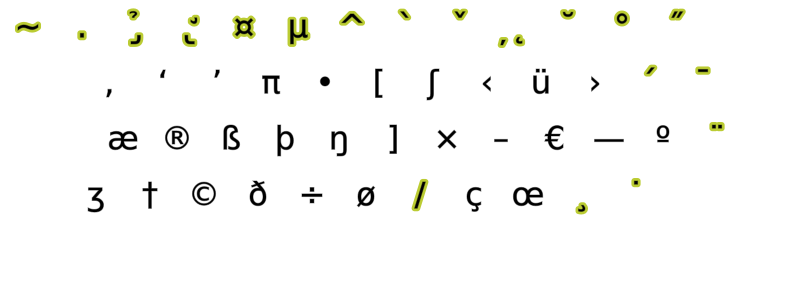

DreymaR's Big Bag Of Keyboard Tricks - EPKL
===========================================
  

Colemak[eD] locale layouts
--------------------------
Most of the Cmk-eD locale variants use ISO keyboards with an AngleWide configuration to allow index finger access to the bracket and ISO_102 keys where I mostly put the needed locale letters.

This may be supplemented with Curl(DH) and Sym mods to provide Colemak-CAW(S) with locale letters. You could remove the Wide mod if desired, but then the right hand pinky may get overworked.

Some locales traditionally use ANSI keyboards though, and some prefer to use the AltGr key instead of dead keys. So there may be other variants available.
  

Colemak-eD-DkNo/FiSe Scandinavian phonetic layout variants
----------------------------------------------------------
- For Danish/Norwegian, `æøå` are readily available on bracket+ISO keys, similarly to the German `äöü`.
- To allow easier Pan-Germanic typing, German `äöü` letters are added on <kbd>AltGr</kbd>+{ <kbd>A</kbd> / <kbd>ISO</kbd> / <kbd>U</kbd> }.
- For Finnish/Swedish,  `äöå` are in the bracket+ISO spots. The letters `æøü` are on AltGr mappings as above.
 

||
|   :---:   |
|_Colemak-eD-DkNo_ISO_CAWS, unshifted state_|

||
|   :---:   |
|_Colemak-eD-DkNo_ISO_CAWS, AltGr state_|

  

||
|   :---:   |
|_Colemak-eD-FiSe_ISO_CAWS, unshifted state_|

||
|   :---:   |
|_Colemak-eD-FiSe_ISO_CAWS, AltGr state_|
