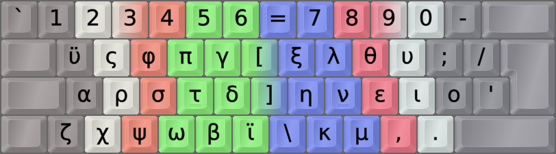
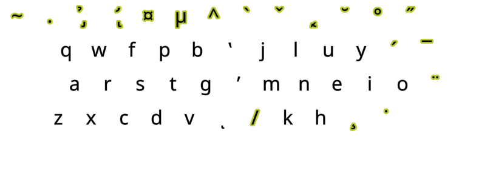

DreymaR's Big Bag Of Keyboard Tricks - EPKL
===========================================
 

 

Colemak[eD] locale layouts
--------------------------
Most of the Cmk-eD locale variants use ISO keyboards with an AngleWide configuration to allow index finger access to the bracket and ISO_102 keys where I mostly put the needed locale letters.

This may be supplemented with Curl(DH) and Sym mods to provide Colemak-CAW(S) with locale letters. You could remove the Wide mod if desired, but then the right hand pinky may get overworked.

Some locales traditionally use ANSI keyboards though, and some prefer to use the AltGr key instead of dead keys. So there may be other variants available.
  

Colemak-Gre Greek phonetic layout variant
-----------------------------------------
- For the Greek phonetic layout, some choices were made 
- It's for the most part similarly mapped as the Greek dead key usually found on AltGr+5
- The two diaeresis letters Ϋϋ/Ϊϊ were added to Q and the ISO key, to ease input. But they are quite rare...
- Full polytonic Greek still would require a lot more DK mappings, or Compose
- Another way is combining accents, if those are supported in your application
 

||
|   :---:   |
|_Colemak-eD-Gre_ISO_CAWS, unshifted state_|

||
|   :---:   |
|_Colemak-eD-Gre_ISO_CAWS, AltGr state_|
