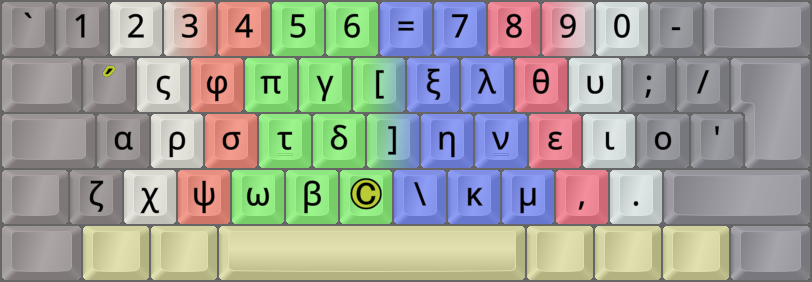

DreymaR's Big Bag Of Keyboard Tricks - EPKL
===========================================
 

 

Colemak[eD] locale layouts
--------------------------
Most of the Cmk-eD locale variants use ISO keyboards with an AngleWide configuration to allow index finger access to the bracket and ISO_102 keys where I mostly put the needed locale letters.

This may be supplemented with Curl(DH) and Sym mods to provide Colemak-CAW(S) with locale letters. You could remove the Wide mod if desired, but then the right hand pinky may get overworked.

Some locales traditionally use ANSI keyboards though, and some prefer to use the AltGr key instead of dead keys. So there may be other variants available.
  

Colemak-Gre Greek phonetic layout variant
-----------------------------------------
- For the Greek phonetic layout, some choices were made as not all letters correspond directly to each other.
- It's for the most part similarly mapped as the Greek dead key usually found on AltGr+5.
- The common Tonos (acute) accent is needed in an accessible spot. The Q key holds it and Diaeresis (umlaut).
- The two diaeresis letters Ϋϋ/Ϊϊ could've been on Q and the ISO key, to ease input. But they are quite rare.
- Instead, the ISO key (if you have it) is used as a Compose key. See the [Big Bag][orgBBT] pages for info.
- The acute/Tonos and umlaut/Diaeresis accents are added on Q for easy access. This is similar to the Greek XKB layout.
- Full polytonic Greek requires a lot more mappings in the tables of several DKs, or using [Compose][CmpIni].
- Another way is to use combining accents, if those are supported in your application
- You can type `;'υ` then Compose to get `ΰ`, or even type full katharevousa like `~(η` then Compose for `ἧ`.
 

||
|   :---:   |
|_Colemak-eD-Gre_ISO_CAWS, unshifted state_|

||
|   :---:   |
|_Colemak-eD-Gre_ISO_CAWS, AltGr state_|

[orgBBT]: https://dreymar.colemak.org/ (DreymaR's Big Bag of Keyboard Tricks)
[CmpIni]: ./Files/_eD_Compose.ini (EPKL Compose file)