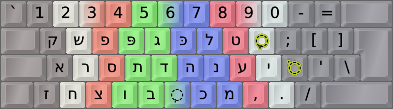
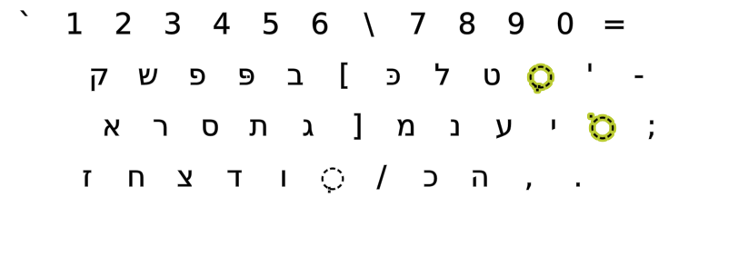
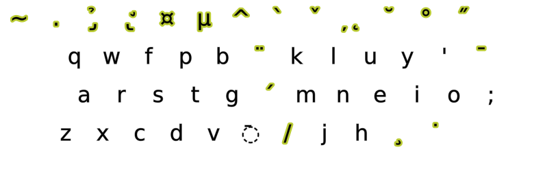

DreymaR's Big Bag Of Keyboard Tricks - EPKL
===========================================
 

  

Colemak[eD] locale layouts
--------------------------
Most of the Cmk-eD locale variants use ISO keyboards with an AngleWide configuration to allow index finger access to the bracket and ISO_102 keys where I mostly put the needed locale letters.

This may be supplemented with Curl(DH) and Sym mods to provide Colemak-CAW(S) with locale letters. You could remove the Wide mod if desired, but then the right hand pinky may get overworked.

Some locales traditionally use ANSI keyboards though, and some prefer to use the AltGr key instead of dead keys. So there may be other variants available.
  

Colemak-Heb Hebrew phonetic layout variant
------------------------------------------
- This is a semi-phonetic Hebrew layout with some novel ideas, constructed mainly by Wrapman, DreymaR and Tzlil
- It is intended for Colemak typists who want to type Hebrew too. It is not really optimized for Hebrew as such.
- It should provide a simple way of typing everyday Hebrew while also allowing for Biblical and other advanced Hebrew typing.
- For more info, see the **[Colemak Forum post on making a Hebrew phonetic Colemak layout][HebFor]**.
- Also see the [Heb BaseLayout file][HebLay].
 

Briefly:
- Hebrew letters on Shift states 0/1, Latin letters on AltGr states. Normal Latin/Hebrew punctuation kept in both cases.
- Shift+letter is for the final form. Where there is none, dagesh/hazaq/mapiq forms instead.
- Where there's both final and dagesh forms, they get spare keys: Fe/pe on <kbd>F</kbd> / <kbd>P</kbd>, chaf/kaf on <kbd>K</kbd> / <kbd>J</kbd>.
- Alef on <kbd>A</kbd>, ayin on <kbd>E</kbd>.
- Samekh on <kbd>O</kbd>, shin on <kbd>W</kbd> by shape and convention. Shin-dot on <kbd>Shift</kbd> + <kbd>O</kbd> / <kbd>W</kbd>.
- On the ISO key, if you have that, there's shva/dagesh/rafe/meteg, but also see the DKs below.
    - Another tack is to comment out that key so it defaults to a Compose key.
    - There are several Hebrew composes, as for Linux XKB. I've added a few more, including Yiddish yod-yod etc.
 

||
|   :---:   |
|_Colemak-eD-Heb_ISO_CAWS, unshifted state_|

||
|   :---:   |
|_Colemak-eD-Heb_ISO_CAWS, shifted state_|

||
|   :---:   |
|_Colemak-eD-Heb_ISO_CAWS, AltGr state_|

 

- Special dead keys on <kbd>Y</kbd> ("short niqqudot") and <kbd>O</kbd> ("long niqqudot").
    - The two DKs provide short and long vowel signs together with the <kbd>A</kbd><kbd>E</kbd><kbd>I</kbd><kbd>O</kbd><kbd>U</kbd> keys.
    - Both have a set of common non-vowel releases, covering special signs and final forms. Again, see the [BaseLayout file][HebLay].
 

||
|   :---:   |
|_The "short niqqudot etc" dead key on Colemak-eD-Heb_ISO_CAWS, unshifted state_|

||
|   :---:   |
|_The "short niqqudot etc" dead key on Colemak-eD-Heb_ISO_CAWS, AltGr state_|

 

||
|   :---:   |
|_The "long niqqudot etc" dead key on Colemak-eD-Heb_ISO_CAWS, unshifted state_|

||
|   :---:   |
|_The "long niqqudot etc" dead key on Colemak-eD-Heb_ISO_CAWS, AltGr state_|

  

More Hebrew script resources
----------------------------
Here are the Biblical-SIL layout states, for reference. The images contain Unicode codes for all relevant glyphs, both for modern and ancient/Biblical Hebrew.
 

 

 

 

[HebFor]: https://forum.colemak.com/topic/1458-locale-colemak-variants-for-several-countries-the-edreymar-way/#p19971 (HebMak discussed on the Colemak Forum)
[HebLay]: ./BaseLayout_Cmk-eD-Heb.ini (the Colemak-eD-Heb EPKL BaseLayout file)
