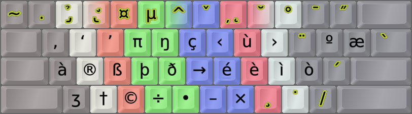

DreymaR's Big Bag Of Keyboard Tricks - EPKL
===========================================

  
  
Colemak[eD] locale layouts
--------------------------
Most of the Cmk-eD locale variants use ISO keyboards with an AngleWide configuration to allow index finger access to the bracket and ISO_102 keys where I mostly put the needed locale letters.
  
This may be supplemented with Curl(DH) and Sym mods to provide Colemak-CAW(S) with locale letters. You could remove the Wide mod if desired, but then the right hand pinky may get overworked.
  
Some locales traditionally use ANSI keyboards though, and some prefer to use the AltGr key instead of dead keys. So there may be other variants available.

Italian Colemak locale layouts
------------------------------
For Italian locale Colemak, at the least we need the letters é and àèìòù easily accessible. There are several solutions, depending on your preferences:
- **Cmk-eD-It**: èàù and éòì on unshifted and shifted `[]œ` (brackets, ISO key). This is unintuitive but avoids layers apart from Shift.
	 

	||
	|                :---:                |
	_Colemak-eD-It_ISO_AWide, unshifted state_

	||
	|                :---:                |
	_Colemak-eD-It_ISO_AWide, shifted state_

	 
- **Cmk-eD-EsLat**: This is good both for Spanish and Italian, using dead keys on brackets for the four main accents. Feel free to replace ñ on the ISO key; on ANSI boards it's no problem.
	 

	||
	|                :---:                |
	_Colemak-eD-EsLat_ANS_AWide, unshifted state_

	||
	_Colemak-eD-EsLat_ANS_AWide, shifted state_

	 
- **Cmk-eD-ItAlt**: An alternative for those who prefer using AltGr. The letters àèìòù are easy to remember on AltGr+aeiou; é gets the neighboring AltGr+n (and/or the ISO key on ISO boards).
	 

	||
	|                :---:                |
	_Colemak-eD-ItAlt_ANS_CurlAngle, AltGr state_
