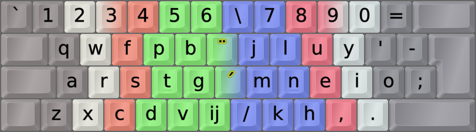

DreymaR's Big Bag Of Keyboard Tricks - EPKL
===========================================
 

  

Colemak[eD] locale layouts
--------------------------
Most of the Cmk-eD locale variants use ISO keyboards with an AngleWide configuration to allow index finger access to the bracket and ISO_102 keys where I mostly put the needed locale letters.

This may be supplemented with Curl(DH) and Sym mods to provide Colemak-CAW(S) with locale letters. You could remove the Wide mod if desired, but then the right hand pinky may get overworked.

Some locales traditionally use ANSI keyboards though, and some prefer to use the AltGr key instead of dead keys. So there may be other variants available.
  

Colemak-Nl Dutch (Netherlands/Belgium) locale layout variant
------------------------------------------------------------
For Dutch locale Colemak, at the least we need accents easily accessible. There's also the ij digraph, but it's often written as a bigram (ij) instead. However, the J position in Colemak is not ideal since J is significantly more common in Dutch than in English.
- **Cmk-eD-Nl** has accents on the bracket keys. The ij digraph may go on the ISO key if you have it, and there's also an ij bigram on AltGr+i.
- The digraph is mostly used typographically and [even though it exists in Unicode its use is somewhat discouraged][WikiIJ].
- Therefore, by default it may be better to keep the immensely useful Compose key on the ISO key by default!
- With the Compose key, you can always type ij/IJ followed by Compose to produce an ij/IJ digraph.
- I've added Dutch specific completion to the Compose key so that i/I plus Compose complete to ij/IJ as well.
- If you decide that you do want the digraph ligature ij on your ISO key after all, uncomment it in your [layout.ini file][layini].
 

||
|   :---:   |
|_Colemak-eD-Nl_ISO_AWide, unshifted state.  The `ij` digraph on the ISO key may represent a Compose key._|

||
|   :---:   |
|_Colemak-eD-Nl_ISO_AWide, shifted state._|

||
|   :---:   |
|_Colemak-eD-Nl_ISO_AWide, AltGr state. Note the `ij` bigram on `AltGr+i`._|

[WikiIJ]: https://en.wikipedia.org/wiki/IJ_(digraph)#Encoding (Wikipedia on encoding the IJ digraph)
[layini]: ./Cmk-eD-Nl_ISO_CurlAWideSym/layout.ini#L62
