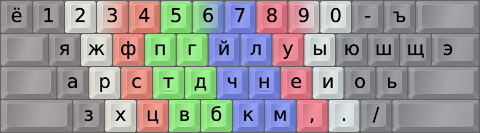

DreymaR's Big Bag Of Keyboard Tricks - EPKL
===========================================

 

Colemak[eD] locale layouts
--------------------------
Most of the Cmk-eD locale variants use ISO keyboards with an AngleWide configuration to allow index finger access to the bracket and ISO_102 keys where I mostly put the needed locale letters.

This may be supplemented with Curl(DH) and Sym mods to provide Colemak-CAW(S) with locale letters. You could remove the Wide mod if desired, but then the right hand pinky may get overworked.

Some locales traditionally use ANSI keyboards though, and some prefer to use the AltGr key instead of dead keys. So there may be other variants available.

 

Colemak-Ru "Rulemak" Kyrillic phonetic layout variant
-----------------------------------------------------
- This is the Rulemak mappings devised by GHen on the Colemak Forum
- Homepage: http://forum.colemak.com/viewtopic.php?id=519
- Version : 1.5 (2017-01-10)
- For Bulgarian and similar variants, some remaps are necessary such as C vs H.

 

||
|   :---:   |
|_Colemak-eD-Ru_ISO_CAWS, unshifted state._|

||
|   :---:   |
|_Colemak-eD-Ru_ISO_CAWS, AltGr state._|
