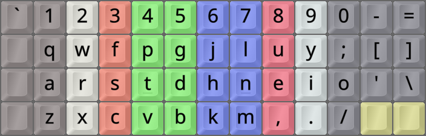
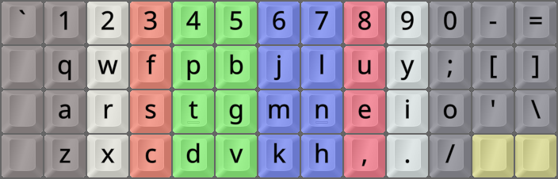
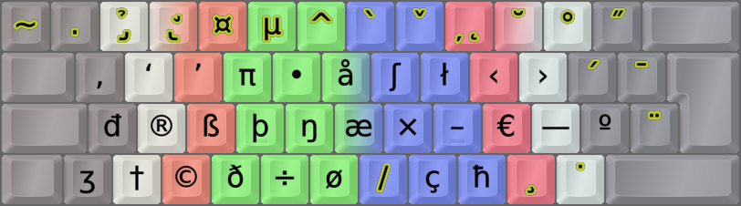

<h1 align=center line-height=1.6>Colemak</h1>  

 

The Colemak layout
------------------
- The Colemak keyboard layout was designed by Shai Coleman in 2006.
- It's my main layout, and highly recommended if you're considering which layout to switch to!
- You really should read more about it on its [main site][CmkCom] and/or [other sites][CmkOrg].
- With EPKL, you can get Cmk with several [ergonomic mods][BB_Erg] and [locale variants][BB_Loc].
 

_The Colemak layout on an Ortho keyboard_

 

Ergonomic mods
--------------
- There are several ergonomic mods available such as [Colemak-DH (CurlAngle)][BB_CDH].
    - NOTE: You should use an Angle mod with Curl(DH) for traditional row-staggered boards.
    - Make sure you read and understand the relevant parts of the [BigBag Ergonomy page][BB_Erg].
    - For Ortho/matrix boards (ISO-Orth and ANS-Orth) there are non-Angle versions available.
 

_The Colemak-Curl-DH layout variant on an Ortho keyboard_

 

_The Colemak-CurlAngleWideSym layout variant, alias Colemak-CAWS, on an ISO keyboard_

 

Colemak[eD]: Colemak - edition DreymaR
--------------------------------------
- Unless you use a simple VK type layout that keeps all keys as in your Windows layout...
- EPKL will usually provide you with [Colemak-eD mappings for AltGr and dead key layers][BB_CeD].

 

_Colemak-CAWS-ISO as above, showing the AltGr layer with dead keys marked in yellow_

 

<h1 align=center>⌨&nbsp;&nbsp;&nbsp;⌨&nbsp;&nbsp;&nbsp;⌨&nbsp;&nbsp;&nbsp;⌨&nbsp;&nbsp;&nbsp;⌨</h1>

[CmkCom]: https://colemak.com/ (The main Colemak site)
[CmkOrg]: https://colemak.org/ (The community Colemak site)
[BB_CeD]: https://dreymar.colemak.org/layers-colemaked.html (DreymaR's Big Bag of Tricks on the Colemak-eD layers)
[BB_Erg]: https://dreymar.colemak.org/ergo-mods.html (DreymaR's Big Bag of Tricks on ergonomic mods)
[BB_Loc]: https://dreymar.colemak.org/variants.html#locales (DreymaR's Big Bag of Tricks on Colemak Locale variants)
[BB_AWi]: https://dreymar.colemak.org/ergo-mods.html#angle-wide (DreymaR's Big Bag of Tricks on Angle+Wide ergo mods)
[BB_CDH]: https://dreymar.colemak.org/ergo-mods.html#curl-dh (DreymaR's Big Bag of Tricks on the Curl-DH ergo mod)
