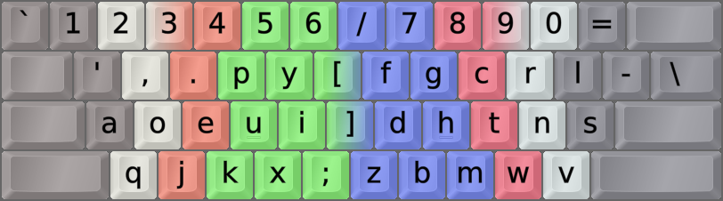
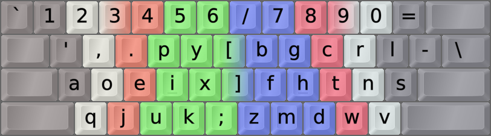
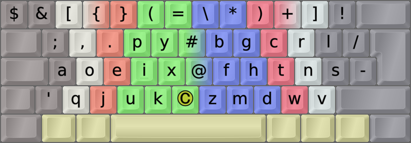
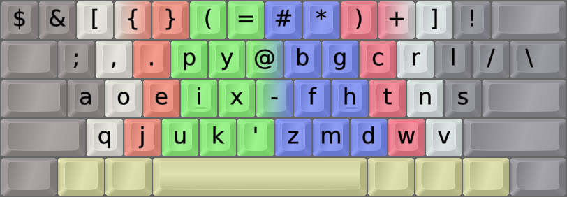

DreymaR's Big Bag Of Keyboard Tricks - EPKL
===========================================
 

_The Dvorak layout with [Angle+Wide ergonomic mods][BB_AWi] on an ANSI board_

 

The Dvorak layout
-----------------
- The Dvorak layout has been around since 1938 when August Dvorak designed it.
- It's more ergonomic than QWERTY by far, and a decent choice despite being quite old now.
- The Dvorak layout features high hand alternation (L-R-L-R...) but less rolls than Colemak.
- There are still some issues with it in my opinion, see below.
- With EPKL, it can be used with the usual Angle and Wide ergonomic mods added, as seen above.
- It rearranges the symbol keys but still isn't marked "Sym"; see "Programmer Dvorak..." below.
 

||
|   :---:   |
|_The unmodified Dvorak layout on an ANSI board_|

 

The Dvorak Curl-ID ergo mod
---------------------------
- My Dvorak CurlAngle mod follows the same principles as the [Colemak Curl-DH][BB_CAW] mod.
    - That is, it deprioritizes the middle column and brings two important keys (here, U and D) down.
    - This lets the hand home position (AOEI|U D|HTNS) follow a comfy curve without lateral stretches.
    - Like Cmk-DH, it should be used with an Angle mod (bottom left half-row) on row-staggered boards.
    - The Angle mods let you keep a straight left wrist while typing. See the color-coded image below.
    - Like Cmk-DH, this mod doesn't change any finger-key assignments.

- The Dvk-Curl-ID mod brings the common <kbd>I</kbd> to a home position, and <kbd>D</kbd><kbd>U</kbd> to the comfortable "Curl" positions.
- It also fixes the bad <kbd>F</kbd> placement in standard Dvorak. The less common <kbd>X</kbd><kbd>K</kbd><kbd>M</kbd><kbd>B</kbd> are moved as a result.
- On the left hand index finger, Dvorak Curl-ID uses a simple `I → U → K → X` rotation from Dvorak.
- On the right hand index finger, a `D → M → B → F` loop improves the Dvorak <kbd>D</kbd> and <kbd>F</kbd> positions.
- Since it's such a light mod however, it doesn't address other known problems such as LS on the pinky.
- Dvk-Curl-ID scores substantially better than plain Dvorak in analysis and impression.
- Speaking for myself, however, I'd still recommend using a more modern optimized layout like Colemak.
 

_The Dvorak Curl-ID AngleWide layout, alias Dvorak-CAW, on an ANSI keyboard_

 

The Programmer Dvorak Symbol mod
--------------------------------
- This is a Dvorak symbol mod inspired by [Programmer Dvorak by Roland Kaufmann][PrgDvk].
- Disclaimer: This is not the Programmer Dvorak layout _per se_, as that consists of a bundle of features.
- This Sym mod deviates from regular Dvorak only in the number row, a <kbd>=+</kbd> `→` <kbd>@^</kbd> remap, and <kbd>;:</kbd> `↔` <kbd>'"</kbd>.
- The ergonomically reordered number sequence 75319 02468 was used in the original Dvorak layout.
- Some dead key mappings on the number row were changed to stay intuitive, e.g., `(` for breve.
 

||
|   :---:   |
|_Unshifted Dvorak-Sym layout on an ANSI board_|

||
|   :---:   |
|_Shifted Dvorak-Sym layout on an ANSI board_|

 

- Dvorak with Curl-Angle, Wide and Sym mods is called Dvorak-CAWS, in analogy to [Colemak-CAWS][BB_Erg].
- For the combination of the Wide and Sym mods, the <kbd>#`</kbd><kbd>@^</kbd> keys were kept together as on the non-Wide layout.
- On the Dvorak ISO-CAWS image below you can see a Compose key in the middle. It's a powerful sequencing method.
- On ANSI boards there isn't room for that and the hyphen is moved to the middle to keep it in a good place.
 

_The Dvorak CurlAngleWideSym layout, alias Dvorak-CAWS, on an ISO keyboard_

 

_The Dvorak CurlAngleWideSym layout, alias Dvorak-CAWS, on an ANSI keyboard_

 

The Boo Layout
--------------
- Do you like and know Dvorak and want to keep as much of it as possible while still getting a modern layout?
- I suggest taking a look at [the Boo layout][BooLay]. It's implemented in EPKL.
- The Boo layout keeps several keys from Dvorak, notably AOE and the right-hand punctuation keys.
- Other similarities and improvements are discussed in the Boo layout README.

[BB_Erg]: https://dreymar.colemak.org/ergo-mods.html (DreymaR's Big Bag of Tricks on ergo mods)
[BB_AWi]: https://dreymar.colemak.org/ergo-mods.html#AngleWide (DreymaR's Big Bag of Tricks on Angle+Wide ergo mods)
[BB_CAW]: https://dreymar.colemak.org/ergo-mods.html#CurlDH (DreymaR's Big Bag of Tricks on the Curl-DH ergo mod)
[PrgDvk]: https://www.kaufmann.no/roland/dvorak/ (Programmer Dvorak, by Roland Kaufmann)
[BooLay]: ../Boo/ (The Boo layout in EPKL)
