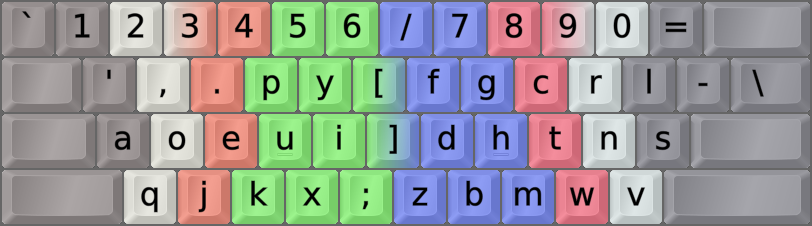

DreymaR's Big Bag Of Keyboard Tricks - EPKL
===========================================
  

_The Dvorak layout with [Angle+Wide ergonomic mods][BB_AWi] on an ANSI board_

 

The Dvorak layout
-----------------
- The Dvorak layout has been around since 1938 when August Dvorak designed it.
- It's more ergonomic than QWERTY by far, and a decent choice despite being quite old now.
- The Dvorak layout features high hand alternation (L-R-L-R...) but less rolls than Colemak.
- There are still some issues with it in my opinion, see below.
- With EPKL, it can be used with the usual Angle and Wide ergonomic mods added, as seen above.
 

||
|   :---:   |
|_The unmodified Dvorak layout on an ANSI board_|

 

The Dvorak Curl-ID ergo mod
---------------------------
- The Dvorak CurlAngle mod follows the same principles as the [Colemak Curl-DH][BB_CAW] mod.
    - That is, it deprioritizes the middle column and brings two important keys (here, U and D) down.
    - This lets the hand home position (AOEIU DHTNS) follow a natural, relaxed curve.
    - Like Cmk-DH, it should be used with an Angle mod (bottom left half-row) on row-staggered boards.
    - The Angle mods let you keep a straight left wrist while typing. See the image below.
    - Like Cmk-DH, this mod doesn't change any fingerings.

- The Dvk-Curl-ID mod brings the common I to a home position, and DU to the comfortable "Curl" positions.
- It also fixes the bad F placement in standard Dvorak. The less common XKMB are moved as a result.
- Since it's such a light mod however, it doesn't address other known problems such as LS on the pinky.
- Dvk-Curl-ID scores substantially better than plain Dvorak in analysis and impression.
- Speaking for myself, however, I'd still recommend using a more modern optimized layout like Colemak.
 

_The Dvorak Curl-ID AngleWide layout, alias Dvorak-CAW, on an ANSI keyboard_

[BB_AWi]: https://dreymar.colemak.org/ergo-mods.html#AngleWide (DreymaR's Big Bag of Tricks on Angle+Wide ergo mods)
[BB_CAW]: https://dreymar.colemak.org/ergo-mods.html#CurlDH (DreymaR's Big Bag of Tricks on the Curl-DH ergo mod)
