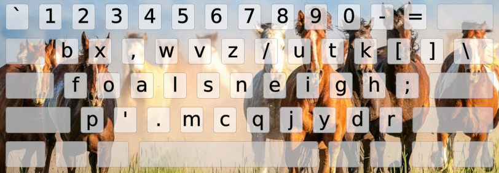

<h1 align=center line-height=1.6>FOALMAK</h1>  

 

The foalproof Foalmak April's Foals layout
------------------------------------------
- This layout was made by Semi at the Colemak Discord, on April 1st, 2021. Do the maths...
- FOALmak features, according to Semi:
    - Almost 2x better SFB rate than QWERTY
    - Smooth rolls like EI, IT, and TH
    - Well balanced finger usage
    - 13% less effort than QWERTY
    - "FOALS NEIGH" on the homerow
- April's Foal! Gallop over text pages like a herd of mustangs! Listen to the neighsayers!
- Your rolls will turn into trots, and your redirects into voltes.
- This layout is recommended for typists who are horsing around. Also try rocking hard with [QUARTZ][LayQua].

- Disclaimer: If at any point you were foaled by this foalish layout, remember: Foal me once, shame on you. ...
 

￣(=⌒ᆺ⌒=)￣

[LayFoa]: /Layouts/Foalmak                                          (The Foalmak layout in EPKL)
[LayQua]: /Layouts/QUARTZ                                           (The QUARTZ layout in EPKL)
