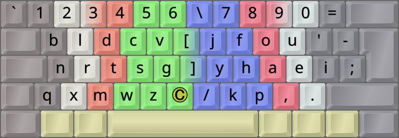

DreymaR's Big Bag Of Keyboard Tricks - EPKL
===========================================
<br><br>


_The default Gallium layout for a Colstag/Ortho keyboard_

<br><br>

The Gallium layout
--------------------
- This layout was made by Bryson James alias 'GalileoBlues', 2022-12.
- It may be said to use the [**Curl**][ErgCrl] principle, by reducing lateral stretches to the middle home row positions.
- An [**Angle**][ErgAWi] ergo mod is recommended for this layout on row-staggered boards.
- For more info, see [the Gallium repo on GitHub][GalGit].
- Gallium is similar to other recent layouts, like [Nerps (by Smudge)][NrpRed] and [Graphite (by strongly-typed)][GraGit].
- It is, in fact, amazing how Gallium and [Graphite][GraPKL] are virtually the same layout, albeit developed independently!
- I like that Gallium has J in its Colemak position (for English, at least), and a symbol on pinky top-row.
- Both Bryson and I favor the Rowstag version, used in the BaseLayout. Getting to the Colstag version is a simple remap.
- The `PHY` trigram is better alt-fingerable on the Rowstag version. The `SC` bigram seems nicely altable, too.
<br>


_The Gallium layout (using the Angle mod) on an ANSI keyboard_
<br>

- The question of whether Q-X or X-Q works best for the two bottom-left positions, is discussed below.
- For the Colstag/Ortho Gallium variant in EPKL, I've gone with the standard X-Q arrangement.
- For Angle-modded Rowstag variants though, I've used Q-X.
- It's quite easy to remove the "GalQX" swap in the `Layout.ini` files. Help images would have to be remade.
<br>

#### The Gallium layout on a ortho/matrix board (Colstag version):
```
+----------------------------+
| b l d c v   j y o u ,  [ ] |
| n r t s g   p h a e i  / \ |  Note the Y P F and X Q placements
| x q m w z   k f ' ; .      |
+----------------------------+
```

#### The Gallium Rowstag version on an ANSI board, with an Angle(Q) mod:
```
+-----------------------------+
| b l d c v   j f o u , [ ] \ |
| n r t s g   y h a e i /     |  Note the F Y P and Q X placements
|  x m w z q   k p ' ; .      |
+-----------------------------+
```
<br>

||
|   :---:   |
|_The Gallium-eD layout on an ANSI board, unshifted layer_|

||
|   :---:   |
|_The Gallium-eD layout on an ANSI board, AltGr+Shift layer_|

<br><br>

Gallium variants
------------------
- As seen above, Gallium has Colstag and Rowstag standard variants. These differ only in `F Y P` on the right index finger.
<br>

- Another question is whether the lower left should be Q-X or X-Q.
- The original release had Q-X. This was then changed to X-Q to facilitate some rare words like `exquisite`.
- The layout's page says "this barely affects the stats and is overall a miniscule change". But is it needed then?
- Personally, I see little gain and some issues with this "castling". I'd like to keep Q and X on their old columns.
- Therefore, in the Angle-modded variants you'll find Q-X swapped back. You can remove the remap if you wish.
- The Q-X configuration is more easily Angle modded on ANSI boards than X-Q: Q in the middle is more favorable.
- It is also consistent with Graphite, and keeps the finger assignments of layouts like QWERTY and Colemak.
<br><br>

- Apart from QX, the sole difference between the left hand of Gallium and Graphite is CV vs WZ on the upper/lower row.
- Graphite's C-V (low) and W (up) look easier to learn for Colemak or QWERTY users, by preserving their row assignments.
- The `QW_F`-`QW_R` bigram is easier than its downward counterpart for me though, being more altable on a row-stag board.
- Thus, it depends on your priorities and tastes.
- Here's an AKL Discord server `cmini` bot analysis of the `S-C` vs `S-W` bigram frequencies involved (the others are rare):

```
Using the Shai corpus:
sc + cs: 0.13%    ( sc: 0.11% , cs: 0.02% )
sw + ws: 0.07%    ( sw: 0.03% , ws: 0.04% )
```
<br>

- [**W**ide][ErgAWi] ergo mods (moving right-hand keys one position to the right) usually place the two bracket keys in the middle.
- Gallium keeps the number row and brackets in their traditional places, making Wide configs straightforward.
- For AngleWide mod combos, I use the Q-X swap as mentioned. On ANSI boards, this puts `Q` in the middle.
- [**S**ym(bol)][ErgSym] mods usually prioritize the common <kbd>'</kbd> (Apostrophe/Quote) and <kbd>-</kbd> (Hyphen/Underscore) keys.
- Gallium already moves most of the symbol keys around in its own fashion, so not everyone may want a further Sym mod.
- As seen below though, the Galliard variant is in itself a Sym (UnSym) mod, making for familiar AngleWideSym combos.
<br><br>


Galliard
--------
- For my own uses, I wanted a mod variant with traditional symbol/punctuation placements.
- Thus, I made a "Galliard" variant with sym key placements like, e.g., Colemak-CAWS.
- The name is a play on "Gallium", but it's also a Renaissance dance. "Galliard" means "brisk, lively".
<br>

- It's easier to learn for someone coming from QWERTY, Colemak, or other layouts that leave sym keys alone.
- In this capacity, it can be a stepping-stone to full Gallium! Learn Galliard first, then decide whether to proceed.
- This incurs some worse punctuation bigrams. Since I use my [CoDeKey][CoDeKy] for most punctuation, I don't care.
<br>

- The `O'` bigram is better this way, but the more common `I'` bigram is worse. Using a CoDeKey solves that.
- The `YOU'` tetragram is actually an outward roll on Galliard, albeit with a lateral stretch. Whee!
- I asked GalileoBlues on his [Gallium repo on GitHub][GalIs5], and got a go for publishing this variant.
- Also see the README for the similar [Gralmak][Gralmk] Graphite variant.
<br>

#### Gallium AWS-ISO "Galliard":
```
+----------------------------+
| 1 2 3 4 5 6 \ 7 8 9 0 =    |
|  b l d c v [ j f o u ' -   |
|  n r t s g ] y h a e i ;   |
| q x m w z _ / k p , .      |
+----------------------------+
```
<br>



_The Gallium-(C)AWS-ISO "Galliard" layout. The © key can be a Compose key, or whatever you wish._

<br><br>


_The Gallium layout, Rowstag version. Image taken from its own [web page][GalGit]._


[GalGit]: https://github.com/GalileoBlues/Gallium                   (The Gallium layout on GitHub)
[GraGit]: https://github.com/rdavison/graphite-layout               (The Graphite layout on GitHub)
[NrpRed]: https://www.reddit.com/r/KeyboardLayouts/comments/tpwyjc/ (The Nerps layout on Reddit)
[GraPKL]: ../Graphite/                                              (The Graphite layout in EPKL)
[Gralmk]: ../Graphite/README.md#gralmak                             (The Gralmak Graphite layout variant)
[GalIs5]: https://github.com/GalileoBlues/Gallium/issues/5          (GitHub issue on adding Gallium to EPKL)
[ErgAWi]: https://dreymar.colemak.org/ergo-mods.html#angle-wide     (DreymaR's BigBag on Angle+Wide ergo mods)
[ErgCrl]: https://dreymar.colemak.org/ergo-mods.html#curl-dh        (DreymaR's BigBag on the Curl-DH ergo mod)
[ErgSym]: https://dreymar.colemak.org/ergo-mods.html#symbols        (DreymaR's BigBag on the Symbols ergo mod)
[CoDeKy]: https://github.com/DreymaR/BigBagKbdTrixPKL/blob/master/README.md#advanced-composecodekey  (The EPKL README on the CoDeKey)
