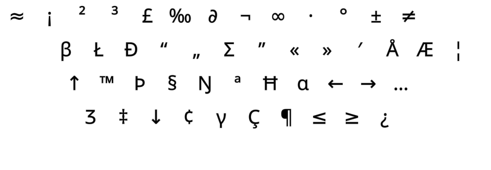

<h1 align=center line-height=1.6>Gralmak</h1><br><br>

<div align=center ></div><br>

The Gralmak layout
------------------
- This layout was made by DreymaR (that's me!), 2024-11.
- It is a variant of [Graphite][GraGit] by StronglyTyped and [Gallium][GalGit] by GalileoBlues. These layouts are very similar.
- Gallium/Graphite are in turn related to other recent layouts, like [Sturdy][StrPKL] by Oxey and [Nerps][NrpGra] by Smudge.
- Gralmak may be said to use the [**Curl**][ErgCrl] principle, by reducing lateral stretches to the middle home row positions.
- An [**Angle**][ErgAWi] ergo mod is recommended for this layout on row-staggered boards.
- For more info, see [the Gralmak repository on GitHub][GrlGit].
- If you're interested, also have a look at the README for the similar [Galliard][Gallrd] Gallium variant.
<br>


_The Gralmak layout (using the Angle mod) on an ANSI keyboard_

<br>

> - I wanted to make a Graphite-Gallium variant with traditional symbol/punctuation placements.
> - Thus came about the Gralmak variant that's easily ergo modified like, e.g., Colemak-CAWS.
> - Like most other layouts (and Graphite-HB), I didn't want to change the Shift states of keys.
> - Like the [Gallium][GalPKL] and [Colemak(-Sym)][CmkPKL] layouts, I want J in the middle and a symbol (Quote) on pinky.
> - I decided to have the apostrophe/quote in the letter block by default, as I like that a lot.
> - I also brought Z back to its familiar spot where QWERTY and Colemak has it.
> - The name is a play on Graphite-Gallium-Colemak, and our quest for the mythical "Holy Grail" of layouts!
<br>

#### Gralmak on an ortho keyboard
```
+----------------------------+
| 1 2 3 4 5   6 7 8 9 0  - = |
| b l d w q   j f o u '  [ ] |
| n r t s g   y h a e i  ; \ |
| z x m c v   k p , . /      |
+----------------------------+
```

#### Gralmak with an Angle(Z)-ANSI ergo mod
```
+-----------------------------+
| b l d w q   j f o u ' [ ] \ |
| n r t s g   y h a e i ;     |
|  x m c v z   k p , . /      |
+-----------------------------+
```
<br>

> - It's easier to learn for someone coming from QWERTY, Colemak, and other layouts that leave the symbol keys unchanged.
> - In this capacity, it can also be a stepping-stone to full Graphite or Gallium! Learn Gralmak first, then decide whether to proceed.
> - This incurs some worse punctuation bigrams. Since I use my thumb [CoDeKey][CoDeKy] for most punctuation, I don't care.
> - If you don't use punctuation solutions, you may instead use a symbol mod of your choice; see the [Gralmak readme][GmkPKL].
<br>

||
|   :---:   |
|_The Gralmak-eD layout on an ANSI board, unshifted layer_|

||
|   :---:   |
|_The Gralmak-eD layout on an ANSI board, AltGr+Shift layer_|

<br><br>

Gralmak Sym - GralmakS
----------------------
- Standard Gralmak keeps punctuation unmoved from QWERTY, like Colemak and some other layouts do.
    - The one exception is the apostrophe/quote (QU) key, which I kept in the letter block like Graphite does.
    - Not moving the symbol keys makes it easier to learn and transition to, and adds flexibility.
    - Another reason is that I can use a special thumb [CoDeKey][CoDeKy] for most punctuation.
- However, if you type text with punctuation with Gralmak and don't have access to such a special key, there will be minor issues.
<br>

- GralmakS, at heart, is a mod variant that remaps `, / .` while keeping other punctuation unchanged.
- You'll have to decide whether that's useful for you.
- See the [the Gralmak repo][GmkSym] for more info and options.
<br>

```
Gralmak:
+----------------------------+
| 1 2 3 4 5   6 7 8 9 0  - = |
| b l d w q   j f o u '  [ ] |
| n r t s g   y h a e i  ; \ |
| z x m c v   k p , . /      |
+----------------------------+

GralmakS (non-Wide Sym mod):
+----------------------------+
| 1 2 3 4 5   6 7 8 9 0  [ ] |
| b l d w q   j f o u '  - = |
| n r t s g   y h a e i  ; \ |
| z x m c v   k p . / ,      |
+----------------------------+
```
<br>

- My [**S**ym(bol)][ErgSym] ergo mods move the hyphen to a better position. GralmakS deserves that.
- Unfortunately, Gralmaks doesn't play well with a Wide ergo mod since it displaces the comma.
<br>

Gralmak WideSym
---------------
- [**W**ide][ErgAWi] ergo mods (moving right-hand keys one position to the right) usually place the two bracket keys in the middle.
- Wide/Sym modded Gralmak variants are fairly straightforward from base Gralmak, as it doesn't change any symbol keys apart from the apostrophe/semicolon.
<br>

- [**S**ym(bol)][ErgSym] mods usually prioritize the common <kbd>'"</kbd> (Apostrophe/Quote) and <kbd>-_</kbd> (Hyphen/Underscore) keys.
- For Wide variants, a Sym mod is beneficial. I've implemented Gralmak WideSym variants.
- The quote-semicolon (QU-SC) swap is already a part of standard Gralmak. Feel free to reverse it if you wish, though.
- I prefer the hyphen (MN) next to QU on the upper row. Seems this is a matter of individual preference.
<br>

#### Gralmak AWS-ANSI
```
+----------------------------+
| 1 2 3 4 5 6 \ 7 8 9 0 =    |
|  b l d w q [ j f o u ' - ; |
|  n r t s g ] y h a e i     |
|   x m c v z / k p , .      |
+----------------------------+
```

<br><br>


_Gralmak-WideSym on an Ortho keyboard._

<br><br>


_Gralmak-AWS-ISO. The © key can be a Compose key, or whatever you wish._

<br>

<h1 align=center>⌨&nbsp;&nbsp;&nbsp;⌨&nbsp;&nbsp;&nbsp;⌨&nbsp;&nbsp;&nbsp;⌨&nbsp;&nbsp;&nbsp;⌨</h1>


[NrpGra]: https://www.reddit.com/r/KeyboardLayouts/comments/tpwyjc/comment/jck98z6/     (Graphite comment in the Nerps post on Reddit)
[GraSci]: https://github.com/rdavison/graphite-layout/blob/main/README.md#on-scissors   (The Graphite README on Scissors)
[Gal-QZ]: https://github.com/GalileoBlues/Gallium/issues/6#issuecomment-2665066910      (Discussing a Q-Z swap w/ almk on the Gallium repo)
[GraPct]: https://github.com/rdavison/graphite-layout/issues/2#issuecomment-2787752575  (Discussing Graphite punctuation and Wide mods on its repo)
[GmkSym]: https://github.com/DreymaR/Gralmak#gralmak-sym---gralmaks                     (The Gralmaks Gralmak-Sym modded variant)

[GraGit]: https://github.com/rdavison/graphite-layout#graphite-keyboard-layout          (The Graphite layout on GitHub)
[GalGit]: https://github.com/GalileoBlues/Gallium#gallium                               (The Gallium layout on GitHub)
[GrlGit]: https://github.com/DreymaR/Gralmak#gralmak                                    (The Gralmak layout on GitHub)
[Sturdy]: https://oxey.dev/sturdy/                                                      (The Sturdy layout's home page)
[NrpRed]: https://www.reddit.com/r/KeyboardLayouts/comments/tpwyjc/                     (The Nerps layout on Reddit)
[CmkPKL]: /Layouts/Colemak#colemak                                                      (The Colemak layout in EPKL)
[StrPKL]: /Layouts/Sturdy#sturdy                                                        (The Sturdy layout in EPKL)
[GalPKL]: /Layouts/Gallium#gallium                                                      (The Gallium layout in EPKL)
[Gallrd]: /Layouts/Gallium#galliard                                                     (The Galliard Gallium layout variant in EPKL)
[GraPKL]: /Layouts/Graphite#graphite                                                    (The Graphite layout in EPKL)
[GmkPKL]: /Layouts/Gralmak#gralmak                                                      (The Gralmak Graphite layout variant in EPKL)
[ErgAWi]: https://dreymar.colemak.org/ergo-mods.html#angle-wide                         (DreymaR's BigBag on Angle+Wide ergo mods)
[ErgCrl]: https://dreymar.colemak.org/ergo-mods.html#curl-dh                            (DreymaR's BigBag on the Curl-DH ergo mod)
[ErgSym]: https://dreymar.colemak.org/ergo-mods.html#symbols                            (DreymaR's BigBag on the Symbols ergo mod)
[BBTseq]: https://dreymar.colemak.org/layers-main.html#sequences                        (DreymaR's BigBag on sequencing)
[BBTtmk]: https://dreymar.colemak.org/tarmak-intro.html                                 (DreymaR's Big Bag on Tarmak transitions)
[CoDeKy]: https://github.com/DreymaR/BigBagKbdTrixPKL/blob/master/README.md#advanced-composecodekey (The EPKL README on the CoDeKey)
