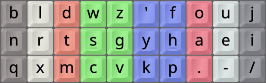
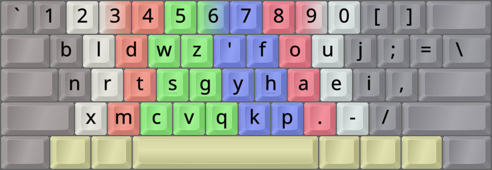
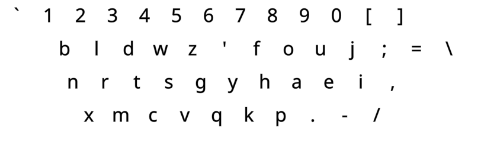
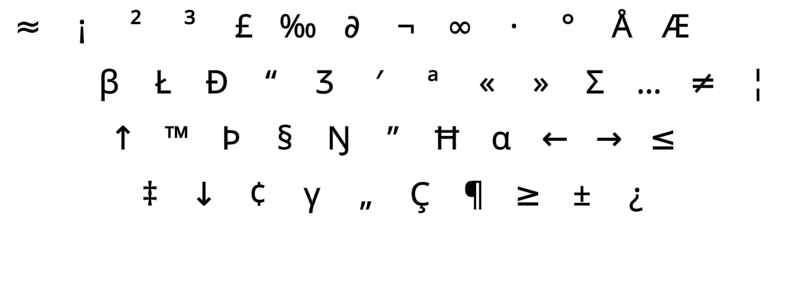
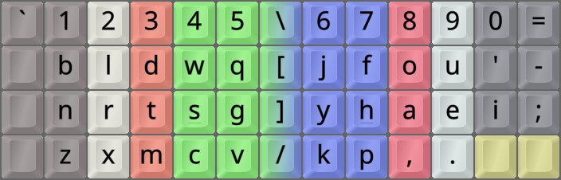
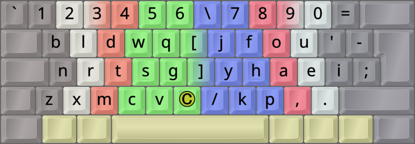
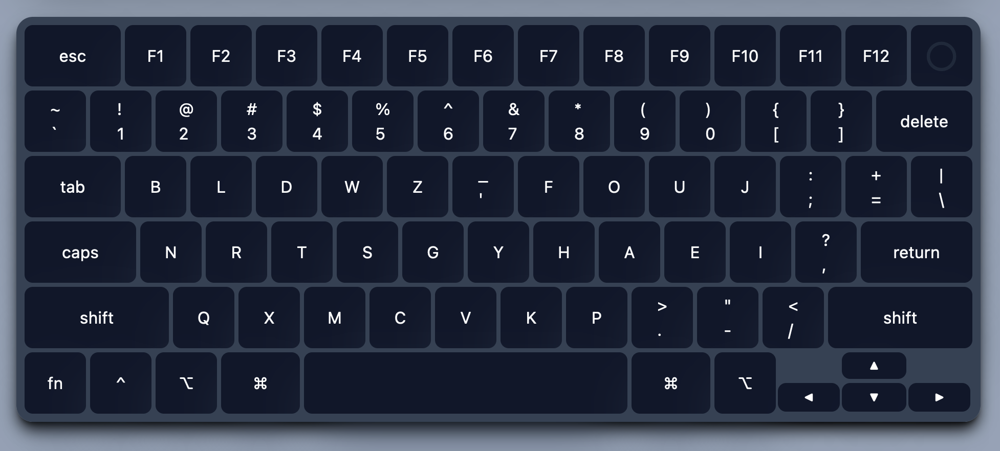

DreymaR's Big Bag Of Keyboard Tricks - EPKL
===========================================
_For info on my Graphite variant, [see the Gralmak section below](#gralmak)_

<br><br>



_The Graphite layout on an Ortho keyboard_

<br>

The Graphite layout
-------------------
- This layout was made by Richard Davison alias 'stronglytyped', 2022-12, as a development from [Sturdy][StrPKL].
- It may be said to use the [**Curl**][ErgCrl] principle, by reducing lateral stretches to the middle home row positions.
- An [**Angle**][ErgAWi] ergo mod is recommended for this layout on row-staggered boards.
- For more info, see [the Graphite repo on GitHub][GraGit].
- Graphite is similar to other recent layouts, like [Nerps (by Smudge)][NrpGra] and [Gallium (by GalileoBlues)][GalGit].
- It is, in fact, amazing how Graphite and [Gallium][GalPKL] are virtually the same layout, albeit developed independently!
<br>

- Fun quote on why it's called Graphite: "...because it is a rock used for writing, and also rock beats [scissors][GraSci]".
- Its standard variant changes some shifted mappings; see below.
<br><br>



_The default Graphite layout (using the Angle mod) on an ANSI keyboard_

<br>

#### The Graphite layout on a ortho/matrix board, showing base and shifted mappings:
```
+----------------------------+
| 1 2 3 4 5   6 7 8 9 0  [ ] |
| b l d w z   ' f o u j  ; = |
| n r t s g   y h a e i  , \ |
| q x m c v   k p . - /      |
+----------------------------+
| ! @ # $ %   ^ & * ( )  { } |
| B L D W Z   _ F O U J  : + |
| N R T S G   Y H A E I  ? | |
| Q X M C V   K P > " <      |
+----------------------------+
```

#### The Graphite layout on an ANSI board, with an Angle(Q) ergo mod:
```
+-----------------------------+
| b l d w z   ' f o u j ; = \ |
| n r t s g   y h a e i ,     |
|  x m c v q   k p . - /      |
+-----------------------------+
```
<br>

||
|   :---:   |
|_The Graphite-eD layout on an ANSI board, unshifted layer_|

||
|   :---:   |
|_The Graphite-eD layout on an ANSI board, AltGr+Shift layer_|

<br><br>

Graphite-HB
-----------
- Graphite has four non-standard shift level mappings, see the figure below.
- This affects the Quote (QU), Minus (MN), Comma (CM) and Slash (SL) keys.
- This makes the double quote and question mark more accessible; not a bad idea in and of itself.
- In my opinion though, that's not quite worth it, making key remapping (VK maps, programmable boards/devices using HID protocol) a lot harder.
- Consequently, I added a keymap-friendly variant, the `Graphite-HB` ("**HB**" for "Hardware Bound" – and for fun!).
- You can select your preferred variant using the `Variant/Locale` setting in the `Layout Selector` GUI.
- The `HB` variant does make the common double quote hard to reach on this layout, especially on row-staggered boards.
- However, with EPKL it's possible to get around such problems elegantly by using a [CoDeKey][CoDeKy] or other [sequencing][BBTseq] options.
- Another option for quote key fans, is to use a [Gallium][GalPKL] variant instead, or [Gralmak][gralmk]. These, like Colemak, relegate the `J` key to that awkward position.
<br>

#### Graphite's altered shift state mappings, from its [web page][GraGit]:
```
+----------------------------+
| b l d w z   ' f o u j  ; = |
| n r t s g   y h a e i  , \ |
| q x m c v   k p . - /      |
+----------------------------+
| · · · · ·   _ · · · ·  · · |
| · · · · ·   · · · · ·  ? · |
| · · · · ·   · · · " <      |
+----------------------------+
```
<br>

Graphite Wide and Sym variants
------------------------------

- [**W**ide][ErgAWi] ergo mods (moving right-hand keys one position to the right) usually place the two bracket keys in the middle.
- For a Wide modded Graphite variant, some special remaps from standard key positions are necessary.
- The base Graphite layout already moves its bracket keys to the top row, putting SC(;) and PL(=) in their places.
<br>

- [**S**ym(bol)][ErgSym] mods usually prioritize the common <kbd>'"</kbd> (Apostrophe/Quote) and <kbd>-_</kbd> (Hyphen/Underscore) keys.
- Graphite already moves most of the symbol keys around in its own fashion, so not everyone may want a further Sym mod.
- As seen below though, the [Gralmak][gralmk] variant is in itself a Sym (UnSym) mod, making for familiar AngleWideSym combos.
- I advise moving the Quote key to be even more accessible. Especially if using the `HB` (keymap friendly) variant!
- For Wide variants, a Sym mod is beneficial. I've proposed Graphite WideSym variants similar to my other WideSym layout variants.
- I prefer the hyphen on the upper row instead of the lower row. Seems this is a matter of individual preference.
- For ISO that's easily achievable, but for ANSI you have no extra key to the right of Quote (Graphite Comma).
- The solution for ANSI seems to be to bring Comma back to the lower row, and with that the `E,` same-finger bigram. Let me know if you have a better suggestion.
<br>

#### Graphite AWS-ANSI proposal, with the comma under UE:
```
+----------------------------+
| 1 2 3 4 5 6 \ 7 8 9 0 =    |
|  b l d w z [ ' f o u j - ; |
|  n r t s g ] y h a e i     |
|   x m c v q / k p . ,      |
+----------------------------+
```

#### Graphite AWS-ISO proposal, with comma on pinky:
```
+----------------------------+
| 1 2 3 4 5 6 \ 7 8 9 0 =    |
|  b l d w z [ ' f o u j -   |
|  n r t s g ] y h a e i ,   |
| q x m c v _ / k p . ;      |
+----------------------------+
```

The details of Graphite WideSym modding aren't up to me alone, of course. I asked Richard Davison for his thoughts on it, and got [an insightful reply][GraPct].

He thinks that at least one of period and comma should be on a strong finger, so putting comma on the pinky may not be great. In fact, he suggests keeping period and comma in their old QWERTY positions for Wide modders, to keep things simple! This is what my Gralmak variant (described in the next section) does.
<br>

#### Graphite AWS-ISO proposal, with more traditional punctuation:
```
+----------------------------+
| 1 2 3 4 5 6 \ 7 8 9 0 =    |
|  b l d w z [ ' f o u j -   |
|  n r t s g ] y h a e i ;   |
| q x m c v _ / k p , .      |
+----------------------------+
```

In sum, if you want to Wide/-Sym mod Graphite there are several options. I advise reading about Gralmak below, as it provides one ready-made option – with a couple of key swaps thrown in for good measure.
<br><br>


_One possible Graphite-(C)AWS-ISO layout. The © key can be a Compose key, or whatever you wish._

<br><br>

Gralmak
-------
- I wanted to make a Graphite variant with traditional symbol/punctuation placements.
- Like most other layouts (and Graphite-HB), I didn't want to change the Shift states of keys.
- Thus came about the Gralmak variant that's easily ergo modified like, e.g., Colemak-CAWS.
- Like the [Gallium][GalPKL] and [Colemak][CmkPKL] layouts, I want J in the middle and a symbol (Quote) on pinky.
- Eventually, I also brought Z back to its familiar spot where QWERTY and Colemak has it.
- The name is a play on Graphite-Gallium-Colemak, and our quest for the mythical "Holy Grail" of layouts!
<br><br>


_The Gralmak layout variant on an Ortho keyboard_

<br>

#### Gralmak on an ortho board (J-' and Z-Q swaps; trad. punctuation):
```
+----------------------------+
| 1 2 3 4 5   6 7 8 9 0  - = |
| b l d w q   j f o u '  [ ] |
| n r t s g   y h a e i  ; \ |
| z x m c v   k p , . /      |
+----------------------------+
```

#### Gralmak AWS-ISO:
```
+----------------------------+
| 1 2 3 4 5 6 \ 7 8 9 0 =    |
|  b l d w q [ j f o u ' -   |
|  n r t s g ] y h a e i ;   |
| z x m c v _ / k p , .      |
+----------------------------+
```
<br>

- It's easier to learn for someone coming from QWERTY, Colemak, and other layouts that leave the symbol keys unchanged.
- In this capacity, it can be a stepping-stone to full Graphite! Learn Gralmak first, then decide whether to proceed.
- This incurs some worse punctuation bigrams. Since I use my thumb [CoDeKey][CoDeKy] for most punctuation, I don't care.
<br>

- This layout manages to satisfy newer analyzers and still keep some similarity to well-known layouts like Colemak.
- For instance, only `L N M` and `F A E` swap hands from QWERTY; `L N M` and `F A P` from Colemak.
- The familiar `QW RT ZX CV` bigrams are (semi-)preserved in Gralmak, also aiding learning and recognition.
- Also see the README for the similar [Galliard][Gallrd] Gallium variant.
<br>



_Gralmak-WideSym on an Ortho keyboard._

<br>

- Below is a comparison of the Graphite layout and the Gralmak variant, disregarding most punctuation.
- It's made by the 'cmini' analyzer at the AKL Discord, with thumb-key for common punctuation.
- As shown, the differences consist of swapping `J` and `QU`, and swapping `Z` and `Q`.
- All overall stat differences are so small that I don't think they can be considered significant.

- The J-QU swap makes 2-key rolls more outwards by 0.4%; this is okay with me.
- One-hand 3-key rolls are not significantly affected.
- The [Q-Z swap][Gal-QZ] retains a little more QWERTY/Colemak familiarity, at a very low stat cost.
- There is a small increase in alternating same-finger skipgrams, which I think is okay.
- Non-SFS alternation, accordingly, goes down by an insignificant amount (from 33.85% to 33.80%).

```
gralmak-thumb(new) - graphite-thumb(old)
  b l d w ~  ~ f o u ~
  n r t s g  y h a e i
  ~ x m c v  k p     /
                 , . ;

SHAI:
  Alter: -0.05%
  Rolls: -0.02%   (In/Out: -0.42% |  0.39%)
  One-h:  0.03%   (In/Out: -0.04% |  0.07%)
  Redir: -0.02%   (Bad:    -0.03%)

  SFB:    0.00%
  SFS:    0.06%   (Red/Alt: 0.01% | 0.05%)
```
<br>



_Gralmak-AWS-ISO. The © key can be a Compose key, or whatever you wish._

<br><br>



_The Graphite layout, as depicted on its own [web page][GraGit]._

<br><br>

GralQwest
---------
- Some [Colemak][CmkPKL] learners have used my [Tarmak][BBTtmk] transitional layouts to learn the layout in smaller steps.
- Some even said they couldn't have done it all at once. Others strongly prefer going all the way at once, cold turkey.
- Learning Gralmak from QWERTY is a longer way since Colemak(-DH) moves only 17(18) keys and Gralmak 24.
- It's still possible to construct learning loops for users who want to learn 3–6 keys at a time.

Here's a way of splitting up a QWERTY-to-Gralmak transition into five steps, roughly sorted by key frequencies:
```
Big loop of 18 keys:
    S → F → U → O → I → ; → 
    P → M → C → V → B → Q → 
    T → D → E → L → W → R

Miniloops of 3 keys:
    A → K → N
    Y → H → J

Not moved – 3 keys:
    G   Z   X
```

- It makes sense to misplace less common keys during the big loop steps: `;` in step 1, `Q` in step 2.
- The rationale for postponing the common `E` and `T` is to avoid misplacing the common `R`.
- It's up to the user whether miniloops should go before or after the big loop. The `Y` miniloop gives less benefit.
- the semicolon can be swapped with the apostrophe in the 2nd part of the big loop, when it finds its place.
- For now, I'm doing this mostly as a mental exercise. 
- If someone really wants to use such a set of transitional layouts, I could help implement them.

Thus, five "GralQwest" QWERTY-to-Gralmak transitional layouts might look as follows:
```
GralQwest 0, alias QWERTY:
q w e r t    y u i o p
a s d f g    h j k l ; '
z x c v b    n m , . /

GralQwest 1 (big loop 1/3):
q w e r t    y F O U p
a ; d S g    h j k l I '                S → F → U → O → I → (;)
z x c v b    n m

GralQwest 2 (big loop 2/3):
B w e r t    y f o u '
a q d s g    h j k l i ;                P → M → C → V → B → (Q)
z x M C V    n P

GralQwest 3 (big loop 3/3):
b L D W Q    y f o u '
a R T s g    h j k E i ;                T → D → E → L → W → R
z x m c v    n p

GralQwest 4 (A miniloop):
b l d w q    y f o u '
N r t s g    h j A e i ;                A → K → N
z x m c v    K p

GralQwest 5 (Y miniloop), alias Gralmak:
b l d w q    J f o u '
n r t s g    Y H a e i ;                Y → H → J
z x m c v    k p , . /
```

This progression prioritizes getting the big loop over with, to avoid "limbo" keys in neither-QWERTY-nor-Gralmak positions.

Alternatively, here are five "GralQwest" QWERTY-to-Gralmak transitional layouts with miniloops first:
```
GralQwest 0, alias QWERTY:
q w e r t    y u i o p
a s d f g    h j k l ;
z x c v b    n m , . /

GralQwest 1 (A miniloop):
q w e r t    y u i o p
N s d f g    h j A l ;                  A → K → N
z x c v b    K m

GralQwest 2 (Y miniloop):
q w e r t    J u i o p
n s d f g    Y H a l ;                  Y → H → J
z x c v b    k m

GralQwest 3 (big loop 1/3):
q w e r t    j F O U p
n ; d S g    y h a l I                  S → F → U → O → I → (;)
z x c v b    k m

GralQwest 4 (big loop 2/3):
B w e r t    j f o u '
n q d s g    y h a l i ;                P → M → C → V → B → (Q)
z x M C V    k P

GralQwest 5 (big loop 3/3), alias Gralmak:
b L D W Q    j f o u '
n R T s g    y h a E i ;                T → D → E → L → W → R
z x m c v    k p , . /
```

This progression might be useful if you wish to practice some smaller loops first. After step 3, you may want to jump to the finish.


[GraGit]: https://github.com/rdavison/graphite-layout               (The Graphite layout on GitHub)
[GalGit]: https://github.com/GalileoBlues/Gallium                   (The Gallium layout on GitHub)
[NrpRed]: https://www.reddit.com/r/KeyboardLayouts/comments/tpwyjc/ (The Nerps layout on Reddit)
[NrpGra]: https://www.reddit.com/r/KeyboardLayouts/comments/tpwyjc/comment/jck98z6/ (Graphite comment in the Nerps post on Reddit)
[GraSci]: https://github.com/rdavison/graphite-layout/blob/main/README.md#on-scissors (The Graphite README on Scissors)
[CmkPKL]: /Layouts/Colemak/                                         (The Colemak layout in EPKL)
[StrPKL]: /Layouts/Sturdy/                                          (The Sturdy layout in EPKL)
[GalPKL]: /Layouts/Gallium/                                         (The Gallium layout in EPKL)
[Gallrd]: /Layouts/Gallium/README.md#galliard                       (The Galliard Gallium layout variant)
[Gralmk]: #gralmak                                                  (The Gralmak Graphite layout variant)
[Galite]: https://github.com/almk-dev/galite/                       (The Galite layout variant, nearly equal to Gralmak - but then removed)
[ErgAWi]: https://dreymar.colemak.org/ergo-mods.html#angle-wide     (DreymaR's BigBag on Angle+Wide ergo mods)
[ErgCrl]: https://dreymar.colemak.org/ergo-mods.html#curl-dh        (DreymaR's BigBag on the Curl-DH ergo mod)
[ErgSym]: https://dreymar.colemak.org/ergo-mods.html#symbols        (DreymaR's BigBag on the Symbols ergo mod)
[BBTseq]: https://dreymar.colemak.org/layers-main.html#sequences    (DreymaR's BigBag on sequencing)
[BBTtmk]: https://dreymar.colemak.org/tarmak-intro.html             (DreymaR's Big Bag on Tarmak transitions)
[CoDeKy]: https://github.com/DreymaR/BigBagKbdTrixPKL/blob/master/README.md#advanced-composecodekey  (The EPKL README on the CoDeKey)
[Gal-QZ]: https://github.com/GalileoBlues/Gallium/issues/6#issuecomment-2665066910      (Discussing a Q-Z swap w/ almk on the Gallium repo)
[GraPct]: https://github.com/rdavison/graphite-layout/issues/2#issuecomment-2787752575  (Discussing Graphite punctuation and Wide mods on its repo)
