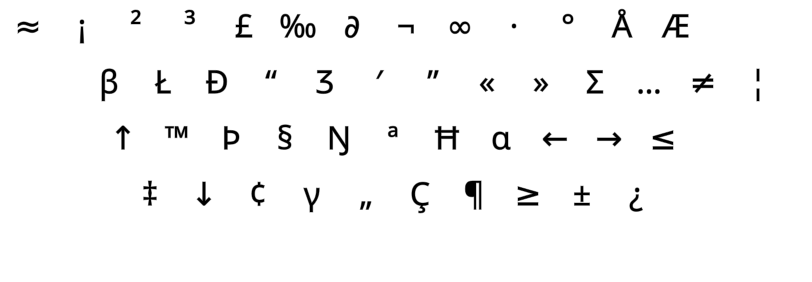

DreymaR's Big Bag Of Keyboard Tricks - EPKL
===========================================
<br><br>


_The default Graphite layout (using the Angle mod) on an ANSI keyboard_

<br><br>

The Graphite layout
--------------------
- This layout was made by Richard Davison alias 'stronglytyped', 2022-12.
- It may be said to use the [**Curl**][ErgCrl] principle, by reducing lateral stretches to the middle home row positions.
- An [**Angle**][ErgAWi] ergo mod is recommended for this layout on row-staggered boards.
- It changes some shifted mappings; see below.
- For more info, see [the Graphite repo on GitHub][LayGit].
<br>

#### The Graphite layout on a ortho/matrix board, showing base and shifted mappings:
```
+----------------------------+
| 1 2 3 4 5   6 7 8 9 0  [ ] |
| b l d w z   ' f o u j  ; = |
| n r t s g   y h a e i  , \ |
| q x m c v   k p . - /      |
+----------------------------+
| ! @ # $ %   ^ & * ( )  { } |
| B L D W Z   _ F O U J  : + |
| N R T S G   Y H A E I  ? | |
| Q X M C V   K P > " <      |
+----------------------------+
```

#### The Graphite layout on an ANSI board, with an Angle(Q) ergo mod:
```
+-----------------------------+
| b l d w z   ' f o u j ; = \ |
| n r t s g   y h a e i ,     |
|  x m c v q   k p . - /      |
+-----------------------------+
```

<br>

||
|   :---:   |
|_The Graphite-eD layout on an ANSI board, unshifted layer_|

||
|   :---:   |
|_The Graphite-eD layout on an ANSI board, AltGr+Shift layer_|

<br><br>

Graphite-HB
-----------
- Graphite has four non-standard shift level mappings, see the figure below.
- This affects the Quote (QU), Minus (MN), Comma (CM) and Slash (SL) keys.
- I guess the idea is to make the double quote and question mark more accessible.
- In my opinion, that's not quite worth it as it makes key remapping (VK maps, programmable boards/devices using the HID protocol) harder.
- Consequently, I added a keymap-friendly variant, the `Graphite-HB` ("**HB**" for "Hardware Bound" or something – and for fun!).
- You can select your preferred variant using the `Variant/Locale` setting in the `Layout Selector` GUI.
- The `HB` variant does make the common double quote hard to reach on this layout, especially on row-staggered boards. Hmmm...
- The two variants use separate EPKL BaseLayout files with minor differences.
<br>

#### Graphite's altered shift state mappings, as per its [web page][LayGit]:
```
+----------------------------+
| b l d w z   ' f o u j  ; = |
| n r t s g   y h a e i  , \ |
| q x m c v   k p . - /      |
+----------------------------+
| • • • • •   _ • • • •  • • |
| • • • • •   • • • • •  ? • |
| • • • • •   • • • " <      |
+----------------------------+
```

<br><br>

Graphite Wide and Sym variants
------------------------------

- [**W**ide][ErgAWi] ergo mods (moving right-hand keys one position to the right) usually place the two bracket keys in the middle.
- For a Wide modded Graphite variant, some special remaps from standard key positions are necessary.
- The base Graphite layout already moves its bracket keys to the top row, putting SC(;) and PL(=) in their places.
<br>

- [**S**ym(bol)][ErgSym] mods usually prioritize the common <kbd>'"</kbd> (Apostrophe/Quote) and <kbd>-_</kbd> (Hyphen/Underscore) keys.
- Graphite already moves most of the symbol keys around in its own fashion, so not everyone may want a further Sym mod?
- I'd advise moving the Quote key to be even more accessible. Especially if using the `HB` (keymap friendly) variant!
- For Wide variants, a Sym mod is beneficial. I've proposed Graphite WideSym variants similar to my other WS layout variants.
- The best tack is to do a Sym mod for the hyphen only, as I prefer that to be on the upper row instead of the lower row.
- For ISO that's easily achievable, but for ANSI you have no extra key to the right of Quote (Graphite Comma).
- The solution for ANSI seems to be to bring Comma back to the lower row, and with that the `E,` same-finger bigram. Let me know if you have a better suggestion.
<br>

#### Graphite (C)AWS-ISO proposal:
```
+----------------------------+
| 1 2 3 4 5 6 \ 7 8 9 0 =    |
|  b l d w z [ ' f o u j -   |
|  n r t s g ] y h a e i ,   |
| q x m c v _ / k p . ;      |
+----------------------------+
```

#### Graphite (C)AWS-ANSI proposal, with the comma under UE:
```
+----------------------------+
| 1 2 3 4 5 6 \ 7 8 9 0 =    |
|  b l d w z [ ' f o u j - ; |
|  n r t s g ] y h a e i     |
|   x m c v q / k p . ,      |
+----------------------------+
```

<br>

The details of Graphite WideSym modding aren't up to me alone, of course. I've asked Richard Davison for his thoughts on it.
<br>


_The Graphite-(C)AWS-ISO layout. The © key can be a Compose key, or whatever you wish._


<br><br>


_The Graphite layout. Image taken from its own [web page][LayGit]._


[LayGit]: https://github.com/rdavison/graphite-layout (The Graphite layout on GitHub)
[ErgAWi]: https://dreymar.colemak.org/ergo-mods.html#angle-wide (DreymaR's BigBag on Angle+Wide ergo mods)
[ErgCrl]: https://dreymar.colemak.org/ergo-mods.html#curl-dh    (DreymaR's BigBag on the Curl-DH ergo mod)
[ErgSym]: https://dreymar.colemak.org/ergo-mods.html#symbols    (DreymaR's BigBag on the Symbols ergo mod)
