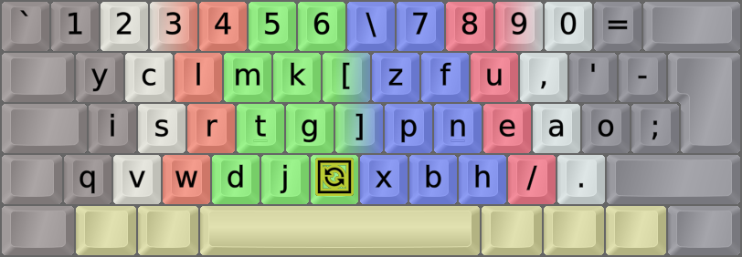

<h1 align=center line-height=1.6>ISRT</h1><br><br>

<div align=center ></div><br>

NotGate's ISRT alias the "IndyRad" layout
-----------------------------------------
- Discord user [NotGate's ISRT - or as I call it, IndyRad][NotGte] - layout, implemented as a Cmk mod.
    - ISRT isn't really a mod of Cmk, but a sibling layout that turned out quite similar to Cmk-DH.
    - Because of said similiarity, it was practically implemented here as a Cmk-DH "mod".
    - ISRT includes the [**C**url][ErgCrl] principle insofar as it uses the same D and H positions as Cmk-DH.
    - On a row-staggered board it should also include an [**A**ngle][ErgAWi] mod.
    - It's also compatible with the standard Wide and [**S**ym][ErgSym] mods I've used elsewhere, so they're added.
- About naming: NotGate simply named the layout ISRT but I found that boring. So I searched, and found:
    - [http://www.isrt.org.in/][IndSRT] - the Indian Society of Radiographers & Technologists! IndyRad!  (✿◠‿◠)
    - No one seem to be using that name though. Too bad, as I see the layout's name misspelled as IRST instead...
<br>



_The ISRT-(C)AWS-ISO layout. The ISO key is here shown as a Repeat special key._
<br><br>

NotGate's version history right before release:
-----------------------------------------------
This may not be central information, but the layout underwent some tweaks before release, making it easier to use Angle and Sym mods with ISRT.
<br><br>

#### ISRT, 2021-01-27 (Q-Y swap improves Y position and Angle-ANSI mod):
```
+-----------------------------+
| y c l m k   z f u , ' [ ] \ |
| i s r t g   p n e a o ;     |
|  q v w d j   b h / . x      |
+-----------------------------+
Remaps from Cmk-DH:
/ a ⇔ i / w ⇔ c / f ⇔ l / p ⇔ m / b ⇔ k / r ⇔ s / y > q > z > j > v > x > SL > CM /
```

#### ISRT, 2021-01-26 (P>K>B>M loop, Quote untouched):
```
+-----------------------------+
| q c l m k   z f u , ; [ ] \ |
| i s r t g   b n e a o '     |
|  y v w d j   p h / . x      |
+-----------------------------+
Remaps from Cmk-DH:
/ a ⇔ i / w ⇔ c / f ⇔ l / p > k > b > m / r ⇔ s / y > z > j > v > x > SL > CM /
```

#### ISRT, pre 2021-01-26 (P-M & B-K swaps):
```
+-----------------------------+
| q c l m k   z f u , ; [ ] \ |
| i s r t g   p n e a o /     |
|  y j w d v   b h ' . x      |
+-----------------------------+
Remaps from Cmk-DH:
/ a ⇔ i / w ⇔ c / f ⇔ l / p ⇔ m / b ⇔ k / r ⇔ s / y > z > j > x > SL > QU > CM /
```
<br>

||
|   :---:   |
|_EPKL help image for the ISRT-CAWS layout on an ISO board_|

[NotGte]: https://notgate.github.io/layout/ (NotGate's layout page, home of the ISRT layout)
[IndSRT]: http://www.isrt.org.in/ (Indian Society of Radiographers & Technologists)
[ErgAWi]: https://dreymar.colemak.org/ergo-mods.html#angle-wide (DreymaR's BigBag on Angle+Wide ergo mods)
[ErgCrl]: https://dreymar.colemak.org/ergo-mods.html#curl-dh    (DreymaR's BigBag on the Curl-DH ergo mod)
[ErgSym]: https://dreymar.colemak.org/ergo-mods.html#symbols    (DreymaR's BigBag on the Symbols ergo mod)
