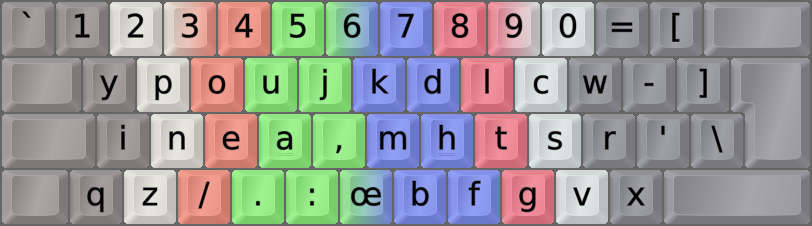

DreymaR's Big Bag Of Keyboard Tricks - EPKL
===========================================

 

_The MTGAP layout with the [Angle and Sym ergonomic mods][BB_Erg] on an ISO board_

 

The MTGAP layout
----------------
- The [MTGAP][MTGAPm] layout designed by [Michael Dickens][MTGaPp] scores well in modern analysis.
- It's a more radical layout than Colemak, changing everything around – even shift layers.
- There are actually several variants of it for different board configurations.
- EPKL comes with the minimal 30-key version that only moves the main letter block of keys.
- This layout can be used with the usual BigBag Angle and Sym ergonomic mods added, as seen above.
    - The ANSI Angle-Z mod will displace Q to the middle. The Wide mods will displace X to the middle.
    - Those are rare letters, but some bigrams like QU and XC may get trickier that way.
  

According to its designer: 
Relative to Colemak and Dvorak, the MTGAP layout puts more priority on single-hand rolls and less on hand 
alternation (notice the positions of TH, NE, ST and the fairly unusual feature of having O off the home row).

 

||
|   :---:   |
|_Unshifted MTGAP help image on an ANSI board_|

 

||
|   :---:   |
|_Shifted MTGAP help image on an ANSI board_|

[MTGAPm]: https://mathematicalmulticore.wordpress.com/the-keyboard-layout-project/ (The MTGAP project)
[MTGaPp]: https://mdickens.me/ (*M*ichael "*T*he *G*lorious *A*nd *P*owerful")
[BB_Erg]: https://dreymar.colemak.org/ergo-mods.html (DreymaR's Big Bag of Tricks on ergo mods)
