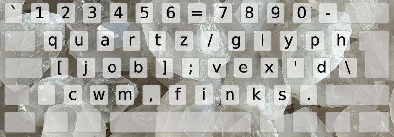
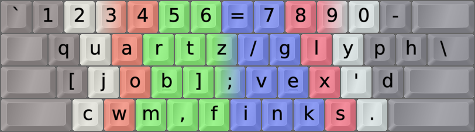

<h1 align=center line-height=1.6>QUARTZ</h1>  

 

The rock solid QUARTZ Perfect Pangram layout
--------------------------------------------
- This layout is based on a [perfect pangram][WikPan]. Therefore, it is a perfect layout!
- Somehow, I felt it's best used with AngleWide hand positions, as seen on the colored image below.
- It should be perfectly suited for typists who want to write about quartz glyph jobs and/or [cwm](https://en.wikipedia.org/wiki/Cirque) finks.
- If you want to horse around instead of rocking hard, try the [Foalmak][LayFoa] layout?

￣(=⌒ᆺ⌒=)￣

 

  

 
 
                        
<b>May the Quartz be with you, always!</b>

 

<h1 align=center>⌨&nbsp;&nbsp;&nbsp;⌨&nbsp;&nbsp;&nbsp;⌨&nbsp;&nbsp;&nbsp;⌨&nbsp;&nbsp;&nbsp;⌨</h1>

[WikPan]: https://en.wikipedia.org/wiki/Pangram#Perfect_pangrams    (Wikipedia on perfect pangrams)
[LayFoa]: /Layouts/Foalmak#foalmak                                  (The Foalmak layout in EPKL)
[LayQua]: /Layouts/QUARTZ#quartz                                    (The QUARTZ layout in EPKL)
