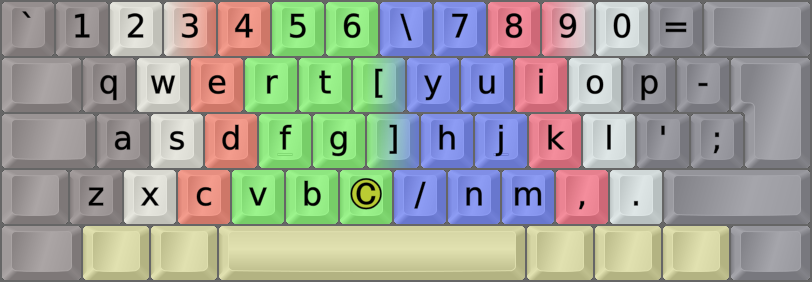

<h1 align=center line-height=1.6>QWERTY</h1>  

 

Þe Olde QWERTY Layout
---------------------
- The standard QWERTY layout is included in EPKL for those who may need it, even though it's a bad layout.
- It's imlplemented in `eD` (my AltGr mappings/deadkeys) and `VK` (key remappings only) layout types.
- You can choose some ergonomic mods like Angle, AWide and/or Sym. Curl/DH mods don't exist for it.
- Due to QWERTY-eD's quirky implementation as a remap from Colemak, KeyMapper entries must map from Colemak-eD positions.
    - Example: If you want to add an umlaut to your QWERTY <kbd>U</kbd> key, you must map to `QW_I` since Cmk <kbd>U</kbd> is on QWE <kbd>I</kbd>.
    - So, in this case remap like this: `QW_I = vc_U   5   u   U   --  ü   Ü` to change the <kbd>U</kbd> key.
- The QWERTY VK layouts have their own BaseLayout, so using the KeyMapper should be unproblematic for them.
 

 

_This image shows some EPKL possibilities: Angle/Wide/Sym ergo mods, and a Compose key in the middle of an ISO keyboard._

 

<h1 align=center>⌨&nbsp;&nbsp;&nbsp;⌨&nbsp;&nbsp;&nbsp;⌨&nbsp;&nbsp;&nbsp;⌨&nbsp;&nbsp;&nbsp;⌨</h1>
