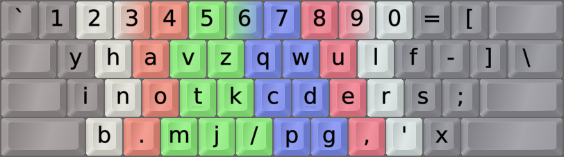
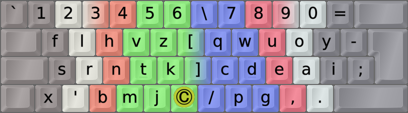

DreymaR's Big Bag Of Keyboard Tricks - EPKL
===========================================
<br><br>



_Semimak AngleSym on an ANSI keyboard_

<br><br>

The Semimak layout
------------------
- This layout was made by Semilin alias Semi based on novel analysis techniques, 2021-07.
- Among other things, it uses his finger speeds for modeling instead of subjective weights.
- It also models some new factors like skipgrams (disjointed SFBs).
- For more info, see the web pages for [Semimak][SemGit] and [Semi's Genkey analyzer][SemGen].
- Also, here's an interesting [reflection on Semimak by Semilin][Sem200] after hitting 200 WPM with it.
- An [**Angle**][ErgAWi] ergo mod is recommended for this layout on row-staggered boards.
- I moved the Semimak-eD `‚‘’` quotes so their relative positions match Colemak-eD.
<br>

This layout gets special mention in [Getreuer's Alt Keyboard Layout guide][GetAKL]. Have a look!
<br>

#### Semimak vanilla:
```
+----------------------------+
| f l h v z   q w u o y  [ ] |
| s r n t k   c d e a i  ; \ |
| x ' b m j   p g , . /      |
+----------------------------+
I'd add a Sym mod to the brackets-equals-hyphen keys.
```

#### Semimak AngleWide-ANSI:
```
+----------------------------+
| 1 2 3 4 5 6 = 7 8 9 0 -    |
|  f l h v z [ q w u o y ; \ |
|  s r n t k ] c d e a i     |
|   ' b m j x / p g , .      |
+----------------------------+
```

<br>

||
|   :---:   |
|_The Semimak-eD layout on an ANSI board, unshifted layer_|

||
|   :---:   |
|_The Semimak-eD layout on an ANSI board, AltGr+Shift layer_|

<br><br>


The Semimak-JQ layout
---------------------
After a while of testing and getting feedback after the one-month Semimak speed contest, Semi made a little twist and now he uses the [Semimak-JQ][Sem_JQ] mod that he made in September 2021.

It's just a `Q > J > '` cycle so it's no big change. Although Semi thinks it's "objectively" better and solves some problems with apostrophe n-grams, some of the fastest Semimak typists still prefer the original.

In EPKL you can select Semimak-eD-JQ as a layout variant of Semimak-eD: In the `Layout Selector` GUI, use the `Variant/Locale` setting.
<br>

#### Semimak-JQ
```
+----------------------------+
| f l h v z   ' w u o y  [ ] |
| s r n t k   c d e a i  ; \ |
| x j b m q   p g , . /      |
+----------------------------+
Remap cycle from vanilla: Q > J > QU
```

<br><br>

Semimak(-JQ) Wide and AWS variants
----------------------------------
The Semimak layout doesn't really follow the [**C**url][ErgCrl] principle explicitly, although it doesn't put too common letters in the "middle trench" positions (QWERTY GH). So a Curl (C) mod isn't relevant for it.
<br>

Semimak's [**W**ide][ErgAWi] mod (right-hand keys one step to the right) is pretty straightforward since it doesn't change any of the symbol keys' positions. Semimak, consequently, can use the same Wide mods as Colemak and QWERTY.
<br>

The same goes for the [**S**ym(bol)][ErgSym] mod to prioritize the common QU (<kbd>'"</kbd>) and MN (<kbd>-_</kbd>) keys, with one little exception: Unlike Colemak, Semimak doesn't move the SC (<kbd>;:</kbd>) key up to the QWERTY P position. Therefore, it should use only the hyphen half of the Sym mods. EPKL has `Sym-Mn` remaps defined for this.
<br>

#### Semimak-JQ AWS-ISO, for a wide mod and a more accessible hyphen key position:
```
+----------------------------+
| 1 2 3 4 5 6 \ 7 8 9 0 =    |
|  f l h v z [ ' w u o y -   |
|  s r n t k ] c d e a i ;   |
| x j b m q _ / p g , .      |
+----------------------------+
```

<br>



_Semimak AngleWideSym on an ISO keyboard. The © key can be a Compose key, or whatever you wish._


[SemGit]: https://semilin.github.io/semimak/                    (Semimak on GitHub.io)
[SemGen]: https://www.semilin.dev/genkey/                       (Semi's Genkey analyzer)
[Sem_JQ]: https://semilin.github.io/semimak/#org0e746fb         (Semimak-JQ)
[Sem200]: https://semilin.github.io/blog/hitting_200wpm.html    (Semilin on hitting 200 WPM)
[ErgAWi]: https://dreymar.colemak.org/ergo-mods.html#angle-wide (DreymaR's BigBag on Angle+Wide ergo mods)
[ErgCrl]: https://dreymar.colemak.org/ergo-mods.html#curl-dh    (DreymaR's BigBag on the Curl-DH ergo mod)
[ErgSym]: https://dreymar.colemak.org/ergo-mods.html#symbols    (DreymaR's BigBag on the Symbols ergo mod)
[GetAKL]: https://getreuer.info/posts/keyboards/alt-layouts/index.html#which-alt-keyboard-layout-should-i-learn (Pascal Getreuer's Alt Keyboard Layout guide)
