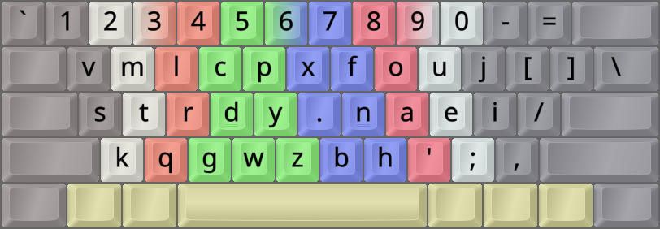
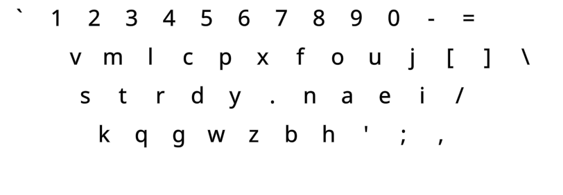
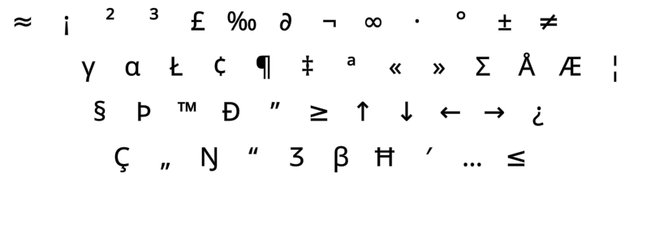
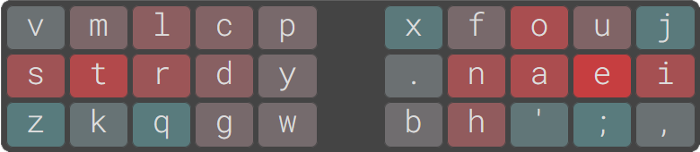

DreymaR's Big Bag Of Keyboard Tricks - EPKL
===========================================
<br><br>



_The default Sturdy layout (using the Angle mod) on an ANSI keyboard_

<br><br>

The Sturdy layout
--------------------
- This layout was made by Oxey, 2022-07, using his own analysis program.
- It may be said to use the [**Curl**][ErgCrl] mod principle, reducing lateral stretches to the middle home row positions.
- An [**Angle**][ErgAWi] ergo mod is recommended for this layout on row-staggered boards.
- For more info, see its [layout home page][LayHom] and [the Oxeylyzer page][AnaHom].
<br>

#### The Sturdy layout on a ortho/matrix board:
```
+----------------------------+
| v m l c p   x f o u j  [ ] |
| s t r d y   . n a e i  / \ |
| z k q g w   b h ' ; ,      |
+----------------------------+
```

#### The <<NewLayout>> layout on an ANSI board, with an Angle mod for correct lower-row stagger:
```
+-----------------------------+
| v m l c p   x f o u j [ ] \ |
| s t r d y   . n a e i /     |
|  k q g w z   b h ' ; ,      |
+-----------------------------+
```

<br>

||
|   :---:   |
|_The Sturdy-eD layout on an ANSI board, unshifted layer_|

||
|   :---:   |
|_The Sturdy-eD layout on an ANSI board, AltGr+Shift layer_|

<br><br>

Sturdy variants
------------------
- Oxey's Reddit comment on Wide variants:
	- https://www.reddit.com/r/KeyboardLayouts/comments/15zu2rn/comment/jysbcn8/?context=2
<br>

	[Question: How would Oxey envision a Sturdy-Wide variant?]. On ISO I'd do this:

	Sturdy (C)AW-ISO:
	 v m l c p  \  x f o u j
	 s t r d y  /  . n a e i ,
	z k q g w  _ -  b h ' ;

	and on ANSI I think this would be good:

	Sturdy Wide-ANSI:
	v m l c p  /  x f o u , \
	s t r d y  -  . n a e i
	 z k q g w  j  b h ' ; 

	But thinking about this now tells me that ANSI version isn't ideal. Probably angle with Z in that position would be better:

	Sturdy (C)AW-ANSI; special Angle mod:
	v m l c p  /  x f o u , \
	s t r d y  -  . n a e i
	 k q g w j  z  b h ' ; 

<br>

- [**W**ide][ErgAWi] ergo mods (moving right-hand keys one position to the right) usually place the two bracket keys in the middle.
- Sturdy-Wide is WIP at the moment.
<br>

- [**S**ym(bol)][ErgSym] mods usually prioritize the common <kbd>'</kbd> (Apostrophe/Quote) and <kbd>-</kbd> (Hyphen/Underscore) keys.
- Sturdy-WideSym is WIP at the moment.
<br>

#### Sturdy (C)AWS-ISO proposal:
```
+----------------------------+
| 1 2 3 4 5 6 \ 7 8 9 0 =    |
|  v m l c p [ x f o u j -   |
|  s t r d y ] . n a e i ,   |
| z k q g w _ / b h ' ;      |
+----------------------------+
```

<br>



_The Sturdy layout. Image taken from its own [homepage][LayHom]._

<br><br>


[LayHom]: https://o-x-e-y.github.io/layouts/sturdy/   (The Sturdy layout home page)
[AnaHom]: https://github.com/O-X-E-Y/oxeylyzer                  (The Oxeylyzer layout analyzer home page)
[ErgAWi]: https://dreymar.colemak.org/ergo-mods.html#angle-wide (DreymaR's BigBag on Angle+Wide ergo mods)
[ErgCrl]: https://dreymar.colemak.org/ergo-mods.html#curl-dh    (DreymaR's BigBag on the Curl-DH ergo mod)
[ErgSym]: https://dreymar.colemak.org/ergo-mods.html#symbols    (DreymaR's BigBag on the Symbols ergo mod)
