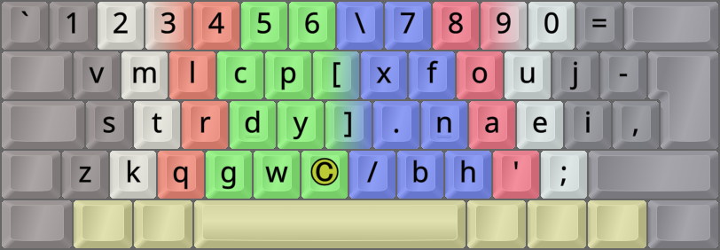
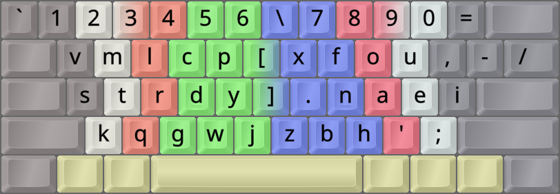

DreymaR's Big Bag Of Keyboard Tricks - EPKL
===========================================
<br><br>


_The default Sturdy layout (using the Angle mod) on an ANSI keyboard_

<br><br>

The Sturdy layout
-----------------
- This layout was made by Oxey using his own 'Oxeylyzer' analysis program, 2022-07.
- It may be said to use the [**Curl**][ErgCrl] principle, by reducing lateral stretches to the middle home row positions.
- An [**Angle**][ErgAWi] ergo mod is recommended for this layout on row-staggered boards.
- For more info, see its [layout home page][LayHom] and [the Oxeylyzer page][AnaHom].
<br>


_The Sturdy layout. Image taken from its own [homepage][LayHom]._

<br>

#### The Sturdy layout on a ortho/matrix board:
```
+----------------------------+
| v m l c p   x f o u j  [ ] |
| s t r d y   . n a e i  / \ |
| z k q g w   b h ' ; ,      |
+----------------------------+
```

#### The Sturdy layout on an ANSI board, with an Angle mod for correct lower-row stagger:
```
+-----------------------------+
| v m l c p   x f o u j [ ] \ |
| s t r d y   . n a e i /     |
|  k q g w z   b h ' ; ,      |
+-----------------------------+
```

<br>

||
|   :---:   |
|_The Sturdy-eD layout on an ANSI board, unshifted layer_|

||
|   :---:   |
|_The Sturdy-eD layout on an ANSI board, AltGr+Shift layer_|

<br><br>

Sturdy Wide and Sym variants
----------------------------
- [**W**ide][ErgAWi] ergo mods (moving right-hand keys one position to the right) usually place the two bracket keys in the middle.
- Sturdy-Wide is fairly simple for ISO keyboards, but for ANSI there's more of a problem since there isn't an extra key next to Enter.
- Oxey has an elegant solution for Sturdy-AngleWide-ANSI, based on this discussion on Reddit:
	- https://www.reddit.com/r/KeyboardLayouts/comments/15zu2rn/comment/jysbcn8/?context=2
- I discussed the bracket positions with Oxey, and he agrees that they may well go in the middle as they do in many other Wide layouts.
<br>

	[Question: How would Oxey envision a Sturdy-Wide variant?]
	
	On ISO I'd do this:
	===  Sturdy AngleWide-ISO:  ===
	 v m l c p  \  x f o u j    
	 s t r d y  /  . n a e i ,  
	z k q g w  _ -  b h ' ;     
	
	and on ANSI I think this would be good:
	===  Sturdy Wide-ANSI:  ===
	v m l c p  /  x f o u , \   
	s t r d y  -  . n a e i     
	 z k q g w  j  b h ' ;      (no Angle mod)
	
	But ... that ANSI version isn't ideal. Probably angle with Z in that position would be better:
	=== Sturdy AW-ANSI; special Angle mod: ===
	v m l c p  /  x f o u , \   
	s t r d y  -  . n a e i     
	 k q g w j  z  b h ' ;      (Angle mod w/ Z <-> J swap)

<br>

- [**S**ym(bol)][ErgSym] mods usually prioritize the common <kbd>'</kbd> (Apostrophe/Quote) and <kbd>-</kbd> (Hyphen/Underscore) keys.
- Sturdy-WideSym was designed to harmonize with other BigBag WideSym variants.
- For ANSI, the concession is that the Slash key ends up in a non-ideal position. It isn't that common, but still.
	- If you prefer, you could swap Backslash and Slash I guess. ANSI just isn't as easily ergo-modded as ISO is.
<br>

#### Sturdy (C)AWS-ISO, simply moving the comma key up:
```
+----------------------------+
| 1 2 3 4 5 6 \ 7 8 9 0 =    |
|  v m l c p [ x f o u j -   |
|  s t r d y ] . n a e i ,   |
| z k q g w _ / b h ' ;      |
+----------------------------+
```

#### Sturdy (C)AWS-ANSI proposal, using Oxey's `J > Z > ,` loop:
```
+----------------------------+
| 1 2 3 4 5 6 \ 7 8 9 0 =    |
|  v m l c p [ x f o u , - / |
|  s t r d y ] . n a e i     |
|   k q g w j z b h ' ;      |
+----------------------------+
```

<br>



_The Sturdy-AWS-ISO layout. The © key can be a Compose key, or whatever you wish._

<br>



_The Sturdy-AWS-ANSI layout. Note the changed J and Z positions._

<br><br>


[LayHom]: https://o-x-e-y.github.io/layouts/sturdy/   (The Sturdy layout home page)
[AnaHom]: https://github.com/O-X-E-Y/oxeylyzer                  (The Oxeylyzer layout analyzer home page)
[ErgAWi]: https://dreymar.colemak.org/ergo-mods.html#angle-wide (DreymaR's BigBag on Angle+Wide ergo mods)
[ErgCrl]: https://dreymar.colemak.org/ergo-mods.html#curl-dh    (DreymaR's BigBag on the Curl-DH ergo mod)
[ErgSym]: https://dreymar.colemak.org/ergo-mods.html#symbols    (DreymaR's BigBag on the Symbols ergo mod)
