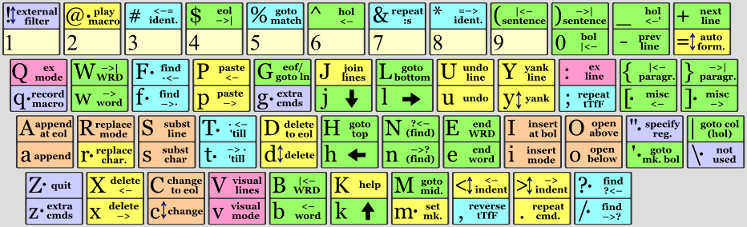

<h1 align=center line-height=1.6>System</h1>  

 

The EPKL System layout
----------------------
- The System layout is a passthrough layout, to use EPKL together with the current OS layout.
- It allows all keys to simply use their underlying Windows system layout mappings.
- It still allows EPKL bells-and-whistles like [Extend][BB_Ext], Compose and sticky mods.
- This should be quite unintrusive, but of course you won't get the eD symbol layers and dead keys.
- You could still add mappings to single keys as desired, for instance locale letters and a Compose key.
- If your system layout contains Wide and/or Angle mods, the mapSC_Extend setting will need adjusting for Extend.
- You may have to refresh EPKL whenever you change the underlying system layout.
- Since EPKL has no idea what your layout is now, you could add anything you like as your `state#.png` images.
- You can of course hide states (just showing Extend images), hide images (menu) or set `showHelpImage` to `no`.
 

||
|   :---:   |
|_Sample state0 help image: A Vim help sheet (for Colemak), included in this layout's base folder._|

[BB_Ext]: https://dreymar.colemak.org/layers-extend.html (DreymaR's Big Bag of Tricks – Extend page)