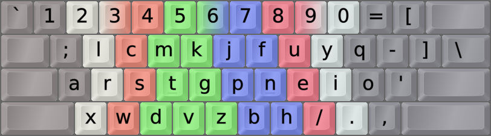

DreymaR's Big Bag Of Keyboard Tricks - EPKL
===========================================


  
  
Colemak Discord user Nyfee's "bleeding-edge" Colemak mods
---------------------------------------------------------
- Colemak design philosophy keeps ZXCV in place, and tries to avoid keys swapping hands.
- These variants don't, with the purpose of squeezing out some more analyzer points and maybe layout quality.
- The newest mods have scored quite well in analysis, possibly(!) beating Colemak-DH by a bit.
- Cmk-QI releases the Cmk constraint of keys changing hands. ZXCV didn't need moving.
- It was inspired by and takes some ideas from the [IndyRad/ISRT layout by NotGate][NotGte].
- Cmk-QI;x is the "extra mile" variant. More changes, lower SFB% but uncertain gains.
    - QI;x adds SL-CM & Q-SC swaps to get SFB% down, and the purely subjective C-W swap.
    - It still ends up at about the same Colemakmods analysis score as Cmk-DH, no more.
- Cmk-QI supports the standard Sym and Wide mods. Cmk-QI;x has its own Sym and no Wide mod.
- ColemaQ is a slightly older variant that consists of 3–4 simple key swaps. See below.
- There were some predecessor mods named Hirou and XCept; these likely aren't in use anymore.


### Colemak-QI by Nyfee, 2021-03:
```
---------------------------
 1 2 3 4 5  6 7 8 9 0  = [ 
 q L W M K  j F u y '  - ] 
 a r s t g  P n e i o  ; \ 
 z x c d v  B h , . /      
---------------------------
Remaps from Cmk-DH-Sym:
        / W > F > L / P ⇔ M / B ⇔ K /
```

### Colemak-QI;x by Nyfee, 2021-03:
```
---------------------------
 1 2 3 4 5  6 7 8 9 0  = [ 
 ; L C M K  j F u y Q  - ] 
 a r s t g  P n e i o  ' \ 
 z x W d v  B h / . ,      
---------------------------
Remaps from Cmk-DH-Sym:
/ W ⇔ C / W > F > L / P ⇔ M / B ⇔ K / CM ⇔ SL / Q > QU > SC /
```

### ColemaQ(-F) by Nyfee, 2021-01:
```
---------------------------
 1 2 3 4 5  6 7 8 9 0  = [ 
 ; w G p b  j l u y Q  - ] 
 a r s t F  m n e i o  ' \ 
 z x c d K  V h / . ,      
---------------------------
Remaps from Cmk-DH-Sym:
                    / V ⇔ K / CM ⇔ SL / Q > QU > SC / / F ⇔ G /
```


My Personal Take On the ColemaQ Mod
-----------------------------------
**Note:** This was originally posted on the Colemak Discord, where unfortunately an unfinished version of it created a heated conflict with some of the mods' fans. My intention with it was an is just to discuss the claims that these mod elements are "objectively" better than Colemak-DH, claims that were made in the server channels on several occasions. I have nothing against these mods _per se_ but at the end of the day I do not see any real benefits with them either in sum, unlike many others.

I've been analyzing Nyfee's and other mods with the [Colemakmods analyzer][CM-Ana] as it's easy to use and yet provides some useful insights, trying to find out what's behind the enthusiasm. This analyzer has a base effort score based on positions and travel, a same-finger bigram (SFB) effort and a near-finger bigram effort that punishes rolls between weak fingers. It's a fairly simple model and its end totals may well be debated, but as mentioned it gives some good insights and pointers.

In particular, the ColemaQ mod consists of 3–4 simple key swaps from Colemak-DH and these aren't directly connected so it's easy to discuss and analyze them separately to gain some idea of their individual effects.

I had a big A-ha! moment when I tried the V-K swap in ColemaQ (the only part of it that the analyzer actually liked) and it created as much problems – maybe more!? – than it solved, given that I view the KN SFB as a zero-problem because I find it extremely easy to alt-finger. I also alt-finger LK easily enough, so I didn't find the V-K swap useful in sum since it creates other issues in turn that the analyzer didn't pick up on. I noticed the VE and CK bigrams, which aren't same-finger bigrams nor weak-finger near-bigrams but involve stretches that felt unpleasant to me from middle to index fingers. Their Colemak-DH counterparts, VK and CE, are less frequent.

The Q; swap seems entirely subjective to me at this point. I know its fans find it good somehow. Neither the analyzer nor I see any point in it, beyond a very minute reduction in SFB%.

The Comma-Slash swap reduces SFB% like nobody's business, but it too comes with problems of its own: It overloads the right-hand pinky which puts the analyzer off it. And it makes further modding like Wide and Sym much more tricky, as trying to find a good home for comma on a Wide config isn't easy at all. Whether the analyzer is right in claiming that the increase in other effort nullifies the benefit of less SFBs, is open for discussion. I think it may be onto something, but it will depend on how strong and agile your pinkies are. Experienced typists and players of instruments like the piano may have very well-trained pinkies indeed, while people coming straight from typing on the QWERTY layout typically have underused and weak right-hand pinkies and have been known to complain about Colemak's higher pinky usage without any mods added to increase it further.

So, that's my personal impression. Other people's experience will vary – for instance, they may have a system that reduces their pinky symbol usage with layers so the pinky won't get too taxed, and they may not mind losing mod modularity.

But: We've had people advertising this and similar mods as "objectively better" and I don't think that's warranted at all. So I wanted to address such claims with a caveat based on my observations. I hope beginners don't get mired down in a bunch of advanced, unclear choices that are too hard to make for them. That may put some newcomers off Colemak entirely, which would be very sad.
  

[CM-Ana]: http://colemakmods.github.io/mod-dh/analyze.html (Colemakmods Layout Analysis Tool)
[NotGte]: https://notgate.github.io/layout/ (NotGate's layout page, home of the ISRT layout)
