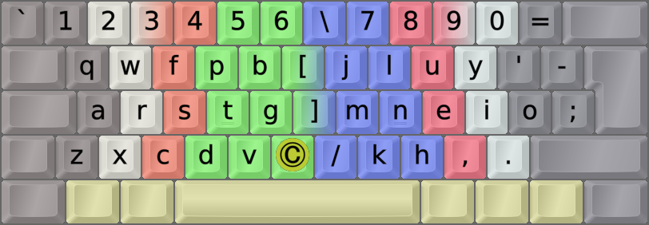
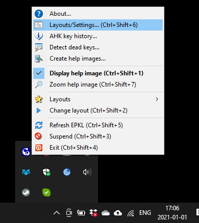
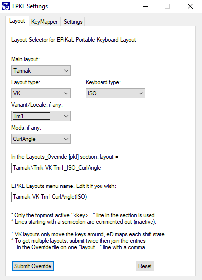
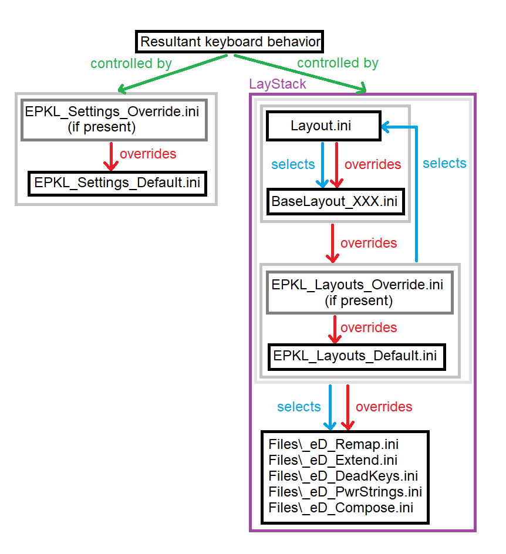

DreymaR's Big Bag Of Keyboard Tricks - EPKL
===========================================

### ***EPiKaL PortableKeyboardLayout** for Windows, with layouts*
<br>



<br><br>

[Θώθ][ThothW] – What Is This?
-----------------------------
* This is a program that implements my [**Big Bag Of Tricks**][orgBBT] for Windows!
    - That is, my many layout mods and tweaks and bells and whistles. 
* It's mostly centered around the brilliant Colemak keyboard layout,…
* … with or without my own `[eD]` AltGr layers and dead keys,…
* … **ergonomic mods** both for **Colemak**, the **Tarmak** learning layouts and **other layouts**,…
* … and the incredibly useful [**Extend**][BBText] layers which work with any layout.
* **DreymaR's Big Bag of Keyboard Trickery** at [dreymar.colemak.org][orgBBT] is my main info site.
    - On those pages, you can choose the Windows (flag icon) platform to see more about EPKL/Windows.
    - <del>In the [old Forum BigBag][CmkBBT] there's a specific [topic for EPKL/Windows][CmkPKL] too. It's old though.</del>
<br>

* This repository holds the **EPiKaL PKL** layout program, with lots of improvements over the old abandonware PKL.
* Nearly all my Big Bag "tricks" are implemented for EPKL, as layouts and accessory files.
* Some non-EPKL BigBag stuff can be found in the Other folder, such as other keyboard tools.
* Some non-BigBag stuff can be found in EPKL too, including support for several other layouts.
    - I won't support just any other layout though, as I don't have time and energy to do so.
    - The layouts I have included for EPKL have all seemed interesting and/or promising to me.
    - Note: This does _not_ include layouts such as Workman and Norman, that, albeit popular, I consider flawed designs for which there are far better options.
    - It does include Dvorak although that layout is old now, together with some interesting Dvorak mods.
<br>

Getting EPKL up and running
---------------------------
* Download a full copy of this repository or just its executable resources.
    - Under **[Release][GitRel] Assets**, there's a .ZIP file with the files needed to run EPKL. Unzip and run!
    - For the newest updated Git **commit** with source code, instead **[Download ZIP][GitCom]** from the green `Code` button.
    - For releases, the `EPKL.exe` binary is included. For commits, you must run `Compile_EPKL.bat` to produce it.
    - Note that some virus protection programs overreact to Autohotkey (AHK) code using keyboard hooks.
* **FAST LANE:** If you simply want "vanilla Colemak" on a US/ANSI keyboard, just run EPKL.exe and type!
    - If you insist on having the Caps key as Backspace instead of the superior and wonderful Extend key…
    - … in the [Layouts Default file][LayDef] find the first `;QWCLK = BACK` etc line and remove that semicolon…
    - … but please read the ["Can I map…"](https://github.com/DreymaR/BigBagKbdTrixPKL#can-i-map-the-caps-key-to-backspace) section below first to know your options!
* Run EPKL.exe inside its main folder in any way you like! Check its tray menu in the bottom right-hand corner.
* To make EPKL start up automatically with Windows, [add a shortcut to it in the Startup folder][StrtUp]:
    - Create a shortcut to EPKL.exe (drag it while holding down <kbd>Alt</kbd>, or right-click and choose).
    - Press <kbd>Win</kbd>+<kbd>R</kbd> then type in `shell:startup` and hit <kbd>Enter</kbd> or press `OK`.
    - Move your EPKL shortcut to the Startup folder that just opened up. That should do it!
<br>

* To choose a layout variant, select the **Layout/Settings…** menu option. The EPKL Settings User Interface pops up.
* Choose a layout with your keyboard type, variant/locale and Curl/Angle/Wide etc preferences.
    - There are two main layout types: VK which only moves your keys, and eD which maps each shift state.
    - There are several premade Locale variants, if you need to type in other languages. Check out which variants exist – they'll likely be eD variants.
    - There are several ergonomic variants, which you can read about in the Big Bag: Curl(DH), Angle, Wide, Sym…
* Helpful help images are shown by default. To show them only when modifiers are pressed, change `img_HideStates` to `0` on the `Settings` tab. You can choose whether to show images at all, or which ones to show; see the [EPKL_Settings][SetDef] file for more explanations.
* This image shows the EPKL tray menu. Right-click the `Co` icon in the lower right corner of your screen, if necessary via the 'Show hidden icons' caret.
<br>



<br><br>

These Aren't The Guides You're Looking For?
-------------------------------------------
EPKL can be complex and confusing for the newbie. So we're very happy to present to you the…

**[Easiest way to setup DreymaR's EPKL on Windows][AndyLi]**, a brilliantly instructive YouTube video by Andrew Li. 
He even shows you how to make a multi-layout setup with for instance Colemak and QWERTY, which should be useful for some people.

If you find my info below and on the Big Bag pages too daunting and massive, do try it out.  ( Θώθ)

External guides may not be fully updated to show everything the Layout/Settings menu can do for instance! So do try that, too.
The Settings dialog holds some useful info points for each tab, and the KeyMapper tab has its own Help button.
<br>



<br>

<del>The [EPKL For Dummies][EPKL4D] guide by [TorbenGB](https://github.com/torbengb), sadly, is now outdated since it predates the Layout/Settings GUI. But if you want to edit EPKL files manually you can still learn the ropes there.</del>

<br><br>

"I just want Colemak-DH(?) …"
-----------------------------
#### What is Colemak-DH?
- There are several different layout options and EPKL has many interesting ones. The two main Colemak flavors are standard/"vanilla" and DH.
- [**Colemak-DH**][Cmk-DH] moves the <kbd>D</kbd> and <kbd>H</kbd> keys down instead of in the inwards "middle trench", so the home row curls downward.
- Many new users ask whether Colemak-DH or vanilla is best for them. This is too long to discuss here, so look on the [Cmk community page][CmkOrg] and elsewhere.
    - Briefly: DH makes the `HE` bigram easier, and removes some lateral stretches. Vanilla is better implemented on various platforms.
    - At the end of the day, the question is whether stretching inwards or curling downwards from the `T/N` home position feels better to you.
    - Some may have heard of DHk and DHm or other sub-variants. DHm is the DH standard now. It should be a one-size-fits-nearly-all.
<br>

#### How do I get Colemak-DH with EPKL?
- EPKL by default gives you the standard Colemak for the [ANSI keyboard type][ISOANS]. Now let's choose something else.
- As described above, open up the `Layout/Settings…` GUI from the EPKL tray menu.
- To get the right layout, you should know your keyboard type. `ISO` has a key between <kbd>Z</kbd> and <kbd>LShift</kbd>, `ANS` not.
    - Don't worry about how your Enter key looks, but look for the ISO key at the lower left.
    - If <kbd>Z</kbd> and <kbd>Shift</kbd> are adjacent by default, you have an ANSI-type board.
- Next, is your keyboard geometry standard row-staggered (rows shifted relative to each other) or ortholinear/column-staggered?
    - For the latter, use the `-Orth` KbdTypes. These also come in ANS/ISO, to account for which underlying key codes are used.
- The `Variant` option is for locale solutions such as French or German Colemak, but may also contain other mods affecting the main layout.
    - If you're a simple USer without the need for such fanciness, leave the `Variant/Locale` setting at `<None>`.
- Colemak-DH is an ergonomic Colemak mod or mod combo:
    - The DH mod in itself is named `Curl` in EPKL, because that's what it does physically: The home row is curled like the curve of your fingers.
    - For standard row-staggered keyboards (whether ANSI or ISO), the `CurlAngle` mod equals the Colemak-DH layout.
    - The `Curl`-only mod is for ortho keyboards.
    - Many newbs on row-stag boards don't understand why an [**Angle mod**][BBTawi] is needed. Please strive to do so! Please! Please!!!
- **TL;DR answer:**: Press Ctrl+Shift+6 then select the CurlAngle mod for your keyboard type (ANS or ISO).
<br>

#### What are the options?
- You'll notice that you can also select `Wide` and `Sym` ergo mods in most cases, up to a cool `CAWS` combo. Consult the [Big Bag][orgBBT].
    - All combos aren't pre-made as that'd be too much work for me. To create new ones yourself, see below.
- The next image shows Colemak-DH on an ANSI keyboard, together with the Symbol mod which affects the right-hand symbol keys.
    - In EPKL terms that's Colemak-eD_ANS_CurlAngleSym which may be abbreviated to Cmk-CAS in writing.
    - Note the Angle(Z) mod that moves the XCDV keys one step to the left so your left wrist can be straight like on the right hand.
    - Every finger in the image has its own color, so make sure you do the Angle mod right!
<br>


<br><br>

"Can I map the Caps key to Backspace?"
--------------------------------------
Sure you can! But may I suggest you do something much better with it and use **[Extend][BBText]** for a lot more power? 
Or, how about the multilayer "MoDK" Tap-or-Mod-Extend with even more wonders?! See below for how that works.

For that matter, you could use your <kbd>Caps</kbd> as a <kbd>Compose</kbd> key, see below. There really are a lot of brilliant options for it.

Using Extend, you can easily press <kbd>Ext</kbd>+<kbd>O</kbd> for <kbd>Backspace</kbd>. 
<kbd>Ext</kbd>+<kbd>T</kbd>+<kbd>O</kbd> for <kbd>Ctrl</kbd>+<kbd>Backspace</kbd> deletes the previous word! 

If you're still convinced you want to lose out on all that power and flexibility, then there are several ways you can do this:
- **By Menu:** On the Layout/Settings menu's Special Keys tab, select your Caps key's desired behavior then allow EPKL to restart.
- **By KeyMapper:** On the Layout/Settings KeyMapper tab, make a `VKey` or `SKey`-type <kbd>CLK</kbd> to <kbd>BSP</kbd> mapping and submit it.
- **By File:** In your `EPKL_Layouts_` .ini file (Default or, if present, Override), find or make these lines under the `[layout]` section.
```
;QWCLK = BACK    	VKey 		; SC03a: CapsLock as Backspace (CAPITAL -> BACK)
QWCLK = Extend  	Mod 		; SC03a: CapsLock as the Extend modifier
;QWCLK = BACK/Ext 	VKey 		; SC03a: CapsLock as a Tap-or-Mod key: Backspace on tap, Extend modifier on hold
```
- Add a semicolon before the line you don't want, and remove the one before the line you do want to use.
- Note the bottom line there? You can actually have both: Backspace on tapping <kbd>Caps</kbd>, Extend on holding it!
- It's actually the default setting for the KeyMapper tab of the Layout/Settings dialog. Press the Submit button and you're on.
<br>


<br><br>

"I don't want your layouts but I still want EPKL"
-------------------------------------------------
You may want to use some of EPKL's functionality without opting for one of the available layouts. That's possible too.
- You may of course make your own layout or layout variant. See [below](https://github.com/DreymaR/BigBagKbdTrixPKL#layout-variants--key-mappings) for more info.
- But you may also run EPKL with your installed OS layout, to just get Extend and/or Compose. Or to map just a few keys.
- To do that, use the System layout. It's designed to pass through the OS layout so whatever you have there will work with EPKL.
- For now, any dead keys on an OS layout will unfortunately not work as they should with the EPKL System layout. You could eD map them...?
- If you want an ergo mod for the Extend layer, you need to select/make the right mod combo.
<br><br>

EPKL & Games
------------
There are some pitfalls to using a keyboard remapping program like EPKL for gaming, which uses the keyboard very differently.

In gaming a key is often held down for a longish time. This may lead to some problems:
* The underlying OS layout sends repeated KeyDown key events that are picked up and processed by EPKL. KeyUp is only sent once, on key release.
* When sending characters, AutoHotkey sends a KeyDown followed immediately by a KeyUp. So inbetween each sent KeyDown there will be an extra KeyUp.
    - The result of this is often choppy game controls. Also, the MonkeyType typing test site has a cheat detection that interprets this behavior as suspect.
    - The solution is to use a VK/SC or System mapped layout (EPKL v1.4+). These send only the KeyDown events from the OS with no KeyUp until you release the key.
    - ShiftState maps like eD must still send input with KeyDown-KeyUp. If you use an eD-type layout, you can make EPKL sleep whenever your game is active.
* Too many key presses in too short time makes normal AHK scripts miss key presses. EPKL uses a buffer queue to avoid this, but this buffer may eventually overflow.
    - When you hold down a key for too long, EPKL may continue sending input events for a while after you let it go. EPKL may act strangely afterwards.
    - To avoid this when using, say, Extend isn't so hard once you get used to it. But for many games it's still a problem. I'm working on a solution.
* You can suspend EPKL at any time with its Suspend hotkey (default `Ctrl+Shift+3`). If you want your layout in-game, you may have to use a [MSKLC install][PklKLC].
* If you want EPKL to suspend itself when your game or webpage is active, you can use the `suspendingApps` setting; see the [Settings file][SetDef].
* You could try setting the Windows Key Repeat speed as low as possible, but I'm unsure whether it'll really help.
* For more info, consult the [Known Issues](https://github.com/DreymaR/BigBagKbdTrixPKL#known-issues) section below.
<br><br>

Layout Variants & Key Mappings
------------------------------
It's entirely possible to create new layout variants and tweak existing ones with EPKL. It can be a little daunting at first though!
Mostly because there is so much functionality and complexity, which is actually a good thing but hard on the beginner.

To learn more about key mappings and creating your own layout variants, please consult the [Layouts folder][PklLay] README.
<br><br>

More Know-How
-------------
#### A Short EPKL Glossary
* **Extend** is a layer switch, by default the <kbd>CapsLock</kbd> key, giving easy access to navigation and NumPad etc layers
    - I really can't overstate the benefits of using Extend. It amazes nearly everyone who gets used to it.
    - The true power of Extend may be hard to understand at first. You really should read about it in the [Big Bag][BBText]!
* **Multi-Extend** means you'll get another Extend layer if you hold down modifiers when pressing <kbd>Extend</kbd>
    - Try holding down <kbd>RShift</kbd> and/or <kbd>RAlt</kbd> then press <kbd>Extend</kbd>
    - After selecting an Extend layer this way, keep only the <kbd>Extend</kbd> key pressed down to maintain it
* **Sticky Modifier** or **OSM** (One-Shot Mod) is when you can tap a mod and then another key shortly thereafter
    - There's a setting in the Settings file for how quickly the OSM times out, and which keys are OSMs
* **ToM** (Tap-or-Mod) is a dual-role key, working as a mod when held down and a normal key when tapped
    - ToM has its own timer setting which is typically shorter than the Sticky Mods timer
* **DK** is a dead key. You tap it then another key, there's no timer. Most of my DKs are on <kbd>AltGr</kbd>+<kbd>‹symbol›</kbd>.
    - DK sequence: You can tap several DKs to get new symbols (example: {<kbd>AltGr</kbd>+<kbd>=</kbd>,<kbd>=</kbd>} gives `≡`; <kbd>AltGr</kbd>+`{/,=}` then <kbd>=</kbd> gives `≢`)
    - DK chaining: One DK can release to another. This is not implemented in EPKL yet
    - **MoDK** (Mother-of-DKs) is a ToM key (here, on **tap-Extend**) that leads to lots of cool DKs
* **Compose** is a concept taken from the Linux world. In EPKL, the Compose key works a little differently.
    - You can enter a sequence of characters and then press an EPKL Compose key if your layout has one
    - If the sequence is recognized as one in an applicable [Compose table][CmpIni], it gets replaced
    - It's also possible to set a Compose table to complete instead of replacing sequences
    - **CoDeKey** is an even more advanced variety of a Compose key, adding Dead Key functionality
    - If you have a CoDeKey set, it works as a special DK if no sequence is recognized, and Compose otherwise
    - Such a key can be very handy for enhancing your layout with a variety of useful mappings!
* **PowerStrings** are shortcuts to text strings. These may be multiline, and may contain AutoHotKey syntax.
    - As an Example, try Extend+End in a text editor. It should produce an editable 'Yours truly' message footer.
* **LayStack** is the stack of files that may hold layout definitions. From top to bottom priority:
    - Layout, that is, the `layout.ini` file in your chosen layout folder
    - BaseLayout, which may be pointed to by the layout file
    - Layouts_Override, which may be generated to hold your personal layout settings and mappings
    - Layouts_Default, found in the root folder, holds default layout settings/mappings
    - Special dedicated files for Extend, DeadKeys, PowerStrings, Remaps etc etc.
* **Remaps** are cycles of keys swapping places. This allows you turn one layout definition into another.
    - These can be in the LayStack files for quick layout tweaks, or in the dedicated [Remap file][MapIni].
* **Prefix-Entry Syntax** is a powerful enhancement for most kind of EPKL mappings
    - Prefix-Entry syntax can go in layout state mappings, DKs, Extend, PowerStrings, Compose entries...
    - Basically, it's any mapping starting with one of the characters `%→$§*α=β~†@Ð&¶®©` and then an entry
    - It allows AHK Send syntax, sending Unicode points, EPKL DKs and PowerStrings
    - See below for more details
<br>

#### Hotkeys defined in the EPKL_Settings file:
* Ctrl+Shift+1 – Display/hide the help image (it may also hide itself by shift state)
* Ctrl+Shift+2 – Switch between the layouts specified in the Layouts file(s)
* Ctrl+Shift+3 – Suspend EPKL; hit again to re-activate. It may also be Ctrl+Shift+` (backtick).
* Ctrl+Shift+4 – Exit EPKL
* Ctrl+Shift+5 – Refresh EPKL, if it gets stuck or something
* Ctrl+Shift+6 – Show the Layout/Settings… dialog
* Ctrl+Shift+7 – Zoom the help image in/out, to see it better or get it out of the way
* Ctrl+Shift+8 – Toggle help image transparency
* Ctrl+Shift+9 – Move the help image between positions, as by mouseover
* Ctrl+Shift+0 – Show info about the active window; useful for setting suspending apps
<br>

#### Examples of tweakable parameters:
The layouts and setup files may take a little tweaking to get what you want. There are several parameters:
* Colemak vs QWERTY vs what-have-you, obviously. Choose your main layout wisely!
    - EPKL defaults to Colemak(-DH) and Tarmak layouts, but also holds QWERTY and Dvorak and several others.
    - To type with QWERTY it may be just as easy to suspend EPKL. Of course, then Extend etc won't work.
* Full/VK/SC mappings: I've provided my own Colemak[eD] as well as 'VirtualKey' versions
    - The _VK_ layouts just move the keys of your installed OS layout around, without other changes
    - The _[eD]_ layouts have their own Shift/AltGr state mappings specified.
    - Actually, you may mix mapping types freely in any layout.
    - Note that a VK mapped key can't be used for Compose sequences. It still works with Extend and DK releases.
* ISO (European/World) vs ANSI (US) vs other keyboard types
    - ISO boards have a <kbd>OEM_102</kbd> key between <kbd>Z</kbd> and <kbd>LShift</kbd>. It often holds `<>` or `-_`.
    - In ISO OS layouts, `OEM_` virtual key codes differ from ANSI ones. These boards send the same scan codes though.
    - Brazilian ABNT boards are like ISO, but have two extra <kbd>ABNT</kbd> keys. These can be remapped by their scan codes.
    - JIS (Japanese) etc are not supported so far. Sorry. Gomen-nasai. ごめんなさい.  &nbsp;&nbsp; ᏊᵕꈊᵕᏊ
* Curl(DH), Angle and/or Wide ergonomic mods, moving some keys to more comfortable positions
    - Angle/Wide affect the "hard" key positions in the layout.ini file, usually both for Layout and Extend
    - Curl(DH) is Colemak/Tarmak/Dvorak specific and for the most part should not affect Extend
    - The Curl(DH) mod does insert <kbd>D</kbd> between <kbd>C</kbd> and <kbd>V</kbd> though. There's a remap to let <kbd>Extend</kbd>+<kbd>V</kbd> still be Paste
* Extend mappings, using for instance CapsLock as a modifier for nav/edit/multimedia/etc keys. It's awesome!!!
    - The Extend modifier may even double as a Tap-or-Mod key so that when you tap it, something else happens.
    - The most advanced way of using this may be the Mother-of-DeadKeys which allows really fancy "tap dances"!
    - Holding down <kbd>Shift</kbd> and/or <kbd>AltGr</kbd> while first holding or while tapping the <kbd>Ext</kbd> key affects which Ext layer you get.
* In EPKL_Layouts you can use shorthand (@#) for KbdType/CurlMod/HardMod etc, or set the layout folder path directly.
    - For most users it'll be much more handy to use the Layout Picker from the `Layout/Settings…` menu.
    - The Layout Picker creates a `EPKL_Layouts_Override.ini` file if necessary, and writes to it.
    - For Extend (on by default), set an Extend file and map the Extend modifier to a key in your layout.
    - My _eD_Extend mappings file is in the Files folder. Look inside it to learn more.
* In the layout folder(s) you've chosen, you may edit the layout.ini files further if required. See below.
    - Mod remaps, help image specifications, Extend key, key mappings etc can be set in the LayStack .ini files.
    - Many layouts use a BaseLayout. Most mappings may be there, so the top layout.ini only has to change a few keys.
* To learn more about remaps, see the [_eD_Remap.ini][MapIni] file. They can even turn Colemak into QWERTY (oh no…!).
* There's a file for named literals/PowerStrings. These are useable by layouts, Extend and dead keys.
* There's a Dead Key file too. DKs are mapped as @###. Pressing the key then a release glyph may produce something new!
    - There are help images for DKs, these can be very useful as they show what releases are in different shift states.
    - I haven't made images for all variants though, so there may be minor discrepancies.
* Layout folders aren't premade for every variant, board and mod combo, as there are so many of them. See below.
* The Layout/Settings dialog can change layout, key mappings and a selection of settings quite easily.
<br>

#### Techy tips for EPKL:
* EPKL is Viper approved! One of the fastest typists in the world has tested it and found it responsive enough.
    - If you type above around 150 Words Per Minute, some pace smoothing may occur. This shouldn't be a problem, mostly.
* EPKL, being portable, doesn't need an install with admin rights to work. You must still be allowed to run programs.
* I usually put a shortcut to EPKL.exe in my [Start Menu "Startup" folder][StrtUp] so it starts on logon, per user.
* EPKL can also easily be used with the [PortableApps.com][PrtApp] menu by putting its folder in a `C:\PortableApps` folder.
    - If the PortableApps menu is run on logon it can start up EPKL for you too.
* Look inside the various .ini files under Files and Layouts if you're interested! Much is explained there.
* See my examples in the Extend file for some advanced mappings! These may be used in layouts and dead keys too.
* EPKL uses both .ini and source files that may be UTF-8 Unicode encoded.
* EPKL allows end-of-line comments (whitespace-semicolon) in .ini files. The old PKL only allowed them in layout entries.
* You can use EPKL with a Virtual Machine. Set it to not capture the keyboard. System key strokes may not transfer then.
    - If you have a VM running Windows, another way is to run EPKL inside the VM of course.
* Running EPKL with other (AutoHotkey) key mapping scripts may get confusing if there is so-called _hook competition_.
    - When this happens, it becomes uncertain which hook gets which key press, with unpredictable results.
* EPKL isn't always a robust solution for gaming etc. See the [Other folder][PklOth] for more options/info.
<br>

#### The LayStack and file relations explained further
* As said before, the easy way to set layouts and settings is to let the `Layout/Settings…` GUI write your overrides.
* If you still want to choose layouts manually, copy the Override_Example file to `EPKL_Layouts_Override.ini`.
    - There can be both [Layouts_Default][LayDef] and [Layouts_Override][LayOvr] files. Override entries take precedence.
* In your Layouts_Override file, activate the layout(s) you want by editing and/or uncommenting (remove initial semicolon).
    - There are KbdType (@K) and other abbreviations, but you could also type the path to a layout folder out in full.
    - The format is: `layout = ‹layout folder›:‹menu entry›,‹2nd layout folder›:‹2nd menu entry›` etc.
* The [EPKL_Layouts][LayDef] .ini file(s) hold layout choices. The [EPKL_Settings][SetDef] file(s) hold general program settings.
* The `layout.ini` files hold layout settings and mappings. They often point to and augment a `BaseLayout` file.
* In theory, you could put all the info needed for a whole layout into any one of the layout stack files.
<br>

* Here's the "LayStack" for layout info priority. Mappings/settings at higher levels take precedence:
    1. The `layout.ini` file in the chosen Layout folder gets the last word about remaps etc
    2. The `BaseLayout` .ini file usually found under each layout type may define most of the layout
    3. The [EPKL_Layouts_Override][LayOvr], if present, can hold overriding layout choices etc
    4. The [EPKL_Layouts_Default][LayDef] holds default and common settings/mappings
    5. Beyond this, specialized files may hold settings, info, Extend or DeadKey mappings etc. See below.
<br>

* Settings priority and file selection during EPKL startup goes like this:
    - The `EPKL_Settings` files (`_Default` and, if present, `_Override`) determine program settings
    - The `EPKL_Layouts` files select the active layout folder(s)
    - The layout folder's `layout.ini` file may select a `BaseLayout` to complement
<br>



<br><br>

Special Special Keys
--------------------
There is a Special Keys tab on the Layout/Settings window, that can be used to set Extend and Compose keys more easily than before. Have a look.

However, to fully understand how these mappings and settings work you may want to study this section as well.

#### Advanced Extend
Here are some sample Extend key mappings:
```
QWCLK   = Extend    Modifier        ; Caps   -> The Extend modifier (see the Big Bag)
QWCLK   = BACK/Ext  VirtualKey      ; Caps   -> Tap-or-Mod: Backspace if tapped, Extend if held
QWCLK   = BACK/Ext  0   @ex0 @ex1 *#. @ex6 @ex7 ; Mother-of-DeadKeys (MoDK) on tap, Extend on hold
```
* These mappings merit explanation. Extend is a most marvelous beast, so don't be daunted now! ฅ(=ʘᆽʘ=)ฅ
* The above Extend modifier mappings may be in any LayStack .ini file, such as [Layouts_Default][LayDef]
* Holding designated modifiers, <kbd>RShift</kbd> and/or <kbd>RAlt</kbd> by default (specified in the [Settings][SetDef]), chooses Extend layers.
    - So, e.g., holding the Ext1 mod (<kbd>RAlt</kbd>) then the <kbd>Extend</kbd> key activates the Extend2 layer (NumPad).
    - After selecting your Extend layer, you hold down only the <kbd>Ext</kbd> key (Caps by default) and start using Extend!
    - Again: To get the NumPad Extend layer (Ext2):
        1) Press AltGr and hold it
        2) Press Extend (Caps) and hold it
        3) Release AltGr while keeping Extend down
        4) While holding down Extend, start using the NumPad layer
* Extend layers (like Ext3/Ext4) can be set as one-shot so they fall back to another layer after each use.
    - This lets you for instance release a string then keep editing. But dead keys are better for that, see below.
* Setting the Extend key as a Tap-or-Mod (ToM) key as above lets you tap it for, e.g., Backspace or hold for Extend.
* Mother-of-DeadKeys (MoDK) is the most powerful option. Tapping <kbd>Extend</kbd> activates a dead key depending on shift state!
    - Tapping <kbd>Ext</kbd> alone or with <kbd>Shift</kbd>/<kbd>AltGr</kbd> activates the dead keys "ex0/1/6/7". See the [DeadKeys.ini][DKsIni] file!
    - In my default example, <kbd>Ext</kbd>-tap alone lets you activate symbols and commands easily.
    - <kbd>Shift</kbd>+<kbd>Ext</kbd>-tap activates a kaomoji DK, similar to Ext3 but you don't have to hold down the <kbd>Ext</kbd> key! d( ^◇^)b
    - Another advantage of DK layers over Extend layers is that you can make entries for any release char.
    - So, e.g., Ext3 has one kitty kaomoji (=^･ω･^=)丿 but dk_Ext_Kaomoji has one for k and one for K. (=ΦωΦ=)ʃ
    - "Tap-dance" {<kbd>Shift</kbd>,<kbd>Ext</kbd>,<kbd>‹key›</kbd>} quickly using Sticky Shift, for a kaomoji. Wait before <kbd>‹key›</kbd> for another.
    - Holding <kbd>Ctrl</kbd> then tapping <kbd>Ext</kbd> sends <kbd>Win</kbd>+<kbd>.</kbd>, opening the Emoji picker.
    - <kbd>AltGr</kbd>+<kbd>Ext</kbd>-tap holds some commands to avoid hand contortion. Example: {<kbd>AltGr</kbd>+<kbd>Ext</kbd>,<kbd>T</kbd>} for Task Manager.
<br>

#### Advanced Compose/CoDeKey
As mentioned, the EPKL Compose key is used to enter a sequence of characters and then change that into something else.
* Unlike its Linux counterpart, the EPKL Compose key works _post-hoc_: Enter the sequence first, then press Compose.
* If the sequence is recognized as one in an applicable [Compose table][CmpIni], it gets replaced or completed.
* A layout can have several Compose keys defined in its state mappings. They may be duplicates or different ones.
* Look inside the [EPKL Compose file][CmpIni] for more info. Compose tables are defined and described in that file.
    - Example: Type <kbd>e</kbd><kbd>'</kbd><kbd>Compose</kbd> to get the accented letter `é`.
    - Example: Composing `'noevil` using the default EPKL tables produces three monkey emojis. 🙈 🙉 🙊
* Composing `U####` where `####` is a 4-5 digit hex number, sends the corresponding Unicode character. 💪
* The key can also be used for completions (using a `+` table), adding to rather than deleting the original sequence.
* **CoDeKey** is an even more advanced variety of a Compose key, adding Dead Key functionality.
* If you have a CoDeKey set, it works as a special DK if no sequence is recognized, and Compose otherwise.
* A Compose key or CoDeKey can be very handy for enhancing your layout with useful mappings!
* I have one on my ISO key in the middle of the board, with mappings to neighboring key rolls. ANSI users can't do that of course.
* I also use one on the key next to RAlt. Using the Wide mod it's a quite accessible thumb key. Excellent for home row mappings!
* If you want for instance a thumb key DK without the Compose, you could of course use any dead key directly.
* You can map keys as Compose and specify which Compose keys are CoDeKeys from the Special Keys tab of the Layout/Settings menu.
<br><br>

KNOWN ISSUES:
-------------
* The AHK `Send` command used by some EPKL mappings, sends a `KeyDown` shortly followed by a `KeyUp`.
    - This does produce a key press with the desired character/key.
    - However, when holding down a key for a while Windows really sends repeated `KeyDown` events and `KeyUp` only on key release.
    - This discrepancy often messes with games. The `KeyUp` events tend to interrupt held-down keys, resulting in choppy game controls.
    - Also, typing sites like Monkeytype may have a cheat detection that reacts to this consistently rapid KeyDown-KeyUp sending.
    - If your game doesn't work well with EPKL, you can use the `suspendingApps` setting to auto-suspend EPKL when the game's active.
    - If you need your layout for the game, you can use a VK/SC-mapped layout, a `MSKLC` install or whatever works for you. See the [Other\MSKLC][PklKLC] folder.
    - Note that EPKL v1.4+ has a send mode for ScanCode and VirtualKey mapped keys that should fix this problem!
* Another effect of key repeats may be key buffer overflow, especially when using Extend combos.
    - This is most notable when holding down Extend arrow combos such as `Ext+S+N` (select previous letter) for a while.
    - Again, to effect this EPKL has to send more key presses including modifier up/down and key up/down.
    - The result may be that EPKL's hotkey buffer overflows. Keys and modifiers may get stuck as a result.
    - I've tried hard to get rid of this problem and it's much better than it used to be, but it's not completely gone.
    - To mostly avoid this problem, use e.g., `Ext+T+S+N` to select whole words instead of single characters.
    - Also, try not to hold your Extend combos down for too long if you can avoid it. You can often break it up a little with some training.
    - If you do get in trouble, use the `Refresh` menu option to restart EPKL. That usually does the trick.
* ISO VK layouts may not send the right OEM_# key VK codes for all ISO locales.
    - This is bad for QWERTZ/AZERTY etc. Known affected locales are: UK, De, Fr, Be…
    - State mapped layouts should work, or you could figure out which VK codes are the right ones and edit the layout files accordingly.
    - Finding a more robust solution is on my TODO list. There should be new options shortly, including more robust ScanCode mappings.
* Using the `Colemak w/ Caps -> Backspace` MSKLC install found on [colemak.com][CmkCom] will cause the Back and Caps keys to be swapped. Also, Extend will not work.
    - This is due to that layout being hacked to provide the Caps-to-Back remapping. Please use a normal Windows layout with EPKL.
* Windows intercepts certain key combinations like <kbd>Ctrl</kbd>+<kbd>Alt</kbd>+<kbd>Del</kbd> and <kbd>Win</kbd>+<kbd>L</kbd>
    - Consequently, these combinations may work oddly with state remaps like eD. Keys may end up working as both unmapped and remapped.
    - A workaround for this is to map a shortcut to `α#e` for accessing <kbd>Win</kbd>+<kbd>E</kbd> on Colemak. For Ext-tap, there's one on `{Ext,w}`.
* Virus programs may be skittish about compiling AHK code. You may get a `Threats found` notification, and your `epkl.exe` file doesn't get made.
    - The `ahk2exe` temp file will be interpreted as a Trojan. Even allowing the "Threat" doesn't always help, as compilation already failed.
    - Turn off `Windows Security → Virus & threat protection → Virus & threat protection settings → Real-time protection` temporarily to remedy this.
<br>

DONE/TODO:
----------
For more info about past and future EPKL history, see the **[EPKL Advanced README][PklSrc]** in the EPKL_Source folder.
<br>

Credits/sources
---------------
#### ~ The original [PKL][PKLGit] written by [Máté Farkas in 2008][PKLSFo] using [AutoHotkey][PKLAHK]
#### ~ [EPKL][EPKLgh], formerly [PKL[edition DreymaR]][CmkPKL] by DreymaR, 2017-
#### ~ Big thanks to the AutoHotkey people, Vortex(vVv), the Colemak Forum crowd and all other contributors.
<br>

_Finally, to all of you: Best of luck using EPKL!_
_Øystein "DreymaR" Bech-Aase_

[PKLGit]: https://github.com/Portable-Keyboard-Layout/Portable-Keyboard-Layout/ (Old PKL on GitHub)
[PKLSFo]: https://sourceforge.net/projects/pkl/ (Old PKL on SourceForge)
[PKLAHK]: https://autohotkey.com/board/topic/25991-portable-keyboard-layout/ (Old PKL on the AutoHotkey forums)
[AHKcom]: https://autohotkey.com/ (AutoHotkey main page)
[CmkCom]: https://www.colemak.com (The Colemak official site)
[CmkOrg]: https://www.colemak.org (The Colemak Community site)
[orgBBT]: https://dreymar.colemak.org/ (DreymaR's Big Bag of Keyboard Tricks)
[BBText]: https://dreymar.colemak.org/layers-extend.html (about Extend, in DreymaR's Big Bag of Keyboard Tricks)
[BBTawi]: https://dreymar.colemak.org/ergo-mods.html#AngleWide (about the Angle/Wide ergo mods, in DreymaR's Big Bag of Keyboard Tricks)
[CmkBBT]: https://forum.colemak.com/topic/2315-dreymars-big-bag-of-keyboard-tricks-main-topic/ (BigBagOfKbdTrix on the Colemak forums)
[CmkPKL]: https://forum.colemak.com/topic/1467-dreymars-big-bag-of-keyboard-tricks-pklwindows-edition/ (BigBag-PKL on the Colemak forums)
[StrtUp]: https://support.microsoft.com/en-us/help/4558286/windows-10-add-an-app-to-run-automatically-at-startup (Windows Startup folder)
[PrtApp]: https://portableapps.com/ (PortableApps.com)
[SCMSDN]: https://msdn.microsoft.com/en-us/library/aa299374(v=vs.60).aspx (Scan code list at MSDN)
[VKCAHK]: https://autohotkey.com/docs/KeyList.htm (Virtual key list in the AHK docs)
[ISOANS]: https://deskthority.net/wiki/ANSI_vs_ISO (Deskthority on ANSI vs ISO keyboard models)
[Cmk-DH]: https://colemakmods.github.io/mod-dh/ (The ColemakMods Mod-DH project on the Colemak-DH layout)
[EPKLgh]: https://github.com/DreymaR/BigBagKbdTrixPKL/ (EPKL on GitHub)
[GitRel]: https://github.com/DreymaR/BigBagKbdTrixPKL/releases/latest (Latest EPKL release)
[GitCom]: https://github.com/DreymaR/BigBagKbdTrixPKL/archive/master.zip (Latest EPKL commit download)
[AndyLi]: https://www.youtube.com/watch?v=P3TxloTNHPw (Setup Dreymar's EPKL on Windows, by Andrew Li on YouTube)
[EPKL4D]: https://docs.google.com/document/d/1G0chfgAwdf8cF-uoPEUw0CWwKXW9-uuQiNLbYlnYurs (EPKL For Dummies, by Torben G.B.)
[ThothW]: https://en.wikipedia.org/wiki/Thoth (Thoth: Egyptian god of wisdom and writing)
[InkPrt]: https://portableapps.com/apps/graphics_pictures/inkscape_portable (Inkscape v1.0 at PortableApps.com)
[PklSrc]: ./Source      (EPKL advanced README)
[PklLay]: ./Layouts     (EPKL Layouts folder)
[PklOth]: ./Other       (EPKL Other folder)
[PklKLC]: ./Other/MSKLC (EPKL's Microsoft Keyboard Layout Creator folder)
[KeyTab]: ./Other/KeyCodeTable.txt (KeyCodeTable.txt)
[LayOvr]: ./EPKL_Layouts_Override_Example.ini (EPKL_Layouts_Override example file)
[LayDef]: ./EPKL_Layouts_Default.ini (EPKL_Layouts_Default file)
[SetDef]: ./EPKL_Settings_Default.ini (EPKL Settings file)
[MapIni]: ./Files/_eD_Remap.ini (EPKL Remap file)
[DKsIni]: ./Files/_eD_DeadKeys.ini (EPKL DeadKeys file)
[CmpIni]: ./Files/_eD_Compose.ini (EPKL Compose file)
