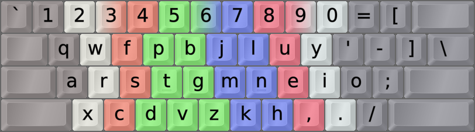

DreymaR's Big Bag Of Keyboard Tricks - EPKL
===========================================

### ***EPiKaL PortableKeyboardLayout** for Windows, with layouts*
<br>


<br><br>

[Θώθ][ThothW] – What Is This?
-----------------------------
* This is a Windows implementation of the [**Big Bag Of Tricks**][orgBBT]!
* That is, my many layout mods and tweaks and bells and whistles. 
* It's mostly centered around the brilliant Colemak keyboard layout,…
* … with or without my own `[eD]` AltGr layers and dead keys,…
* … **ergonomic mods** both for **Colemak**, the **Tarmak** learning layouts and **other layouts**,…
* … and the incredibly useful [**Extend**][BBText] layers which work with any layout.
* Info about DreymaR's Big Bag of Keyboard Trickery is mainly found on the BigBag site at [dreymar.colemak.org][orgBBT].
    - On those pages, you can choose the Windows (flag icon) platform to see more about EPKL/Windows.
    - <del>In the [old Forum BigBag][CmkBBT] there's a specific [topic for EPKL/Windows][CmkPKL] too. It's old though.</del>
<br>

* This repository holds the **EPiKaL PKL** layout program, with lots of improvements over the old abandonware PKL.
* Nearly all my Big Bag "tricks" are implemented for EPKL, as layouts and accessory files.
* Some non-EPKL BigBag stuff can be found in the Other folder, such as other keyboard tools.
* Some non-BigBag stuff can be found in EPKL too, including support for several other layouts.
    - I won't support just any other layout though, as I don't have time and energy to do so.
    - The layouts I have included for EPKL have all seemed interesting and/or promising to me.
    - Note: This does _not_ include layouts such as Workman and Norman, that, albeit popular, I consider flawed designs for which there are far better options.
    - It does include Dvorak although that layout is old now, together with some interesting Dvorak mods.
<br>

Getting EPKL up and running
---------------------------
* Download a full copy of this repository or just its executable resources.
    - Under **[Release][GitRel] Assets**, there's a .ZIP file with the files needed to run EPKL. Unzip and run!
    - For the newest updated Git **commit** with source code, instead **[Download ZIP][GitCom]** from the green `Code` button.
    - For releases, the `EPKL.exe` binary is included. For commits, you must run `Compile_EPKL.bat` to produce it.
    - Note that some virus protection programs overreact to Autohotkey (AHK) code using keyboard hooks.
* **FAST LANE:** If you simply want "vanilla Colemak" on a US/ANSI keyboard, just run EPKL.exe and type!
    - If you insist on having the Caps key as Backspace instead of the superior and wonderful Extend key…
    - … in the [Layouts Default file][LayDef] find the first `;QWCLK = BACK` etc line and remove that semicolon…
    - … but please read the ["Can I map…" section](https://github.com/DreymaR/BigBagKbdTrixPKL#can-i-map-the-caps-key-to-backspace) below first to know your options!
* Run EPKL.exe inside its main folder in any way you like! Check its tray menu in the bottom right-hand corner.
* To make EPKL start up automatically with Windows, [add a shortcut to it in the Startup folder][StrtUp]:
    - Create a shortcut to EPKL.exe (drag it while holding down <kbd>Alt</kbd>, or right-click and choose).
    - Press <kbd>Win</kbd>+<kbd>R</kbd> then type in `shell:startup` and hit <kbd>Enter</kbd> or press `OK`.
    - Move your EPKL shortcut to the Startup folder that just opened up. That should do it!
<br>

* To choose a layout variant, select the **Layout/Settings…** menu option. The EPKL Settings User Interface pops up.
* Choose a layout with your keyboard type, variant/locale and Curl/Angle/Wide etc preferences.
    - There are two main layout types: VK which only moves your keys, and eD which maps each shift state.
    - There are several premade Locale variants, if you need to type in other languages. Check out which variants exist – they'll likely be eD variants.
    - There are several ergonomic variants, which you can read about in the Big Bag: Curl(DH), Angle, Wide, Sym…
* Helpful help images are shown by default. To show them only when modifiers are pressed, change `img_HideStates` to `0` on the `Settings` tab. You can choose whether to show images at all, or which ones to show; see the [EPKL_Settings][PklIni] file for more explanations.
* This image shows the EPKL tray menu. Right-click the `Co` icon in the lower right corner of your screen, if necessary via the 'Show hidden icons' caret.
<br>


<br><br>

These Aren't The Guides You're Looking For?
-------------------------------------------
EPKL can be complex and confusing for the newbie. So we're very happy to present to you the…

**[Easiest way to setup DreymaR's EPKL on Windows][AndyLi]**, a brilliantly instructive YouTube video by Andrew Li. 
He even shows you how to make a multi-layout setup with for instance Colemak and QWERTY, which should be useful for some people.

If you find my info below and on the Big Bag pages too daunting and massive, do try it out.  ( Θώθ)

External guides may not be fully updated to show everything the Layout/Settings menu can do for instance! So do try that, too.
The Settings dialog holds some useful info points for each tab, and the KeyMapper tab has its own Help button.
<br>


<br>

<del>The [EPKL For Dummies][EPKL4D] guide by [TorbenGB](https://github.com/torbengb), sadly, is now outdated as a beginner's guide since it predates the Layout/Settings GUI. But if you want to edit EPKL files manually you can pick up a few tricks here. It's still well written and understandable.</del>

<br><br>

"I just want Colemak-DH(m) …"
------------------------------
**What is Colemak-DH?**
- There are several different layout options and EPKL has many interesting ones. The two main Colemak flavors are standard/"vanilla" and DH.
- [**Colemak-DH**][Cmk-DH] moves the <kbd>D</kbd> and <kbd>H</kbd> keys down instead of in the inwards "middle trench", so the home row curls downward.
- Many new users ask whether Colemak-DH or vanilla is best for them. This is too long to discuss here, so look in the [Big Bag][orgBBT] and elsewhere.
    - Briefly: DH makes the `HE` bigram easier, and removes some lateral stretches. Vanilla is better implemented on various platforms.
    - At the end of the day, the question is whether stretching inwards or curling downwards from the `T/N` home position feels better to you.
    - Some may have heard of DHk and DHm or other sub-variants. DHm is the DH standard now. It should be a one-size-fits-nearly-all.

<br>

**How do I get Colemak-DH with EPKL?**
- EPKL by default gives you the standard Colemak for the [ANSI keyboard type][ISOANS]. Here's how to get something else.
- As described above, open up the `Layout/Settings…` GUI from the EPKL tray menu.
- To get the right layout, you should know your keyboard type. `ISO` has a key between <kbd>Z</kbd> and <kbd>LShift</kbd>, `ANS` not.
    - Don't worry about how your Enter key looks, but look for the ISO key at the lower left.
    - If <kbd>Z</kbd> and <kbd>Shift</kbd> are adjacent by default, you have an ANSI-type board.
- Next, is your keyboard geometry standard row-staggered (rows shifted relative to each other) or ortholinear/column-staggered?
    - For the latter, use the `-Orth` KbdTypes. These also come in ANS/ISO, to account for which underlying key codes are used.
- The `Variant` option is for locale solutions such as French or German Colemak, but may also contain other mods affecting the main layout.
    - If you're a simple USer without the need for such fanciness, leave the `Variant/Locale` setting at `<None>`.
- Colemak-DH is an ergonomic Colemak mod or mod combo:
    - The DH mod in itself is named `Curl` in EPKL, because that's what it does physically: The home row is curled like the curve of your fingers.
    - For standard row-staggered keyboards (whether ANSI or ISO), the `CurlAngle` mod equals the Colemak-DH layout.
    - The `Curl`-only mod is for ortho keyboards.
    - Many newbs on row-stag boards don't understand why an [**Angle mod**][BBTawi] is needed. Please strive to do so! Please! Please!!!

<br>

**What are the options?**
- You'll notice that you can also select `Wide` and `Sym` ergo mods in most cases, up to a cool `CAWS` combo. Consult the [Big Bag][orgBBT].
    - All combos aren't pre-made as that'd be too much work for me. To create new ones yourself, see below.
- The image below shows Colemak-DH on an ANSI keyboard, together with the Symbol mod which affects the right-hand symbol keys.
    - In EPKL terms that's Colemak-eD_ANS_CurlAngleSym which may be abbreviated to Cmk-CAS in writing.
    - Note the Angle(Z) mod that moves the XCDV keys one step to the left so your left wrist can be straight like on the right hand.
    - Every finger in the image has its own color, so make sure you do the Angle mod right!
<br>



<br><br>

"Can I map the Caps key to Backspace?"
--------------------------------------
Sure you can! But may I suggest you do something much better with it and use **[Extend][BBText]** for a lot more power? 
Or, how about the multilayer "MoDK" Tap-or-Mod-Extend with even more wonders?! See below for how that works.

For that matter, you could use your <kbd>Caps</kbd> as a <kbd>Compose</kbd> key, see below. There really are a lot of brilliant options for it.

Using Extend, you can easily press <kbd>Ext</kbd>+<kbd>O</kbd> for <kbd>Backspace</kbd>. 
<kbd>Ext</kbd>+<kbd>T</kbd>+<kbd>O</kbd> for <kbd>Ctrl</kbd>+<kbd>Backspace</kbd> deletes the previous word! 

If you're still convinced you want to lose out on all that power and flexibility, then there are several ways you can do this:
- **By Menu:** From the Layout/Settings menu's KeyMapper tab, make a `VirtualKey`-type <kbd>CLK</kbd> to <kbd>BSP</kbd> mapping and submit it. Allow EPKL to restart.
- **By File:** In your `EPKL_Layouts_` .ini file (Default or, if present, Override), find or make these lines under the `[layout]` section.
```
;QWCLK = BACK    	VKey 		; SC03a: CapsLock as Backspace (CAPITAL -> BACK)
QWCLK = Extend  	Mod 		; SC03a: CapsLock as the Extend modifier
;QWCLK = BACK/Ext 	VKey 		; SC03a: CapsLock as a Tap-or-Mod key: Backspace on tap, Extend modifier on hold
```
- Add a semicolon before the line you don't want, and remove the one before the line you do want to use.
- Note the bottom line there? You can actually have both: Backspace on tapping <kbd>Caps</kbd>, Extend on holding it!
- It's actually the default setting for the KeyMapper tab of the Layout/Settings dialog. Press the Submit button and you're on.
<br>


<br><br>

More Know-How
-------------
#### A Short EPKL Glossary
* **Extend** is a layer switch, by default the <kbd>CapsLock</kbd> key, giving easy access to navigation and NumPad etc layers
    - I really can't overstate the benefits of using Extend. It amazes nearly everyone who gets used to it.
    - The true power of Extend may be hard to understand at first. You really should read about it in the [Big Bag][BBText]!
* **Multi-Extend** means you'll get another Extend layer if you hold down modifiers when pressing <kbd>Extend</kbd>
    - Try holding down <kbd>RShift</kbd> and/or <kbd>RAlt</kbd> then press <kbd>Extend</kbd>
    - After selecting an Extend layer this way, keep only the <kbd>Extend</kbd> key pressed down to maintain it
* **Sticky Modifier** or **OSM** (One-Shot Mod) is when you can tap a mod and then another key shortly thereafter
    - There's a setting in the Settings file for how quickly the OSM times out, and which keys are OSMs
* **ToM** (Tap-or-Mod) is a dual-role key, working as a mod when held down and a normal key when tapped
    - ToM has its own timer setting which is typically shorter than the Sticky Mods timer
* **DK** is a dead key. You tap it then another key, there's no timer. Most of my DKs are on <kbd>AltGr</kbd>+<kbd>‹symbol›</kbd>.
    - DK sequence: You can tap several DKs to get new symbols (example: {<kbd>AltGr</kbd>+<kbd>=</kbd>,<kbd>=</kbd>} gives `≡`; <kbd>AltGr</kbd>+`{/,=}` then <kbd>=</kbd> gives `≢`)
    - DK chaining: One DK can release to another. This is not implemented in EPKL yet
    - **MoDK** (Mother-of-DKs) is a ToM key (here, on **tap-Extend**) that leads to lots of cool DKs
* **Compose** is a concept taken from the Linux world. In EPKL, the Compose key works a little differently.
    - You can enter a sequence of characters and then press an EPKL Compose key if your layout has one
    - If the sequence is recognized as one in an applicable [Compose table][CmpIni], it gets replaced
    - It's also possible to set a Compose table to add to instead of replacing sequences
    - **CoDeKey** is an even more advanced variety of a Compose key, adding Dead Key functionality
    - If you have a CoDeKey set, it works as a special DK if no sequence is recognized, and Compose otherwise
    - A Compose key or CoDeKey can be very handy for enhancing your layout with useful mappings!
* **PowerStrings** are shortcuts to text strings. These may be multiline, and may contain AutoHotKey syntax.
    - As an Example, try Extend+End in a text editor. It should produce an editable 'Yours truly' message footer.
* **LayStack** is the stack of files that may hold layout definitions. From top to bottom priority:
    - Layout, that is, the `layout.ini` file in your chosen layout folder
    - BaseLayout, which may be pointed to by the layout file
    - Layouts_Override, which may be generated to hold your personal layout settings and mappings
    - Layouts_Default, found in the root folder, holds default layout settings/mappings
    - Special dedicated files for Extend, DeadKeys, PowerStrings, Remaps etc etc.
* **Remaps** are cycles of keys swapping places. This allows you turn one layout definition into another.
    - These can be in the LayStack files for quick layout tweaks, or in the dedicated [Remap file][MapIni].
* **Prefix-Entry Syntax** is a powerful enhancement for most kind of EPKL mappings
    - Prefix-Entry syntax can go in layout state mappings, DKs, Extend, PowerStrings, Compose entries...
    - Basically, it's any mapping starting with one of the characters `%→$§*α=β~†@Ð&¶®©` and then an entry
    - It allows AHK Send syntax, sending Unicode points, EPKL DKs and PowerStrings
    - See below for more details
<br>

#### Hotkeys defined in the EPKL_Settings file:
* Ctrl+Shift+1 – Display/hide the help image (it may also hide itself by shift state)
* Ctrl+Shift+2 – Switch between the layouts specified in the Layouts file(s)
* Ctrl+Shift+3 – Suspend EPKL; hit again to re-activate. It may also be Ctrl+Shift+` (backtick).
* Ctrl+Shift+4 – Exit EPKL
* Ctrl+Shift+5 – Refresh EPKL, if it gets stuck or something
* Ctrl+Shift+6 – Show the Layout/Settings… dialog
* Ctrl+Shift+7 – Zoom the help image in/out, to see it better or get it out of the way
* Ctrl+Shift+8 – Toggle help image transparency
* Ctrl+Shift+9 – Move the help image between positions, as by mouseover
* Ctrl+Shift+0 – Show info about the active window; useful for setting suspending apps
<br>

#### Tweakable parameters:
The layouts and setup files may take a little tweaking to get what you want. There are several parameters:
* Colemak vs QWERTY vs what-have-you, obviously. Choose your main layout wisely!
    - EPKL defaults to Colemak(-DH) and Tarmak layouts, but also holds QWERTY and Dvorak and several others.
    - To type with QWERTY it may be just as easy to suspend EPKL. Of course, then Extend etc won't work.
* Full/VK mappings: I've provided my own Colemak[eD] as well as 'VirtualKey' versions
    - The _VK_ layouts just move the keys of your installed OS layout around, without other changes
    - The _[eD]_ layouts have their own Shift/AltGr state mappings specified.
    - Actually, you may mix mapping types freely in any layout.
    - Note that a VK mapped key can't be used for Compose sequences. It still works with Extend and DK releases.
* ISO (European/World) vs ANSI (US) vs other keyboard types
    - ISO boards have a <kbd>OEM_102</kbd> key between <kbd>Z</kbd> and <kbd>LShift</kbd>. It often holds `<>` or `-_`.
    - In ISO OS layouts, `OEM_` virtual key codes differ from ANSI ones. These boards send the same scan codes though.
    - Brazilian ABNT boards are like ISO, but have two extra <kbd>ABNT</kbd> keys. These can be remapped by their scan codes.
    - JIS (Japanese) etc are not supported so far. Sorry. Gomen-nasai. ごめんなさい.  &nbsp;&nbsp; ᏊᵕꈊᵕᏊ
* Curl(DH), Angle and/or Wide ergonomic mods, moving some keys to more comfortable positions
    - Angle/Wide affect the "hard" key positions in the layout.ini file, usually both for Layout and Extend
    - Curl(DH) is Colemak/Tarmak/Dvorak specific and for the most part should not affect Extend
    - The Curl(DH) mod does insert <kbd>D</kbd> between <kbd>C</kbd> and <kbd>V</kbd> though. There's a remap to let <kbd>Extend</kbd>+<kbd>V</kbd> still be Paste
* Extend mappings, using for instance CapsLock as a modifier for nav/edit/multimedia/etc keys. It's awesome!!!
    - The Extend modifier may even double as a Tap-or-Mod key so that when you tap it, something else happens.
    - The most advanced way of using this may be the Mother-of-DeadKeys which allows really fancy "tap dances"!
    - Holding down <kbd>Shift</kbd> and/or <kbd>AltGr</kbd> while first holding or while tapping the <kbd>Ext</kbd> key affects which Ext layer you get.
* In EPKL_Layouts you can use shorthand (@#) for KbdType/CurlMod/HardMod etc, or set the layout folder path directly.
    - For most users it'll be much more handy to use the Layout Picker from the `Layout/Settings…` menu.
    - The Layout Picker creates a `EPKL_Layouts_Override.ini` file if necessary, and writes to it.
    - For Extend (on by default), set an Extend file and map the Extend modifier to a key in your layout.
    - My _eD_Extend mappings file is in the Files folder. Look inside it to learn more.
* In the layout folder(s) you've chosen, you may edit the layout.ini files further if required. See below.
    - Mod remaps, help image specifications, Extend key, key mappings etc can be set in the LayStack .ini files.
    - Many layouts use a BaseLayout. Most mappings may be there, so the top layout.ini only has to change a few keys.
* To learn more about remaps, see the [_eD_Remap.ini][MapIni] file. They can even turn Colemak into QWERTY (oh no…!).
* There's a file for named literals/PowerStrings. These are useable by layouts, Extend and dead keys.
* There's a Dead Key file too. DKs are mapped as @###. Pressing the key then a release glyph may produce something new!
    - There are help images for DKs, these can be very useful as they show what releases are in different shift states.
    - I haven't made images for all variants though, so there may be minor discrepancies.
* Layout folders aren't premade for every variant, board and mod combo, as there are so many of them. See below.
* The Layout/Settings dialog can change layout, key mappings and a selection of settings quite easily.
<br>

#### Techy tips for EPKL:
* EPKL is Viper approved! One of the fastest typists in the world has tested it and found it responsive enough.
    - If you type above around 150 Words Per Minute, some pace smoothing may occur. This shouldn't be a problem, mostly.
* EPKL, being portable, doesn't need an install with admin rights to work. You must still be allowed to run programs.
* I usually put a shortcut to EPKL.exe in my [Start Menu "Startup" folder][StrtUp] so it starts on logon, per user.
* EPKL can also easily be used with the [PortableApps.com][PrtApp] menu by putting its folder in a `C:\PortableApps` folder.
    - If the PortableApps menu is run on logon it can start up EPKL for you too.
* Look inside the various .ini files under Files and Layouts if you're interested! Much is explained there.
* See my examples in the Extend file for some advanced mappings! These may be used in layouts and dead keys too.
* EPKL uses both .ini and source files that may be UTF-8 Unicode encoded.
* EPKL allows end-of-line comments (whitespace-semicolon) in .ini files. The old PKL only allowed them in layout entries.
* You can use EPKL with a Virtual Machine. Set it to not capture the keyboard. System key strokes may not transfer then.
    - If you have a VM running Windows, another way is to run EPKL inside the VM of course.
* Running EPKL with other (AutoHotkey) key mapping scripts may get confusing if there is so-called _hook competition_.
<br>

#### The LayStack and file relations explained further
* As said before, the easy way to set layouts and settings is to let the `Layout/Settings…` GUI write your overrides.
* If you still want to choose layouts manually, copy the Override_Example file to `EPKL_Layouts_Override.ini`.
    - There can be both [Layouts_Default][LayDef] and [Layouts_Override][LayOvr] files. Override entries take precedence.
* In your Layouts_Override file, activate the layout(s) you want by editing and/or uncommenting (remove initial semicolon).
    - There are KbdType (@K) and other abbreviations, but you could also type the path to a layout folder out in full.
    - The format is: `layout = ‹layout folder›:‹menu entry›,‹2nd layout folder›:‹2nd menu entry›` etc.
* The [EPKL_Layouts][LayDef] .ini file(s) hold layout choices. The [EPKL_Settings][PklIni] file(s) hold general program settings.
* The `layout.ini` files hold layout settings and mappings. They often point to and augment a `BaseLayout` file.
* In theory, you could put all the info needed for a whole layout into any one of the layout stack files.
<br>

* Here's the "LayStack" for layout info priority. Mappings/settings at higher levels take precedence:
    1. The `layout.ini` file in the chosen Layout folder gets the last word about remaps etc
    2. The `BaseLayout` .ini file usually found under each layout type may define most of the layout
    3. The [EPKL_Layouts_Override][LayOvr], if present, can hold overriding layout choices etc
    4. The [EPKL_Layouts_Default][LayDef] holds default and common settings/mappings
    5. Beyond this, specialized files may hold settings, info, Extend or DeadKey mappings etc. See below.
<br>

* Settings priority and file selection during EPKL startup goes like this:
    - The `EPKL_Settings` files (`_Default` and, if present, `_Override`) determine program settings
    - The `EPKL_Layouts` files select the active layout folder(s)
    - The layout folder's `layout.ini` file may select a `BaseLayout` to complement
<br>


<br><br>

Key mappings
------------
Most of my layouts have a base layout defined; their layout section may then change some keys. You can add key definitions following this pattern.

Here are some full shift-state mappings with a legend:
```
; SC  = VK      CS    S0    S1    S2    S6    S7    ; comments
QW_O  = Y       1     y     Y     --    ›     »     ; SC018: QW oO
QW_P  = vc_SC   0     ;     :     --    @0a8  …     ; SC019: QW pP - dk_umlaut (ANS/ISO_1/3)
```
Where:
* SC & VK: [Scan code ("hard code")][SCMSDN] & Virtual Key Code [("key name")][VKCAHK]; also see my [Key Code Table][KeyTab].
    - For SC, you could use an AHK key name instead. For VK you need Windows VK names/codes.
    - Instead of the technical SC or VK you may use my more intuitive KLM codes. See the [Remap file][MapIni].
    - _Example:_ The above SC are for the <kbd>O</kbd> and <kbd>P</kbd> keys; these are mapped to their Colemak equivalents <kbd>Y</kbd> and <kbd>;</kbd>.
    - The `OEM_#` VK names are ISO/ANSI keyboard type specific. For these, it's much better to use KLM `vc_##` codes.
    - _Example:_ The KLM code `vc_SC` is the <kbd>;</kbd> key, which is VK `OEM_1` for ANSI but `OEM_3` for ISO keyboards.
    - If the VK entry is VK/ModName, that key is Tap-or-Mod. If tapped it's the VKey, if held down it's the modifier.
    - The VK code may be an AHK key name. For modifiers you may use only the first letters, so `LSh` -> `LShift` etc.
* CS: Cap state. Default 0; +1 if S1 is the capitalized version of S0 (that is, CapsLock acts as Shift for it); +4 for S6/S7.
    - _Example:_ For the <kbd>Y</kbd> key above, CS = 1 because `Y` is a capital `y`. For `OEM_1`, CS = 0 because `:` isn't a capital `;`.
* S#: Modifier states for the key. S0/S1:Unmodified/+Shift, S2:Ctrl (rarely used), S6/S7:AltGr/+Shift.
    - _Example:_ <kbd>Shift</kbd>+<kbd>AltGr</kbd>+<kbd>Y</kbd> sends the `»` glyph. <kbd>AltGr</kbd>AltGr+<kbd>;</kbd> has the special entry `@0a8` (umlaut deadkey).
* EPKL prefix-entry syntax can be used in layout state mappings, Extend, Compose and dead key entries:
    - There are two equivalent prefix characters for each entry type: One ASCII (easy to type), one from the eD Shift+AltGr layer.
    - If the mapping starts with `«#»` where # is one or more characters, these are used for Help Images.
    - `→ | %‹entry›` : Send a literal string/ligature by the SendInput {Text}‹entry› method
    - `§ | $‹entry›` : Send a literal string/ligature by the SendMessage ‹entry› method
    - `α | *‹entry›` : Send entry as AHK syntax in which !+^# are modifiers, and {} contain key names
    - `β | =‹entry›` : Send {Blind}‹entry›, keeping the current modifier state
    - `† | ~‹entry›` : Send the 4-digit hex Unicode point U+<entry>
    - `Ð | @‹entry›` : Send the current layout's dead key named ‹entry›
    - `¶ | &‹entry›` : Send the current layout's powerstring named ‹entry›; some are abbreviations like &Esc, &Tab…
* A `®®` mapping repeats the previous character. Nice for avoiding same-finger bigrams. May work best as a thumb key?
    - A state mapping of `®#` where `#` is a hex number, repeats the last key # times.
* A `©<name>` mapping uses a Linux/X11-type Compose method, replacing the last written characters with something else.
    - Example: Type <kbd>e</kbd><kbd>'</kbd><kbd>Compose</kbd> to get the accented letter é.
    - Example: Composing `'noevil` using the default EPKL tables produces three monkey emojis. 🙈 🙉 🙊
    - The key can also be used for completions, adding to rather than deleting the original sequence.
    - See the [EPKL Compose file][CmpIni] for more info. Compose tables are defined and described in that file.
    - Composing `U####` where `####` is a 4-5 digit hex number, sends the corresponding Unicode character.
* A `##` state mapping sends the key's VK code "blind", so whatever is on the underlying system layout shines through.
    - Note that since EPKL can't know what this produces, a `##` mapped key state can't be used in, e.g., compose sequences.
<br>

Here are some VirtualKey/VKey and Modifier/Mod mappings. Any layout may contain all types of mappings.
```
QW_J    = N         VKey            ; QW jJ  -> nN, a simple VK remapping
RWin    = BACK      VirtualKey      ; RWin   -> Backspace (VKey)
RShift  = LShift    Modifier        ; RShift -> LShift, so it works with LShift hotkeys
SC149   = NEXT      VKey            ; PgUp   -> PgDn, using ScanCode and VK name (the old way)
QWPGU   = vcPGD     VKey            ; PgUp   -> PgDn, this time with my more intuitive KLM codes
QW_U    = VKey                      ; System mapped key. Uses whatever is on the system layout.
```
Entries are any-whitespace delimited.
<br><br>

Advanced Extending
------------------
Here are some sample Extend key mappings:
```
QWCLK   = Extend    Modifier        ; Caps   -> The Extend modifier (see the Big Bag)
QWCLK   = BACK/Ext  VirtualKey      ; Caps   -> Tap-or-Mod: Backspace if tapped, Extend if held
QWCLK   = BACK/Ext  0   @ex0 @ex1 *#. @ex6 @ex7 ; Mother-of-DeadKeys (MoDK) on tap, Extend on hold
```
* These mappings merit explanation. Extend is a most marvelous beast, so don't be daunted now! ฅ(=ʘᆽʘ=)ฅ
* The above Extend modifier mappings may be in any LayStack .ini file, such as [Layouts_Default][LayDef]
* Holding designated modifiers, <kbd>RShift</kbd> and/or <kbd>RAlt</kbd> by default (specified in the [Settings][PklIni]), chooses Extend layers.
    - So, e.g., holding the Ext1 mod (<kbd>RAlt</kbd>) then the <kbd>Extend</kbd> key activates the Extend2 layer (NumPad).
    - After selecting your Extend layer, you hold down only the <kbd>Ext</kbd> key (Caps by default) and start using Extend!
    - Again: To get the NumPad Extend layer (Ext2):
        1) Press AltGr and hold it
        2) Press Extend (Caps) and hold it
        3) Release AltGr while keeping Extend down
        4) While holding down Extend, start using the NumPad layer
* Extend layers (like Ext3/Ext4) can be set as one-shot so they fall back to another layer after each use.
    - This lets you for instance release a string then keep editing. But dead keys are better for that, see below.
* Setting the Extend key as a Tap-or-Mod (ToM) key as above lets you tap it for, e.g., Backspace or hold for Extend.
* Mother-of-DeadKeys (MoDK) is the most powerful option. Tapping <kbd>Extend</kbd> activates a dead key depending on shift state!
    - Tapping <kbd>Ext</kbd> alone or with <kbd>Shift</kbd>/<kbd>AltGr</kbd> activates the dead keys "ex0/1/6/7". See the [DeadKeys.ini][DKsIni] file!
    - In my default example, <kbd>Ext</kbd>-tap alone lets you activate symbols and commands easily.
    - <kbd>Shift</kbd>+<kbd>Ext</kbd>-tap activates a kaomoji DK, similar to Ext3 but you don't have to hold down the <kbd>Ext</kbd> key! d( ^◇^)b
    - Another advantage of DK layers over Extend layers is that you can make entries for any release char.
    - So, e.g., Ext3 has one kitty kaomoji (=^･ω･^=)丿 but dk_Ext_Kaomoji has one for k and one for K. (=ΦωΦ=)ʃ
    - "Tap-dance" {<kbd>Shift</kbd>,<kbd>Ext</kbd>,<kbd>‹key›</kbd>} quickly using Sticky Shift, for a kaomoji. Wait before <kbd>‹key›</kbd> for another.
    - Holding <kbd>Ctrl</kbd> then tapping <kbd>Ext</kbd> sends <kbd>Win</kbd>+<kbd>.</kbd>, opening the Emoji picker.
    - <kbd>AltGr</kbd>+<kbd>Ext</kbd>-tap holds some commands to avoid hand contortion. Example: {<kbd>AltGr</kbd>+<kbd>Ext</kbd>,<kbd>T</kbd>} for Task Manager.
<br><br>

Layout variant tutorial
-----------------------
You can make your own version of, say, a locale layout variant – for instance, using an ergonomic mod combo that isn't provided out-of-the-box:
* Determine which keyboard type (ISO/ANS), ergo mod and if applicable, existing locale variant you want to start from.
* Determine whether you want to just move keys around by VirtualKey mappings or map all their shift states like Colemak-eD does.
* Copy/Paste a promising layout folder and rename the result to what you want.
    - In this example we'll make a German (De) Colemak[eD] with only the ISO-Angle mod instead of the provided CurlAngleWide.
    - Thus, copy `Cmk-eD-De_ISO_CurlAWide` in the [Colemak\Cmk-eD-De](./Layouts/Colemak/Cmk-eD-De) folder and rename the copy to `Cmk-eD-De_ISO_Angle`.
    - Instead of 'De' you could choose any locale tag you like such as 'MeinDe' to set it apart.
* In that folder's layout.ini file, edit the remap and/or other relevant fields to represent the new settings.
    - Here, change `mapSC_layout = Cmk-CAW-_@K` to `mapSC_layout = Angle_@K` (`@K` is shorthand for ISO/ANS).
    - Some Extend layers like the main one use "hard" or positional remaps, which observe most ergo mods but not letter placements.
    - Here, `mapSC_extend = Angle_@K` too since Angle is a "hard" ergo mod. If using Curl-DH, you can move <kbd>Ctrl</kbd>+<kbd>V</kbd> with `Ext-CA--`.
    - The geometric ergo mods Angle and Wide alone are named `Angle` and `Wide`; `AWide` for both. For the Curl mods, use C/A/W/S letter abbreviations.
    - If you don't know the name of your desired mod combo, look in a `layout.ini` file using that combo. Or in the [Remap file][MapIni] itself.
* Change any key mappings you want to tweak.
    - The keys are mapped by their native Scan Codes (SC), so, e.g., SC02C is the QWERTY/Colemak Z key even if it's moved around later.
    - However, I've also provided a more intuitive syntax, like `QW_Z` for the QWERTY Z key. See the next section to learn more about key mapping syntax.
    - The mappings in the De layout are okay as they are, but let's say we want to swap <kbd>V</kbd> and <kbd>Ö</kbd> (`QW_LG`) for the sake of example.
    - In the `[layout]` section of layout.ini are the keys that are changed from the BaseLayout. `QW_LG` is there, state 0/1 mapped to ö/Ö.
    - To find the <kbd>V</kbd> key, see the `baseLayout = Colemak\BaseLayout_Cmk-eD` line and open that file. 
    - There's the <kbd>V</kbd> key, with the KLM code `QW_V` (scan code `SC02f`).
    - Now, copy the `QW_V` key line from the BaseLayout file to your layout.ini `[layout]` section so it'll override the baseLayout.
    - Make sure the `QW_LG` line you want is also active and not commented out with a `;`, and then swap the key names (scan codes) for the two lines.
    - Alternatively, you could just edit the mappings for the affected shift states of the two keys in the `layout.ini` file.
    - The main shift state mappings are `0/1` for unshifted/shifted, and `6/7` for the AltGr states. See above for more info.
* Now, if your `EPKL_Layouts_Override.ini` layout selection setting is right, you should get the variant you just made.
    - From the Layout/Settings menu, you should be able to see and select it using the right options. Then you can let EPKL restart itself.
    - Or, in the file set LayType/LayVari/KbdType/CurlMod/HardMod/OthrMod to eD/De/ISO/--/Angle/-- respectively (or use 'MeinDe' if you went with that).
    - If you prefer to use another existing layout line in the file, comment out the old `layout = ` line with `;` and activate another.
    - You can also write the `layout = LayoutFolder:DisplayedName` entry directly instead, using the folder path starting from `Layouts\`.
* After making layout changes, refresh EPKL with the <kbd>Ctrl</kbd>+<kbd>Shift</kbd>+<kbd>5</kbd> hotkey.
    - If that somehow doesn't work, just quit and restart EPKL.
* To get relevant help images without generating them with Inkscape:
    - Check around in the eD layout folders. Maybe there's something that works for you there despite a few minor differences?
    - Here, you might either keep the current De_ISO_CurlAWide settings to see the German special signs without making new images, or…
    - … edit the image settings, replacing AWide/CAWide/CAngle with 'Angle' to get normal ISO_Angle images without German letters, or…
    - … make new help images in an image editor by copying and combining from the ones you need. I use Gimp for such tasks.
* If you do want to generate a set of help images from your layout you must get Inkscape and run the EPKL Help Image Generator (HIG).
    - You can download Inkscape for instance from [PortableApps.com]{InkPrt], or install it properly. Make sure it's version 1.0 or newer.
    - Point to your Inkscape in the [ImgGen_Settings](./Files/ImgGenerator/EPKL_ImgGen_Settings.ini) file.
    - By default, the HIG looks for Inkscape in `C:\PortableApps\InkscapePortable\InkscapePortable.exe`, so you could just put it there.
    - To see the "Create help images…" menu option, advancedMode must be on in [EPKL_Settings][PklIni].
    - The HIG will make images for the currently active layout.
    - I recommend making state images only at first, since a full set of about 80 dead key images takes a _long_ time!
<br>

KNOWN ISSUES:
-------------
* ISO VK layouts may not send the right OEM_# key VK codes for several ISO locales. Known affected locales: UK, De, Fr, Be…
* Windows intercepts certain key combinations like <kbd>Ctrl</kbd>+<kbd>Alt</kbd>+<kbd>Del</kbd> and <kbd>Win</kbd>+<kbd>L</kbd> so these may work oddly with state remaps like eD.
    - A workaround for this is to map a shortcut to `α#e` for accessing <kbd>Win</kbd>+<kbd>E</kbd> on Colemak. For Ext-tap, there's one on `{Ext,w}`.
<br>

DONE/TODO:
----------
For more info about past and future EPKL history, see the **[EPKL Advanced README][EPKLRM]** in the Source folder.
<br>

Credits/sources
---------------
#### ~ The original [PKL][PKLGit] written by [Máté Farkas in 2008][PKLSFo] using [AutoHotkey][PKLAHK]
#### ~ [EPKL][EPKLgh], formerly [PKL[edition DreymaR]][CmkPKL] by DreymaR, 2017-
#### ~ Big thanks to the AutoHotkey people, Vortex(vVv), the Colemak Forum crowd and all other contributors.
<br>

_Finally, to all of you: Best of luck using EPKL!_
_Øystein "DreymaR" Bech-Aase_

[PKLGit]: https://github.com/Portable-Keyboard-Layout/Portable-Keyboard-Layout/ (Old PKL on GitHub)
[PKLSFo]: https://sourceforge.net/projects/pkl/ (Old PKL on SourceForge)
[PKLAHK]: https://autohotkey.com/board/topic/25991-portable-keyboard-layout/ (Old PKL on the AutoHotkey forums)
[AHKHom]: https://autohotkey.com/ (AutoHotkey main page)
[orgBBT]: https://dreymar.colemak.org/ (DreymaR's Big Bag of Keyboard Tricks)
[BBText]: https://dreymar.colemak.org/layers-extend.html (about Extend, in DreymaR's Big Bag of Keyboard Tricks)
[BBTawi]: https://dreymar.colemak.org/ergo-mods.html#AngleWide (about the Angle/Wide ergo mods, in DreymaR's Big Bag of Keyboard Tricks)
[CmkBBT]: https://forum.colemak.com/topic/2315-dreymars-big-bag-of-keyboard-tricks-main-topic/ (BigBagOfKbdTrix on the Colemak forums)
[CmkPKL]: https://forum.colemak.com/topic/1467-dreymars-big-bag-of-keyboard-tricks-pklwindows-edition/ (BigBag-PKL on the Colemak forums)
[StrtUp]: https://support.microsoft.com/en-us/help/4558286/windows-10-add-an-app-to-run-automatically-at-startup (Windows Startup folder)
[PrtApp]: https://portableapps.com/ (PortableApps.com)
[SCMSDN]: https://msdn.microsoft.com/en-us/library/aa299374(v=vs.60).aspx (Scan code list at MSDN)
[VKCAHK]: https://autohotkey.com/docs/KeyList.htm (Virtual key list in the AHK docs)
[EPKLgh]: https://github.com/DreymaR/BigBagKbdTrixPKL/ (EPKL on GitHub)
[GitRel]: https://github.com/DreymaR/BigBagKbdTrixPKL/releases/latest (Latest EPKL release)
[GitCom]: https://github.com/DreymaR/BigBagKbdTrixPKL/archive/master.zip (Latest EPKL commit download)
[EPKLRM]: https://github.com/DreymaR/BigBagKbdTrixPKL/tree/master/Source (EPKL advanced README)
[AndyLi]: https://www.youtube.com/watch?v=P3TxloTNHPw (Setup Dreymar's EPKL on Windows, by Andrew Li on YouTube)
[EPKL4D]: https://docs.google.com/document/d/1G0chfgAwdf8cF-uoPEUw0CWwKXW9-uuQiNLbYlnYurs (EPKL For Dummies, by Torben G.B.)
[ThothW]: https://en.wikipedia.org/wiki/Thoth (Thoth: Egyptian god of wisdom and writing)
[InkPrt]: https://portableapps.com/apps/graphics_pictures/inkscape_portable (Inkscape v1.0 at PortableApps.com)
[KeyTab]: ./Other/KeyCodeTable.txt (KeyCodeTable.txt)
[LayOvr]: ./EPKL_Layouts_Override_Example.ini (EPKL_Layouts_Override example file)
[LayDef]: ./EPKL_Layouts_Default.ini (EPKL_Layouts_Default file)
[PklIni]: ./EPKL_Settings_Default.ini (EPKL Settings file)
[MapIni]: ./Files/_eD_Remap.ini (EPKL Remap file)
[DKsIni]: ./Files/_eD_DeadKeys.ini (EPKL DeadKeys file)
[CmpIni]: ./Files/_eD_Compose.ini (EPKL Compose file)
[ISOANS]: https://deskthority.net/wiki/ANSI_vs_ISO (Deskthority on ANSI vs ISO keyboard models)
[Cmk-DH]: https://colemakmods.github.io/mod-dh/ (The ColemakMods Mod-DH project on the Colemak-DH layout)
