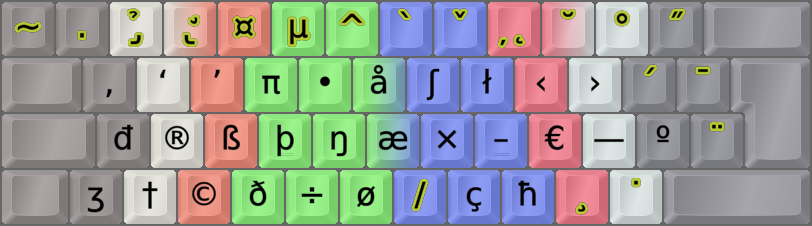

DreymaR's Big Bag Of Keyboard Tricks - EPKL
===========================================
<br>

### [EPiKaL PKL][CmkPKL] for Windows
#### Formerly PKL[edition DreymaR] by DreymaR, 2017-, based on [PortableKeyboardLayout][PKLGit]
#### ([Written By Farkas Máté in 2008][PKLSFo] using [AutoHotkey][PKLAHK])



<br>

Source code info
----------------
This is the source code README, briefly explaining how to compile PKL/EPKL with AHK2EXE.

To this purpose, there's a [Compile_EPKL.bat][MakExe] file that makes and runs EPKL.exe.

Info about DreymaR's Big Bag of keyboard trickery is found on:
* The [Big Bag pages][BBTind] with better explanations and links
* The old [Forum BigBag][CmkBBT], including the [Big Bag for EPKL/Windows][CmkPKL] topic

The [EPKL][EPKLRM] source code is based on a decompiled PKL v0.4preview (formerly v0.3r85).
<br>

Compiling manually
------------------
* To compile the (E)PKL source code, use the Ahk2Exe compiler from the [AHK download page][AHKDld].
* AHK compiler v1.1 Unicode is needed for EPKL; v1.0 and v1.1 in ANSI mode work for the original PKL.
* There's a folder in Source that contains the v1.1 AHK compiler.
* Choose the right Source\#.ahk file, EPKL or PKL_Orig.
* Choose to compile into your main EPKL folder.
* You may choose any name for the .exe and run it afterwards.
* Choose Source\Resources\Main.ico as the custom icon file.  
<br>

Setup:
------
1. Just compile right into your main EPKL folder, or move the resulting .exe file there.
2. Adjust any extra settings in the layout.ini file in your layout folder.
   See the Colemak-eD_ISO layout.ini and baseLayout.ini files as examples.
3. For generic EPKL settings, look in the Files folder, and the EPKL_Settings .ini file(s).
   Or, you can use the EPKL Layout/Settings menu to change stuff.
4. Changes should ideally go in `_Override.ini` files instead of the Default files.
  

_Best of luck!_
_Øystein "DreymaR" Gadmar, 2018-_

[PKLGit]: https://github.com/Portable-Keyboard-Layout/Portable-Keyboard-Layout/ (PKL on GitHub)
[PKLSFo]: https://sourceforge.net/projects/pkl/ (PKL on SourceForge)
[PKLAHK]: https://autohotkey.com/board/topic/25991-portable-keyboard-layout/ (PKL on the AutoHotkey forums)
[AHKHom]: https://autohotkey.com/ (AutoHotkey main page)
[AHKDld]: https://autohotkey.com/download/ (AutoHotkey download page)
[MakExe]: ./Compile_EPKL.bat (Compile_EPKL batch file)
[BBTind]: https://dreymar.colemak.org/ (DreymaR's Big Bag of Keyboard Tricks)
[CmkBBT]: https://forum.colemak.com/topic/2315-dreymars-big-bag-of-keyboard-tricks-main-topic/ (BigBagOfKbdTrix on the Colemak forums)
[CmkPKL]: https://forum.colemak.com/topic/1467-dreymars-big-bag-of-keyboard-tricks-pklwindows-edition/ (BigBag-PKL on the Colemak forums)
[EPKLRM]: ./Files/ (EPKL Files folder/README)
<br><br>

WARNING: HARD HAT AREA!
=======================

EPiKaL PKL is a Work-In-Progress, so all of it may not be working perfectly ... yet. ;-)

This is the EPKL Work-In-Progress README, going into details on the changes. For the normal EPKL README see the main folder.

~ Øystein B "DreymaR" Gadmar, 2020
<br>

DONE:
-----
**GENERAL/SETTINGS**
* Renamings and file mergings to make the code more compact and streamlined.
* Removed MenuIcons and HashTables code, replacing them with AHK v1.1+ native code.
* Unicode native AHK now works. SendU and changeNonASCIIMode removed.
* New iniRead functions that support the UTF-8 Unicode file format.
* Merged several .ini sections including eD specific ones into the default [pkl] as it's tidier.
* Made a PKL_Tables.ini file for info tables that were formerly internal. This way, the user can make additions as necessary.
* If using a layout from the command line, the notation "UseLayPos_#" will run layout # in the layout list set in EPKL_Layouts.
	- This also makes Refresh robust against layout changes in EPKL_Layouts.
* Base layout: Specify in layout.ini a basis file (layout section only). Just need to list changes in layout.ini now. Nice for variants.
* Shorthand notation in EPKL .ini layouts, allowing the KbdType/CurlMod/ErgoMod settings to be referred to as @K/@C/@H resp. (@A for all at once).
* Path shortcut for layout.ini entries, allowing ".\" instead of full path from EPKL root.
<br>

**MENUS/IMAGES**
* Edited menus and the About... dialog.
* Added a KeyHistory shortcut for debugging etc. Make it configurable in EPKL_Settings (eD_DebugInfo).
* Added a Refresh hotkey. Reruns EPKL in case something got stuck or similar.
* You can specify in the EPKL_Settings .ini which tray menu item is the default (i.e., activated by double-clicking the tray icon)
* Would tray menu shortcuts work? E.g., &About. Answer: The menu shows it, but unselectable by key(?).

* Multilayered help images so fingering can be in one image and letters/symbols in another (saves file space, adds options).
	- Shift/AltGr indicators on separate images in a specified directory instead of in the state#.png (and dk) images.
	- Allow pushing the help image horizontally if mouse x pos. is in the R/L ~20% zone.
	- Zoom and Move hotkeys for the help image, cycling between image sizes and positions. Set e.g., imgZoom = 60,100,150 (%) in EPKL_Settings.
	- Settings in layout.ini: Size/scaling, background/extend images, background color, shift indicator, icons and dead key dirs.
	- Settings in settings.ini: Overall transparency/opacity, top/bottom gutter distances, horizonal activation zone.
	- If settings are missing, may default to backgr.png, extend.png, on/off.ico and ModStateImg\ in the layout dir.
	- Instead of many lines of image sizes, introduced a scaling factor 'img_scale' (in percent).
* Help Image Generator, using my KLD format in an SVG image template. With search/replace this is turned into a key glyph image.
	- You'll need an Inkscape (Scalable Vector Graphics program) install. A good option is portable Inkscape from PortableApps.com.
	- You can choose whether to make shift state images only or a full image set with all shift states for all deadkeys. The latter takes time!
	- The HIG can be used from the menu when Advanced Mode is set. Its settings file is in Files\ImgGenerator.
	- In the HIG settings file you can control replacement characters used in a marking layer; anything written to it will show in bold yellow.
	- The SVG image template file is in the same location. You could use another template and specify it in the HIG settings file.
	- If you don't want the dead keys marked in yellow for instance, you could save the SVG template with that layer hidden.
	- You can make full layout images showing keys as well, by combining with a Files\ImgBackground image of choice. I use the GIMP for that.
<br>

**MAPPINGS**
* Updated and added several layouts, including locale and script variants.
* Removed explicit Cut/Copy/Paste keys (in pkl_keypress.ahk); use +{Del} / ^{Ins} / +{Ins} (or as I have used in my Extend mappings, }^{X/C/V ).
* Made an _eD_Extend.ini file for Extend mappings that were formerly in pkl.ini (or layout.ini). The old way should still work though.
* Made Extend substitutes for Launch_Media/Search/App1/App2, as AHK multimedia launcher keys aren't working in Win 10.
* Scan code modular remapping, making ergo and other variants much easier. Separate key permutation cycles, and remaps combining/translating them.
	- In layout.ini, specify any remap combinations using the names (and syntax) found in the [Remaps] section of the Remap.ini file.
	- The _layout remap specifies a full remapping, while the _extend remap is only for those keys you want to move for Extend ("hard" remaps).
	- Uses my KeyLayoutDefinition (KLD) mapping format.
	- KLD is good for remaps, but too compact for main layout or Extend definitions. (Besides, Aldo Gunsing has a conversion tool for those.)
	- Unfortunately though, I can't make that work for the help images directly. New images need to be generated then.
	- Should I have a cycle merge syntax, e.g., "Angle_ISO105 = TC<  |L0LG  | ^Angle_ANSI-Z"? Probably unnecessary.
* Virtual Key remapping, similarly to SC. I'd like to make only ANSI or ISO layouts, and leave the ISO-ANSI VK issue to a simple remap routine.
* Sensible dead key names for images and entries (e.g., @14 -> tilde) in a central doc that layouts can point to.
	- Dead key list and file path in layout (but use dk## in the layout itself, for compatibility!)
	- If no lookup is specified, EPKL defaults to the local file as before
	- This way, one change in a DK will affect all layouts using that DK
	- DK images may still be kept in the layout dir (or a subdir to avoid clutter), as they are layout dependent
	- DK imgs named ‹name›_dk‹#› for state ‹#› (add s6/7 where applicable?!)
* Greek layout w/ tonos/dialytika in the acute/umlaut dead keys.
* In the OS deadkey table ([DeadKeysFromLocID] in PKL_Tables.ini) a -2 entry means no dead keys and RAlt may be used as AltGr (CtrlAltlIsAltGr).
* Special keys such as Back/Del/Esc/F# used to release a dead key's base char and also do their normal action. Now they just cancel the dead key(s).
* A single layout entry of VK or -1 will set that key to itself as a VirtualKey (if it was set in the base layout and you don't want it remapped).
<br>

**OTHER/NOTES**
* There was a problem with DKs getting stuck after a special entry. Seems this was always the case?! A call to pkl_CheckForDKs( 0 ) somehow prevents it...
<br>

**PKL[eD] VERSION HISTORY**
* PKL[eD] v0.4.0: Transition to AHK v1.1
	- A Refresh menu option with a hotkey (default Ctrl+Shift+5) in case the program hangs up in some way (stuck modifiers etc).
	- Advanced Mode setting that shows 'AHK key history' and other menu options, plus more info in the About... dialog.
	- Sensible dead key names for images and entries (e.g., @14 -> tilde) in a central file that layouts can point to.
	- A PKL_Tables.ini file for info tables that were formerly internal. This way, the user can make additions as necessary.
* PKL[eD] v0.4.1: Transition to AHK v1.1 Unicode, using native Unicode Send and UTF-8 compatible files. Menu icons.
	- Array pdics instead of the old HashTable code
	- A base layout file can be specified, allowing layout.ini to only contain entries that should override the base layout.
* PKL[eD v0.4.2: Help image layers, opacity, scaling, background color and gutter size settings. Help images can be pushed horizontally too.
	- Separate help image background/overlay, so keys/fingering, letters/glyphs and Shift/AltGr marks can be in different images.
* PKL[eD] v0.4.3: Scan and virtual key code modular remapping for layouts and Extend, making ergo and other variants much more accessible.
	- Ergo and other mods can be played over a few existing base layouts.
* PKL[eD] v0.4.4: Help Image Generator that uses Inkscape (separate download) to generate a set of help images from the current layout.
	- A shorthand notation in EPKL_Layouts.ini to specify KbdType (ISO/ANSI), CurlMod and ErgoMod with the layouts.
* PKL[eD] v0.4.5: Common prefix-entry syntax for keypress/deadkey/extend. Allows, e.g., literal/deadkey release from Extend.
	- Layouts, Extend and dead keys now support the same prefix-entry syntax, parsing "%$*=@&" as first character specially.
	- The "&" prefix denotes literals/powerstrings found in a separate file. These may span more than one line.
	- There's a string file specified in the layout.ini, by default it's Files\_eD_PwrStrings.ini
	- The ligature name can be any text string. In layout entries, two-digit names are prettiest.
	- Note that programs handle line breaks differently! In some apps, \r\n is needed but that creates a double break in others.
	- SendMode can be selected for powerstrings (Input, Message, Paste from Clipboard) in the string file.
	- To avoid stuck modifiers for long strings, a SendMessage() method was implemented.
	- More generic dead key output: Same prefix-entry syntax as layout/Extend, parsing "%$*=@&" entries.
		- Dead key base/release entries can be in 0x#### Unicode format in addition to the old decimal format. For base keys, the syntax must be exact.
		- Examples: "102 = ƒ" is possible instead of "102 = 402". For a glyph not shown in your font such as Meng, "77 = 0x2C6E" (or 11374 still).
		- Should be easy to import MSKLC dead key tables of the form '006e	0144	// n -> ń' by script (e.g., RegExp "0x$1 = 0x$2	; $3")
* PKL[eD] v0.4.6: The base layout can hold default settings. Layout entries are now any-whitespace delimited.
	- pklIniRead() can have an altFile, such as "BasIni". For BasIni/LayIni, .\ and ..\ point to their own and mother directories.
	- Read most layout settings apart from remaps from the base layout if not found in the main layout.
	- ONHOLD: Look for backup bgImg/extImg/dkImg in BasIni after all? If using an ANS base file for an ISO layout, it looks silly. But better than nothing?
	- Requiring Tab delimited layout entries was too harsh. Now, any combination of Space/Tab is allowed. For Space, use ={Space}.
* PKL[eD] v0.4.7: Multi-Extend w/ 4 layers selectable by modifiers+Ext. Extend-tap-release. One-shot Extend layers.
	- Multi-Extend, allowing one Extend key with 2 modifiers (e.g., RAlt/RShift) to select up to 4 different layers. Ext+Mod{2/3/2+3} -> Ext2/3/4.
	- Ext2 is a NumPad/nav layer w/ some useful symbols. Ext3/Ext4 are one-shot string layers but mostly to be filled by the user.
	- Dual-role tap-release Extend key. Works as Back on tap within a certain time and Ext on hold. Set the time to 0 ms to disable it.
	- ExtReturnTo setting to allow one-shot Extend, e.g., for strings. Can for instance return from Ext3 to Ext1.
* PKL[eD] v0.4.8: Sticky/One-shot modifiers. Tap the modifier(s), then within a certain time hit the key to modify.
	- Settings for which keys are OSM and the wait time. Stacking OSMs works (e.g., tap RShift, RCtrl, Left).
	- NOTE: Mapping LCtrl or RAlt as a Modifier causes trouble w/ AltGr. So they shouldn't be used as sticky mods or w/ Extend if using AltGr.
	- Powerstrings can have prefix-entry syntax too now. Lets you, e.g., have long AHK command strings referenced by name tags in layouts.
<br>

**EPKL VERSION HISTORY:**
* EPKL v1.0.0: Name change to EPiKaL PKL.
	- Moved ./PKL_eD -> ./Files folder. Languages are now under Files.
	- Bugfix: A '--' entry in layout.ini didn't overwrite the corresponding BaseLayout.ini entry.
* EPKL v1.1.0: Some layout format changes. Minor fixes/additions. And kaomoji!  d( ^◇^)b
	- Fixed: DK images were gone due to an error in the EPKL_Settings .ini. DK images also didn't work for some layouts.
	- Fixed: Sticky/One-Shot mods stayed active when selecting Extend, affecting strings if sent within the OSM timer even when sent with %.
	- New: A set of 30+ Kaomoji text faces in the Strings Extend3 layer. Help images included.  ♪～└[∵┌]└[･▥･]┘[┐∵]┘～♪
	- New: Hungarian Cmk[eD] locale variant.
	- New: Zoom and Move hotkeys for the help image, cycling between image sizes and positions. Set e.g., imgZoom = 60,100,150 (%) in EPKL_Settings.
	- Tutorial on making a layout variant in README. How to make and activate a layout, changing locale, remaps and a keys mappings.
	- 'Spc' and 'Tab' layout mappings, sending {Blind}{Key}. Makes for compact layout entries for the delimiting whitespace characters.
	- Direct Extend key mapping, e.g., for CapsLock use 'SC03A = Extend Modifier' instead of the old extend_key setting.
	- Extend layers can be set as hard/soft in the _Extend file. Soft layers follow mnemonic letter mappings, hard ones are positional (like my Ext1/2).
		- The Curl(DH) Ext+V may still be mnemonic/soft instead of positional/hard (^V on Ext+D). [v1.1.3: Use `mapSC_extend = V-B,` before AWide/Angle mods.]
	- BaseLayout files are now at the same tree level as layout folders instead of inside one of them.
* EPKL v1.1.1: Some format changes. Minor fixes/additions. Tap-or-Mod keys (WIP).
	- New: Tap-or-Modifier a.k.a. Dual-Role Modifier keys. Work-in-progress, not working well for rapidly typed keys yet.
		- To make a ToM key, specify its VK layout entry as VK/Mod, where 'Mod' is a modifier name. The rest of the line can be any valid entry.
		- The Help Image Generator can mark ToM keys (state 0 and 1) with a background symbol.
	- The Extend key can be set the old way as extend_key in [pkl] (but no layout entry is needed anymore!), as 'Ext Mod' or as ToM, e.g., 'VK/EXT VKey'
	- Modifiers can be referred to by the first letters of their name so, e.g., 'LS' and 'LSh' both point to LShift. Also, VK or VKey = VirtualKey.
	- Unicode points can be sent by the ~ prefix; a ~#### entry sends the U+#### character as used in MSKLC file entries.
	- The shiftStates layout entry is now in the [layouts] section of layout.ini, spaced out so entries have more room and are clearer.
	- Since Space/Tab are used to delimit layout entries, there are now special '&Spc' and '&Tab' PowerString entries for them.
	- Dead key abbreviations are now by code point instead of numbered, as in MSKLC. Example: The .klc entry 02c7@ is a caron DK; in EPKL it becomes @2c7.
	- Added a Compile_EPKL.bat file that compiles the source code by running AHK2Exe with default settings.
	- Fixed: HIG made a state8 image of semicolons. This was due to the SGCaps states (8:9) being added unnecessarily.  (つ_〃*)
		- Also fixed some minor HIG bugs related to hex dead key values etc.
* EPKL v1.1.2: Multifunction Tap-or-Mod Extend with dead keys on tap. Janitor inactivity timer.
	- Dead keys on Extend key tap. Examples: Tap {Extend, n} for parentheses with positioning. {Ext, z/Z} Undo/Redo. {Shift, Ext, letter} for kaomoji.
	- Sticky Shift works to select Extend dead keys, and stays active. If you want the shift-P kaomoji tap {Shift, Ext} then P quickly. If not, wait.
	- For InputRaw/Send/AHK/Blind/Unicode/DeadKey/PowerString entry prefixes, both the old %$*=~@& or →§αβ«Ð¶ (AltGr+Shift+ISABUDP) work now.
	- Direct dead key entries in the format <#> = <entry> work too. If the char is an uppercase version, append a plus (<#>+).
	- "Janitor" inactivity timeout setting (e.g., 2 s) to release any stuck modifiers. These can happen with advanced usage.
	- IniRead can now handle UTF-8 .ini files (but not UTF-16) allowing Unicode in all entries.
	- The EPKL.exe binary file is no longer version controlled. It can be compiled using the .bat file but is also provided with each release.
* EPKL v1.1.3: The LayStack, separating & overriding layout settings. Bugfixes. More kaomoji.
	- The downloadable release asset .zip file now contains all files needed to run EPKL. No Source/Other/Data nor .bat/.git. files.
	- The Kaomoji dead key now outshines the Extend layer with a related entry for each shifted letter/symbol, e.g., d( ^◇^)b vs (b￣◇￣)b.
	- An EPKL_Layouts_Default .ini file has been split off from the EPKL_Settings .ini so the layout definitions have a file of their own.
	- If present, an EPKL_Layouts_Override.ini file will take precedence. In the future, this may be generated by a GUI panel.
	- Several mappings and settings common to most layouts are now in the Layouts_Default file. This includes the Extend modifier mapping.
	- The LayStack [ mainLay, baseLay, LayOver, LayDef ] can be used for most mappings and layout info, including Extend and DeadKey overrides.
	- Added Layout Type (eD or VK) and Other Mod (e.g., Sym) shortcuts to the Layouts.ini file.
	- The 'Sym' (;>' />=>- cycles) symbol key rotation mod I'm testing is available as a remap.
	- The CurlM/DHm variant of the Curl(DH) mod is available through the remap 'Curl-DHmMod'; it isn't available for most premade layouts though.
	- Added eD/VK Colemak Curl(DHm) only layouts. Used CurlM/DHm here, to support ortho boards. Ortho help images are on the TODO list.
	- Fixed: The Extend modifier in the BaseLayout didn't work so most layouts didn't get Extend before adding it to their layout.ini manually.
	- Fixed: From PKL[eD] v0-4-5, DK+Spc didn't release the base accent as Spc was prefixed. Now, (&)Spc and {Space} are turned into a space glyph.
	- Fixed: Some kaomoji with ^ or ` in them would get confused - (=･ω･^^=)丿 - due to insufficient handling of OS dead keys.
	- Fixed: Ensured that a quickly used Extend press isn't open for re-use as an Extend tap! Example: Ext+Space, then quickly E.
	- Fixed: The janitor timer kept resending mod up strokes every # s. Now it's once only after recent keyboard activity.
	- Minor: Made a bool() fn to use bool(pklIniRead()) instead of a dedicated pklIniBool().
	- Tested: The LAlt key (SC038) can work as Extend Modifier, just like any other key can. (Remapping another key to LAlt can still be tricky.)
* EPKL v1.1.4: Sym mod and Dvorak layouts. HIG updated for new Inkscape. Unified VK codes for layouts. Mapping/setting tweaks.
	- Three Sym(bol) mod variants: Improving quote/apostrophe (Qu), Minus/hyphen (Mn) or both (QuMn). ANSI uses both. Choose between them in the Remap file.
		- Premade Sym(QuMn) variants for VK/eD Colemak vanilla and CAW.
	- Dvorak layouts, with suitable Curl/Angle/Wide ergo mods. These are my suggestions and not "official" variants for now.
	- The HIG (Help Image Generator) has been updated for Inkscape v1.0 that's finally out! All images are now created in one call, a lot faster.
		- Also tweaked the HIG for Co_## KLM key codes since the image template doesn't have the underscore for these codes.
	- My KLM QW_## codes found in the Remap file may replace VK codes in layouts.
		- All BaseLayout files are now unified for KbdType by replacing ANS/ISO specific OEM_# VK codes with KLM ones.
		- Added a KbdType setting in the layout files, overriding the one used in layout selection.
		- KbdType @K codes for ANS/ISO in LayStack files, further simplifying ISO/ANSI conversion. (For baseLayout, mapSC_, img_Extend#/DKeyDir/bgImage.)
	- Keys can now be disabled by '--' or VK mapped to themselves by VK(ey) as their first layout entry.
	- Key state and dead key mappings can be disabled using '--' or '-1' entries. Thus an entry can be removed in the LayStack.
	- Remap cycles can consist of minicycles separated by slashes, like this: | a | b / c | d | e | to remap a-b and c-d-e separately.
	- Instead of special '_ExtDV' remaps for Extend Ctrl+V to follow V under CurlDH, now prepend the mapSC_extend remap with 'V-B,'.
	- All mapVK_mecSym (ANS2ISO/ISO2ANS) mappings removed from layout.ini files. Still left in BaseLayout files as an example.
	- Set the help image refresh timer a bit faster. Seems to help for Extend2, but not for Tap-Ext Kaomoji DK nor the initial help image?
* EPKL v1.1.5: Tarmak Curl(DHm) w/ ortho images. Suspending apps. Language tweaks, fixes.
	- The EPKL_Layouts_Override file is no longer tracked. Instead, there's an Override_Example file you can copy/rename/edit. Thus, your changes are kept over updates.
	- Added Tarmak-DH(m) alias Curl(M) for Ortho boards. There's a line in the EPKL_Layouts files for the Tarmak steps with DHm, but you can also use the shortcut syntax.
	- You can now list "suspendingApps" in Settings that automatically suspend EPKL when active. Specify by exe (X), window class (C) or any other AHK title match method.
	- To see the AHK window class and other info about the currently active window, there's now a hotkey (default Ctrl+Shift+0).
	- The janitor timer now handles suspending and/or exiting by the suspendTimeOut and exitAppTimeout settings. As before, set these to 0 to ignore them.
	- The About hotkey is now shown in the tray menu, and toggles the About... GUI on/off.
	- Image opacity hotkey (default Ctrl+Shift+8), toggling between opaque and transparent (by setting) help images.
	- Moved EPKL specific string settings to the language files. Added a few languages (Italian, Norwegian Bm/Nn).
	- Multi-ID locale variants can be addressed by their component. So for French, either Be Ca or Fr would point to the BeCaFr variant. Specified in the Tables file.
	- Added the Cmk-eD-Pl ANSI CAW Polish variant designed by Kuba Wiecheć, Colemak forum user Wiechciu. It swaps Z and V from ANSI Cmk-CAW, and adds żŻ to the Z key.
	- Added the QUARTZ pangram layout (Quartz/glyph [job];vex'd cwm,finks.), as a joke! I used a Wide mod for it, but beware that this is NOT a good layout!  ╭(๑•﹏•)╮
	- Fixed: Local on/off icons were broken since the LayStack (v1.1.3)
	- Fixed: Help image didn't work if not shown initially, and might become an icon on the first minimize. Now it's shown once and if necessary toggled off again.
	- Fixed: Sticky Shift didn't get reset by the next typed key on VK layouts, leading to MULtiple SHifted characters.
	- Made Compile_EPKL.bat stop EPKL before compiling so the .exe can be overwritten, and rerun EPKL afterwards.
* EPKL v1.1.6: New Curl-DH standard! EPKL For Dummies. KLM key codes. Extend fixes. AltGr layouts for Es/It, and Pan-Germanic locale variants.
	- Colemak-DH(m) (M on the home row) is now the Curl(DH) standard. The 2017 DH standard (K on the home row) is now named DHk in the Remap file. Files are updated.
	- Added a link to the useful "EPKL For Dummies!" guide by Torben Gundtofte-Bruun in the README. Also some images and text updates, and a new README for the Files.
	- Like VK codes, SC### scan codes in layouts & Extend can be replaced by the KLM Co or QW codes found in the Remap file. These are more intuitive and user friendly.
		- For VK entries, vc### is a synonym for the QW### KLM code. I felt that it makes sense to distinguish between SC and VK this way.
	- Fixed: Shift+Spc didn't send a shifted space, which should scroll up in most browser windows. Now, Spc is sent Blind.
	- Fixed: The first Tap-or-Mod Extend key press didn't take if within the ToM timer term. An initializing call to setExtendInfo() solved the problem.
	- Fixed: Extend mods such as `{Ext+S} = Shift` pressed quickly w/ ToM Ext often led to stuck mods. Now they're only depressed/released for each Extended key press.
	- Replaced some Loop Parse commands with more modern For loops, and made pklIniSect() return a row array for For loops. Let pklIniCSVs() take a specified separator.
	- Added EsAlt and ItAlt for users who prefer AltGr to DKs. Es/It have áéíóú/àèìòù on AltGr+aoeiu, and some tweaks to fit in other symbols. Es_ANS has ñ on AltGr+n.
	- Made the German and Scandinavian (De, DkNo & FiSe) Pan-Germanic, with easier access to each others' letters (De has ÆØÅ on AltGr+AOU; DkNo has ÄÖÜ etc).
	- Tweaked a few AltGr mappings in the Vi and Hu laoyuts to better take care of lost symbol mappings.
	- Added a setting that makes HIG delete its temporary files dir after generation. The options are 0=no, 1=paperbin, 2=delete.
	- Local icons for Ru, Bg etc weren't working if there was an icons_OnOff entry in the LayStack. Now, local on/off icons take precedence.
	- Help Image Generator reworked. It can now take non-numeric entries. For DKs, it marks strings as ellipses and prefix syntax as for instance '·¶·'.
	- Currency dead key reworked. Several symbols added, most duplicates removed.
	- Fixed: Help images didn't always show on rapid dead key activation. Added a help image refresh (if the image is active) whenever a DK is activated.
	- Tip: Help images can be shown on other monitors using an extended workspace, by adjusting the margins to negative values. See the Settings file.
* EPKL v1.2.0: Layout/Settings UI.
	- Layout/Settings GUI panel to help newcomers get into several of the powerful options EPKL offers.
	- The Layout Picker UI can be used to select any existing layout variant combo in the Layouts folder.
		- When a Main Layout, Layout Type and Keyboard Type are chosen, existing Variants and Mods for that combo are shown.
		- Upon submitting, if a Layouts_Override file isn't found one can be created based on the `_Example` file.
		- A layout line is then written to the top of the `[pkl]` section of the Override file. This line will take precedence on the next Refresh.
		- Old UI generated lines of the same type are commented out and if there are many of them (>4) the oldest ones get deleted.
	- The Key Mapper UI reads KeyLayoutMap (KLM) names from the Remap file. Keys not in the selection box may be edited manually into the text fields.
		- Select row then code to remap, then the same for the VK code that you're mapping to. Then mapping type. Finally, edit any state mappings etc. manually.
		- For most modifiers, you can select Left/Right or use the generic mod. The modifier is used in Mod, Tap-or-Mod (ToM) and MoDK mappings.
		- The mapping is written into the `Layouts_Override` file. If that key is also mapped in your (Base)Layout.ini, write the line to `layout.ini` or it won't work.
		- Added a `Write to layout.ini` button to the KeyMapper. Such mappings will override other LayStack mappings. The default Submit button writes to `Layout_Override`.
	- The Settings UI lets you choose between several EPKL settings. It shows their current value and any same-line comments. Edit their value and submit.
		- The UI-adjustable settings have to be in the `Settings_Default` file and specified in the "setInGUI" entry of the `EPKL_Tables.ini` file.
		- To allow the Settings UI to work, EPKL can now use a Settings Override/Default stack (like with the Layouts files) instead of just `EPKL_Settings.ini`.
	- The ߧ/þÞ/ŋŊ ligatures from the Colemak-eD AltGr layers were added to the RingAbove-Lig dead key as spares.
	- Moved Cmk-eD/VK as subdirs under a Colemak folder, like other layouts are organized (`Layouts\MainLay\3LA-LT[-LayVar]_KbT[_Mods]`).
	- The Tarmak layout folders were also renamed to use the standard format. Tarmak step # is now a Tm# Layout Variant.
	- The layout shortcuts for EPKL_Layouts files were tweaked somewhat, renaming Variant from `@L` to `@V` and making the underscore before `@K` explicit.
	- Switching Slash and Backslash for Wide modded Extend brings the WheelLeft/Right keys together. Used it for Colemak-ISO-CAWS. Less intuitive for (C)AWide Ext2.
	- Added a `LayMain(\3LA)` setting and `@L` shortcut for the main layout in the Layouts files. It may specify a 3-Letter Abbreviation (3LA) for subfolder names.
	- If not set directly, the 3-Letter Abbreviation is found from the Tables file. Failing that, the three first letters of LayMain are used.
	- Renamed the KLM key code `_DT` (OEM_PERIOD) to `_PD` and `_EQ` (OEM_PLUS) to `_PL` for better compatibility with the actual VK names. Also updated the HIG files.
	- Added a 'hideImageState' setting to hide certain help image shift states. Some users may want only AltGr, Extend and dead key images to show.
	- Remaps and RemapCycle sections are now allowed in the LayStack. See the `_Test\Cmk-eD-Nyfee_ANS_CurlAngle` layout for an example.
		- LayStack Remaps and cycles will only be checked for if their sections are present in `layout.ini`. This is to avoid slowing down other layouts.
		- The Nyfee Colemak-DH mods were added to test LayStack remaps. His mods move `Z W X C F K (V)` and the Bracket/Minus/Equals keys.
	- Detection of current system layout VK codes through GetKeyVK().
		- This makes `key = VKey` mappings work as intended, enabling for instance Extend to see and use a key without changing its system layout mapping.
		- Added "System-VK" throughput layouts for Extend etc. users using VKey mappings. Ergomaps would also work on it. One could also remap some keys with states.
	- Non-Scandinavian installed ISO layouts such as the UK one, should now get the right VK codes detected for OEM_# symbol keys.
		- If the underlying system layout is changed while running EPKL, for now you should Refresh EPKL to get the codes reread correctly.
		- The old way of specifying VK remaps from the default KLM ANSI-based codes should still work, but shouldn't be neither necessary nor advisable anymore.
		- QWERTZ and especially AZERTY are special in that they require some letter remaps too. There are remaps for them in the Remaps file but no layouts using those.
	- Fixed: If a remap (cycle?) wasn't mapped to a cycle, it could lead to an infinite loop in ReadRemaps().
	- Fixed: Some Ext-Shift presses would get lost, especially after having pressed Ext-Ctrl.
		- Reworked extendKeyPress() to avoid this. Also let the Janitor clean up idle Ext-mods to be sure.
	- Reworked Extend modifiers further, to send with the AHK prefixes `+^!#` instead of holding down modifier keys. Seems smoother. Also, releasing Ext sends mods up.
	- Updated the non-Wide Sym and ANSI CAWS to the latest versions. ISO and ANSI are the same now. The non-Wide variants swap brackets with minus/plus.
	- Cz (Czech) ANSI variants. With no ISO key for Ůů, it was mapped to AltGr+Uu. There's optionally a map line to swap J and Z if desired, but it's non-standard.
* EPKL v1.3.0: Compose/Completion and Repeat keys.
	- Repeat key: Set any state mapping to `®®` to make that entry repeat the previous key. Good for avoiding same-finger bigrams.
	- Compose/Completion key: Set any state mapping to `©<name>` to use it for composing up previously sent characters using specified tables.
		- The ISO key's unshifted state has been set as a Compose key (`©Def`) by default, editable in `EPKL_Layouts_Default.ini` or the LayStack.
		- Compose tables are kept in a specified file, by default `Files\_eD_Compose.ini`. Each named key has a list of tables to use.
		- As a Compose key, this is like a post-hoc version of the famous Linux Compose method. It's a very powerful tool for producing new output!
		- Instead of pressing the Multi/Compose key before a sequence, in EPKL you press the sequence then Compose.
			- You can get, say, <kbd>é</kbd> by pressing <kbd>e</kbd>,<kbd>'</kbd>,<kbd>Compose</kbd>. The `e'` sequence is deleted first.
		- As a Completion key, the previous input is kept and added to. This is specified by the tables entry in the Compose file.
			- This is handy for making common n-grams easier. Some Colemak examples are: E-comma, UE, SC, Que/And/The/Ion.
		- By default the method will look for the longest possible sequences first. You can adjust this behavior in the Compose file.
		- Compose key entries can be any Unicode text, or even use EPKL prefix-entry syntax to do pretty much anything. Backslash escapes are allowed.
		- Note: VK mapped keys and ## mapped states can't be used for composes, as EPKL can't know what their output is. E.g., `88 ⇒ ∞` w/ ## numbers.
		- The standard Linux X `en_US.UTF-8` compose file was imported to `Files\_eD_Compose.ini`. Only entries starting with `<Multi_key>` were used.
		- You can compose with any single-character input like dead key releases and AltGr mappings. So using the x11 compose, e.g., `~(α` ⇒ `ἇ`.
		- Backspace pops the last character from the Compose queue so you can correct a mistake and write the right sequence.
		- See the `_eD_Compose.ini` file for more examples and explanations.
	- Compose table import module: Converts actual Linux tables like /usr/share/X11/locale/en_US.UTF-8/compose (~5000 lines) to EPKL Compose.ini entries.
		- Composing Linux key sym names are translated to their U####[#] Unicode hex values as .ini keys, using a keysym file like the X keysymdef.h one.
		- The [keysyms.txt](https://www.cl.cam.ac.uk/~mgk25/ucs/keysyms.txt) file by [Dr Markus Kuhn](https://www.cl.cam.ac.uk/~mgk25/) uses proper Unicode.
	- Moved layout variants into their own folders to reduce clutter, and for better variant documentation placement. Updated the Layout/Settings GUI accordingly.
	- Layout additions:
		- Added Nyfee's ColemaQ mod and NotGate's ISRT alias IndyRad layout, as ANSI Cmk-CA mods in the `_Test` folder. Nyfee's mod has his own Sym mod included.
		- Added the Cmk-DpgH mod using SteveP's `D>P>G` loop which leaves the left hand bottom row alone. It's considered a secondary, somewhat inferior variant.
		- Added Michael Dickens' MTGAP layout as an eD base layout, and some ergo mods for it. There are many MTGAP variants; I used the "main 30 keys" one.
		- April's Foal! The Foalmak layout is an April Fool's joke layout by Semi at the Colemak Discord. It's still better than QWERTY, heh. And it's got nice images!
		- Added Nyfee's new Colemak-QI mod as a Colemak variant, CAS & CAWS modded. Also the "extra mile" QI;x mod as `_Test` layouts like before.
	- Layer/variant additions:
		- Added some symbols to the RingAbov-Lig (ring symbols), Stroke-Bar (ballot boxes on s/v/x), Macron (trigrams on 0-7) and DotAbove (dice on 1-6) dead keys.
		- Added the ijIJ digraphs and ijIJ bigrams to the Nl layouts, on the `OEM_102` "ISO" key and AltGr+iI, respectively.
		- Added a full set of CAWS locale variants.
		- Added (Curl)AngleSym Colemak-eD variants. The non-Wide Sym variant now keeps Plus/Equal next to 0 and brackets above another as in the Wide variants.
	- Added a Reset button to Layout/Settings. It deletes all UI-made lines for the current setting in the Override file, including commented-out UI lines.
	- Separate BaseLayout for the Greek (Gre) and Kyrillic (Kyr, Ru/Bg) scripts. This removes the need for full mappings in layout files. Bg keeps the necessary mappings.
	- Fixed: Minor bug in which the Settings GUI wouldn't try to make a new Override file but just lead to a file read error instead.
	- Fixed: After the Ext-mods rework, spamming modded Ext presses led to stuckness (~5 s for Ext+S+N). Afterwards, Extend got wonky, w/ Ext+S+T+N the arrow was stuck.
	- Fixed: Layout settings didn't initially show type/variant/mod. Arrow cycling back/forth "removed" VK/variants. Selecting a valid combo removed the problem.
	- HIG updated so shift state help images show parseable entries like bigrams correctly.
	- New mappings for Ext-tap `wfpblu`. `{Ext-tap,w}` opens Windows Explorer; useful since the Win+E shortcut may be compromised in Colemak due to a hardwired Win+L.
	- Updated the EPKL compiler to Ahk2Exe from AHK v1.1.27.07. Later versions are currently not fully compatible with EPKL source, causing trouble with AltGr.
	- A `##` state entry now sends the key's VK## Blind. Good for, e.g., `Win+<number>` which doesn't work otherwise. Warning: Output will depend on your OS layout.
		- In particular, if you run a self-made MSKLC layout underneath in which letter and/or `OEM_` VK codes are wrong, the result will be odd.
		- Added a `BaseLayout_Cmk-eD-NoVK.ini` file with only direct state mappings. If the VK mappings cause you any trouble, point your `layout.ini` to this one.
		- Cut back on VK ## letter mappings in `BaseLayout_Cmk-eD.ini` again, as these cause some chained dead key outputs like ự and ậ to be preceded by an unwanted space.
	- Added DK images for ANS AWide and CAWS, in addition to the existing vanilla and CAW. For ISO, we already have Angle, AWide, CAW and CAWS.
	- Reworked the `@` layout codes. ErgoMod/`@E` is now HardMod/`@H`, as Curl/DH and Sym are also ergonomic mods. MainLay is now `@L` and the ergo mod ensemble `@E`.
	- Tidied up some complex remaps like `SL-BS,V-B` for Ext. Made `Ext-CAW(S)_@K` remaps instead. Ext1/2 images were also renamed/copied to be simpler and more consistent.
	- The SL-BS swap is good for `Extend-CAWS_ISO`, bringing the WheelLeft/Right keys together. Since Ext1 and Ext2 use the same remap, it wasn't done for AWide/CAW.
	- Background image files were renamed more consistently.
	- Replaced the global PklHotKeyBuffer queue string with a global array.
	- Mirrored Colemak BaseLayouts. The AltGr layer holds mirror mappings, and ergo mods can be used normally. The Sym mod may not be ideal for it.
		- There's a separate base layout for Cmk-DH to make mirroring work as it should. Curl mod remaps should not be added to the resulting layout, just other mods.
	- The AHK Send command sends active modifiers up before a sent character/string, and down after, before the final up as you release them physically.
		- Specifically, after an `AltGr` key press AHK sends both `LCtrl` and `LCtrl+Ralt` down/up. If this happens too fast, they may get jumbled.
		- Tried adding `{LCtrl Up}` to getAltGrState(), ~15 ms after `{LCtrl Down}{RAlt Down}`. It did not fix the stuck `LCtrl` problem.
		- Using the AHK v1.1.27 `{Text}` mode avoids the first `LCtrl`, so it may help.
		- However, Text mode doesn't work with Win+Key shortcuts, so it's only used for single-glyph mappings on AltGr layers.
		- Fixed: Earlier, if Win+v (Paste Clipboard) was pressed, the clipboard would often close again unless Win were released very fast.
	- Seems all the `LCtrl+RAlt` sending around `AltGr` in `pkl_SendThis() `wasn't necessary? It has been removed.
	- Added the `{Text}` mode (AHK v1.1.27+) to PowerStrings, and made it default. It's more reliable for special characters.
	- The `img_Positions` setting may define which help image positions are allowed. By default `TL,TM,TR,BL,BM,BR` (Top/Bottom + Left/Mid/Right).
	- Made string matches case sensitive using StringCaseSense. Hope that didn't break anything...?
	- Fixed: Win+Spc was broken in commit "Repeat and Compose keys" (506e5b). It sent a space instead. The error was in pkl_Send().
	- In the `EPKL_HelpImgGen_Settings` file, the BrutalMode setting governs whether the EPKL HIG moves generated images straight into the layout folder.
		- If this setting is true, generated images may overwrite any existing ones. Also, the `ImgGen_` temporary folder is deleted after use.
* EPKL v1.3.1: WIP

	- Mapping a state to `®#` where # is a hex number will repeat the previous key # times. This is affected by modifiers, but not sticky ones.
	- The img_HideStates setting can hide the `ext` layer image too, and even DK shift states specified as `dk#`; # is a shift state (0,1,6,7).

<br>

TODO:
-----
* A "janitor" timer that checks whether the underlying Windows layout has changed (affects dead keys)
* Generic dual-role keys and/or modifiers. For instance, home row keys might act as modifiers when held and letters when tapped.
* An import module for MSKLC layout files and other formats.
* Dead key chaining, allowing one DK to release another.
	- EPKL allows the @## syntax but it doesn't work as it should yet. Because it resets PVDK?
	- Chainable dead keys would allow a true Mother-of-DKs for Compose-like "tap dance" sequences like {MoDK,t,n}->ñ.
* Check whether Ralt (SC138 without LCtrl) will be AltGr consistently in layouts with state 6-7.
* Add to unmapped dead key functionality
	- Specify release for unmapped sequences. Today's practice of leaving an accent then the next character is often bad.
	- That way, one could for instance use the Vietnamese Telex method with aou dead keys (aw ow uw make â ô ư) etc.
	- One catch would be that the dead key wouldn't release until next key press, but that may be acceptable.
	- Specify, e.g., the entry for s1 similar to today's s0 entry. (U+0000–U+001F are just ‹control› chars.)
	- That'd be backwards compatible with existing PKL tables, and one can choose behavior.
* Truly transparent image background without the image frame. Overall transparency (but not transparent color?) works.
	- Transparent foreground images for all states and dead keys.
* Some more dead key mappings:
	- Greek polytonic accents? Need nestable accents, e.g., iota with diaeresis and tonos. See https://en.wikipedia.org/wiki/Greek_diacritics for tables.
	- Kyrillic special letters like ёЁ (for Bulmak) җ ӆ ҭ ң қ ӎ (tailed); see the Rulemak topic
	- IPA on AltGr+Shift symbol keys?
<br>

INFO: Some documentation notes
------------------------------
* Virtual key code links:
    http://www.kbdedit.com/manual/low_level_vk_list.html
    https://msdn.microsoft.com/en-us/library/ms927178.aspx
    https://msdn.microsoft.com/en-us/library/windows/desktop/dd375731(v=vs.85).aspx
  
* "Anti-madness tips" for EPKL (by user Eraicos and me):
    - PKL using AHK v1.0: Script files need to be ANSI encoded. They don't support special letters well.
        - EPKL using AHK v1.1-Unicode: Supports scripts in UTF-8 w/ BOM.
    - EPKL .ini files may be UTF-8 encoded, with or without BOM. Source .ahk files should be UTF-8-BOM?
        - PKL: Don't use end-of-line comments in the .ini files. OK in layout.ini because of tab parsing.
        - EPKL: End-of-line comments are now safe.
    - In layout.ini, for old PKL:
        - Always use single tabs as separators in layout.ini, also between a VK code and 'VirtualKey'.
        - The CapsLock key should have scan code 'CapsLock' instead of SC03A, if using 'extend_key = CapsLock'.
        - The Extend key should be mapped or it won't work, e.g., 'CapsLock = CAPITAL	VirtualKey'.
        - EPKL changes all of the above: Any whitespace delimits, and Extend is mapped as 'Extend Modifier'.
    - In the Extend section:
        - Don't have empty mappings in the Extend section. Comment these out.
        - By default {} is added to send keys by name. To escape these, use a prefix-entry or }‹any string›{.
<br>

**Entry format info from Farkas' sample.ini layout file:** (Note that EPKL now uses '@' for 'dk' entries etc)
```
Scan code =
	Virtual key code (like in MS KLC)
	CapsState (like in MS KLC):
		If CapsState == vk or VirtualKey
			When you press this key, it sends only the virtual key.
			It is very useful, if you install your special layout, and you 
			would like to extend it. (See extend_* layouts)
		Else If CapsState == modifier
			You can use this key as a modifier, like Shift, RAlt (== AltGr)
		Else If CapsState & 1 (first bit set)
			Shift + Key == CapsLock + Key
		Else If CapsState & 4 (third bit set)
			AltGr + Shift + Key == CapsLock + AltGr + Key
	Output for each shift state (see http://www.autohotkey.com/docs/commands/Send.htm):
		#       send utf-8 characters (one or more)
		*####   send without {Text} – that is, interpret key names (and ^+1#{} ?) in AHK style
		=####   send {Blind} – that is, keep the modifier state intact
		%####   utf ligature
		--      disabled key/state entry
		dk##    deadkey (EPKL: @## is used instead, w/ ## from a DeadKeyNames section)
		&###    EPKL: PowerString name (named strings that are sent by the chosen method)
NOTE: Use tabs as separator for these entries!!!

;scan = VK	CapStat	0Norm	1Sh	2Ctrl	6AGr	7AGrSh	Caps	CapsSh
SC002 = 1	1	1	!			; QWERTY 1!
SC003 = 2	0	2	={Left}		; QWERTY 2@
SC004 = 3	0	3	*{Right}	; QWERTY 3#
SC005 = rshift	modifier		; QWERTY 4$
SC006 = 5	0	dk1	dk2			; QWERTY 5% (EPKL: DKs are named for instance @0b4 or @060)

[deadkey1]
; 0 = unicode number of the "accent"
0    =  126	; ~
; [Unicode number of the base letter] = [Unicode number of the new letter] ‹tab› ; comments
97   =  227	; a -> ã
```
